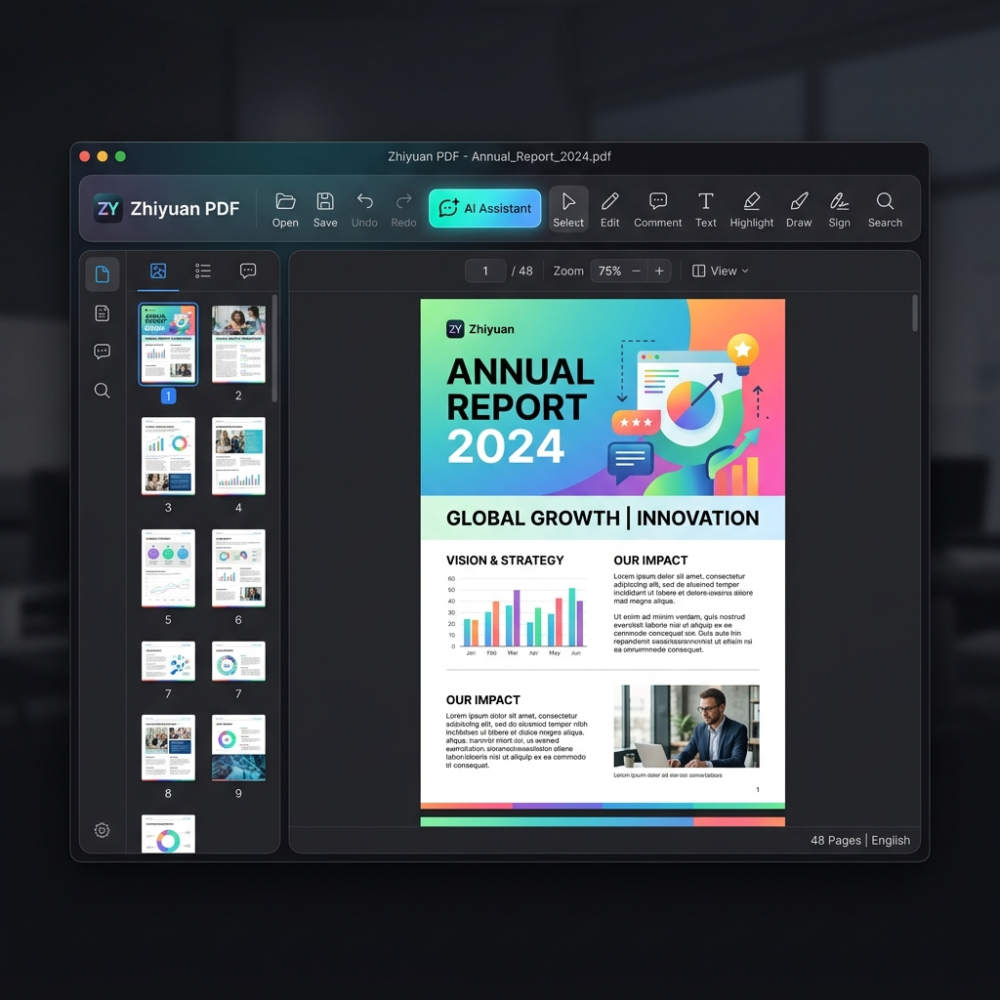
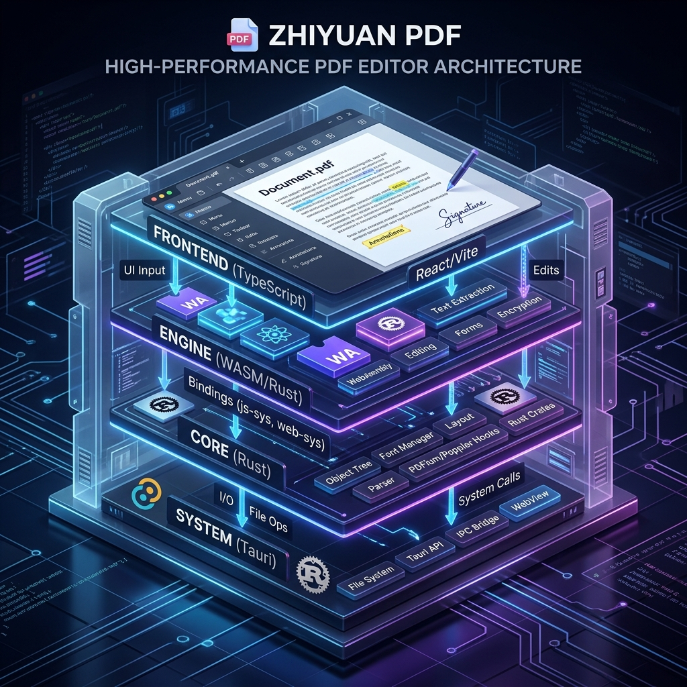
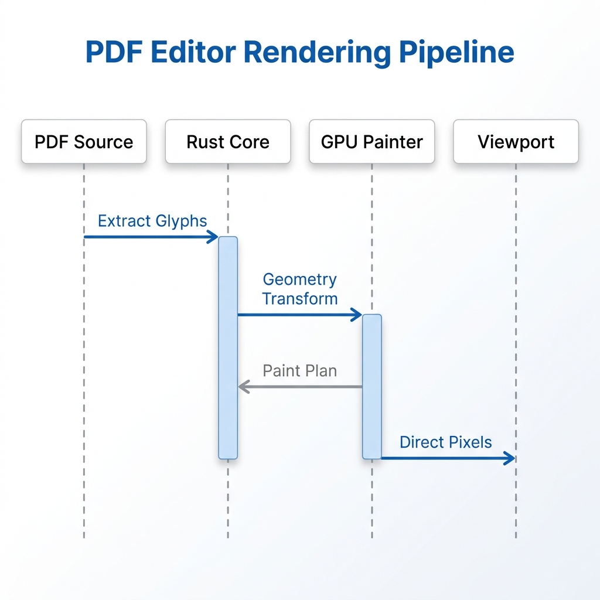
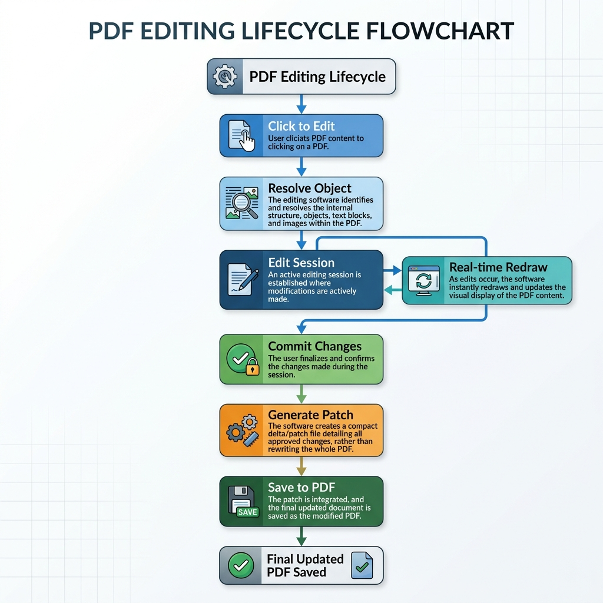

# 纸鸢 (Zhiyuan) ：多模态数据智能与深度学习平台

**纸鸢 (Zhiyuan)** 不仅仅是一个 PDF 编辑器。它是一个以 **Agent 为核心的数据流中心**，旨在打破“文档”与“数据”的边界。它能从任何格式中提取信息，重组为可存储的结构化知识，并通过 PDF 等高保真平台进行多模态呈现与深度学习。

## 🚀 核心价值：极限性能支撑的智能中枢

纸鸢之所以强大，首先源于其**不可思议的性能**，这是处理大规模数据流与高强度学习的基石：

- ⚡ **极限响应**：基于 Rust 的零成本抽象，即使面对 **100MB+ 的复杂扫描件**，翻页与操作响应依然保持在 **毫秒级 (ms)**，彻底消除知识获取的摩擦感。
- 🎯 **100% 像素还原**：自研渲染管线直达底层，杜绝任何乱码与位移，为您提供最精准的视觉数据输入。
- 🧠 **Agent 赋能**：在极致速度的基础上，Agent 实现对全格式数据的无损提取、语义重组与分类存储，将非结构化文档转化为可检索、可分析的数字资产。

---

## 🧠 核心使命：从“看文档”到“提炼知识”

纸鸢的核心竞争力在于其**端到端的智能数据流**：

1.  **全格式提取 (Universal Ingestion)**：打破格式壁垒，无论是 PDF、扫描件还是其他数据流，Agent 均能实现像素级/字符级的无损提取。
2.  **语义化重组 (Semantic Restructuring)**：后端 Agent 对提取的数据进行清洗、分类与逻辑重组，将其转化为可持久化存储的结构化数据（如向量库、图数据库）。
3.  **多模态呈现 (Multimodal Display)**：处理后的数据不仅能通过自研的高保真 PDF 引擎显示，还能根据需求转化为各种交互式格式，实现“一份数据，多种呈现”。

---

## 🎨 核心技术：数据智能管线 (Intelligence Pipeline)



### 1. 数据流中心架构 (Data Center Architecture)
后端负责数据的分类、管理与深度分析；前端（PDF）作为 Agent 与人交互的最高效、最高保真的窗口。



### 2. 核心渲染与提取管线
确保在提取和显示过程中，数据的物理位置、语义联系与视觉特征 100% 对齐。



### 3. 编辑生命周期 (Editing Lifecycle)
原子化编辑操作，状态机管理撤销/重做，精准物理写回。



---

## 📚 垂直学习生态 (Learning Ecosystem)

纸鸢通过深度集成的 Agent 插件，为特定知识领域提供超强支持：

### 🏴󠁧󠁢󠁥󠁮󠁧󠁿 1. 外刊英语学习支持 (English Learning)
-   **上下文感知翻译**：Agent 实时分析长句结构，提供地道的学术/新闻语境解释。
-   **语料库重组**：自动将外刊中的生词、句型提取并整理入库，支持跨文档的复习提醒。
-   **交互式精读**：双击即开启深度解析模式， Agent 陪你拆解《经济学人》、《纽约客》等深度内容。

### 🎓 2. 论文深度研读支持 (Research Paper)
-   **逻辑脉络提取**：一键生成论文的论点树图，提取核心公式、图表数据及引用关系。
-   **学术背景增强**：Agent 自动联通外部知识库，针对论文中的技术术语提供秒级背景说明。
-   **对比分析**：支持多篇论文数据流的横向对比，辅助发现研究领域的技术前沿。

---

## 🛠️ 项目架构详解 (Directory)

```text
.
├── crates/                         # 计算与 Agent 核心
│   ├── pdf-viewer-core/            # 【数据引擎】：实现全格式提取与重组的核心算法
│   └── pdf-viewer-ui/              # 【WASM 代理】：管理 Agent 学习会话与 UI 交互
├── src-tauri/                      # 数据流中心后端
│   ├── src/
│   │   ├── application/            # 【大脑】：负责数据的存储、管理、分类与分析逻辑
│   │   ├── interfaces/             # 【触角】：对接 Agent 模型与外部 API
│   │   └── infrastructure/         # 【基石】：底层 I/O、本地数据库、GPU 渲染
│   └── tauri.conf.json
├── src/                            # 多模态前端显示
└── docs/                           # 审计、设计方案与技术演进
```

---

## ✅ 路线图 (Roadmap)

### 已实现
- ✅ **数据流初步打通**：实现 PDF 物理数据的精准提取与重组写回。
- ✅ **高性能显示层**：毫秒级渲染响应，支撑高强度学习负载。
- ✅ **Agent 基础集成**：支持基于 Gemini 的文档润色与初步分析。

### 规划中
- [ ] **全格式输入支持**：扩展至 Word、Markdown、网页等多种数据流。
- [ ] **外刊学习助手**：上线词频分析、结构化翻译与生词库同步功能。
- [ ] **论文工作台**：支持引用自动关联、公式语义提取与学术摘要自动生成。
- [ ] **跨平台存储同步**：实现后端数据流在多端之间的安全流转。
