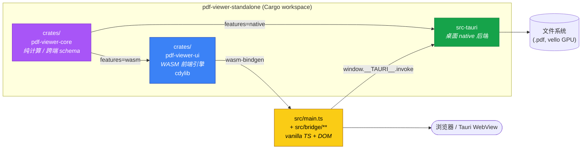
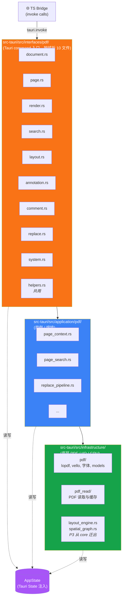
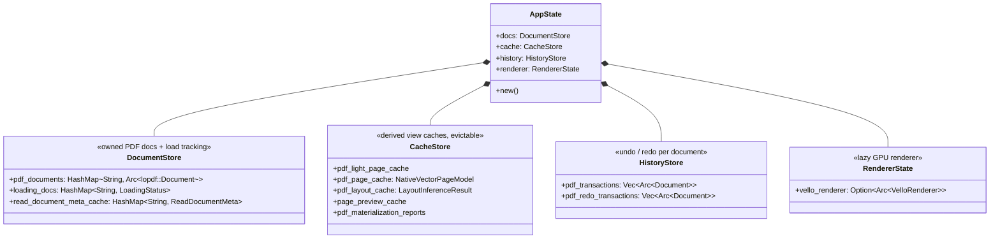
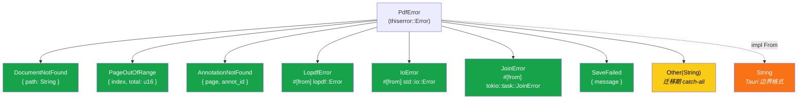
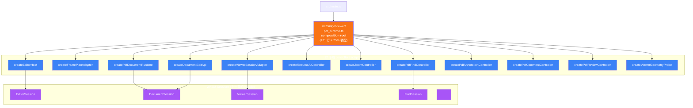
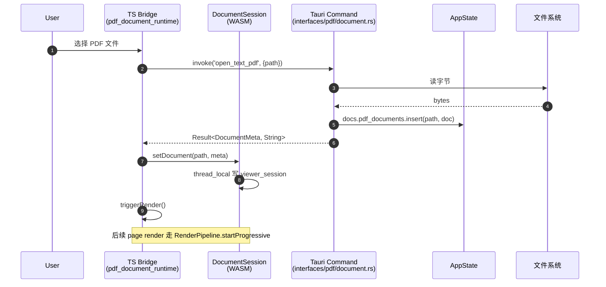
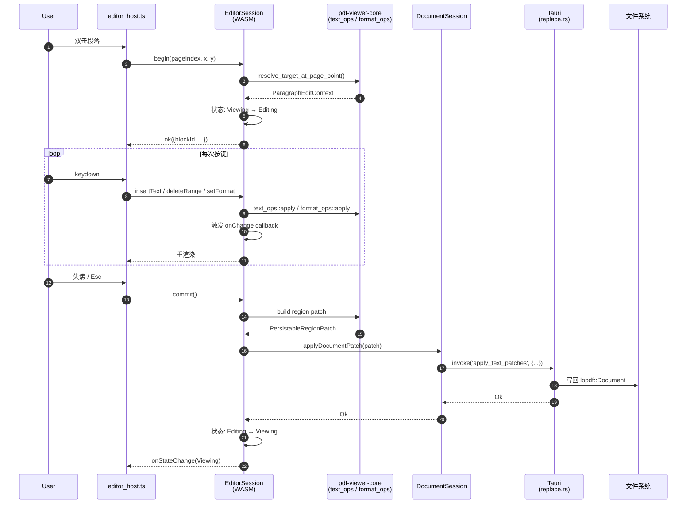
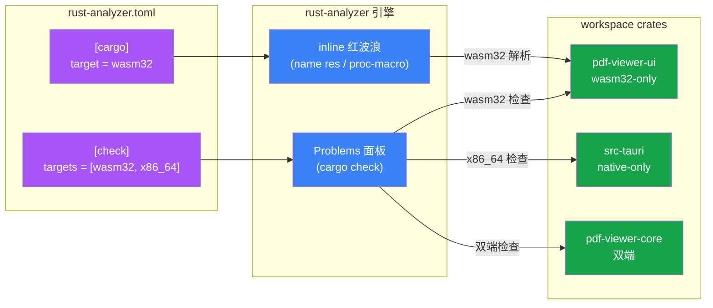

# 架构图册（重构后真实状态 · 2026-05-10）

> 所有图均依据代码静态扫描生成，非示意。最后更新日期与最后一次相关 commit 同步。

## 目录

1. [Crate 拓扑与构建目标](#1-crate-拓扑与构建目标)
2. [Tauri 后端三层架构](#2-tauri-后端三层架构)
3. [`AppState` 子存储组合](#3-appstate-子存储组合)
4. [`PdfError` 类型层次](#4-pdferror-类型层次)
5. [WASM API 表面（10 个 handle）](#5-wasm-api-表面10-个-handle)
6. [TS bridge composition root](#6-ts-bridge-composition-root)
7. [打开文档数据流](#7-打开文档数据流)
8. [文字编辑数据流（begin → commit → save）](#8-文字编辑数据流begin--commit--save)
9. [错误传播链路](#9-错误传播链路)
10. [rust-analyzer 多 target 配置](#10-rust-analyzer-多-target-配置)

---

## 1. Crate 拓扑与构建目标



| Crate | 构建 target | 职责 |
|-------|------------|------|
| `pdf-viewer-core` | wasm32 + native（feature 切换） | 纯计算、跨端共享 schema、几何/排版/文本算法 |
| `pdf-viewer-ui` | **wasm32-only**（cdylib） | WASM 前端引擎，11 个 Session/Manager handle |
| `src-tauri` | **native-only**（x86_64） | Tauri 桌面后端、PDF 文件 I/O、vello GPU 渲染 |

---

## 2. Tauri 后端三层架构



> **重构成果**：原 `interfaces/pdf.rs` 单文件 ~40 个 Tauri command 已拆为 10 个领域文件，最小 0.9 KB（system.rs），最大 7.4 KB（helpers.rs 共用工具）。

---

## 3. `AppState` 子存储组合



> **设计意图**（来自 `app_state.rs` doc-comment）：每个 sub-store 自洽，handler 可以**只取自己需要的子集**（递增重构 Law of Demeter），同时保留原 `pdf_xxx` / `read_xxx` 字段名以保护 grep。

---

## 4. `PdfError` 类型层次



> **关键设计**：`impl From<PdfError> for String` 让 `?` 操作符在仍返回 `Result<T, String>` 的旧 command 中**直接吸收**新类型错误，**渐进式迁移**不需要大爆炸重写。

---

## 5. WASM API 表面（10 个 handle）

```mermaid
graph TB
    subgraph Umbrella["crates/pdf-viewer-ui/src/api.rs<br/><i>逻辑集中：pub use 重导出</i>"]
        direction LR
        U[" "]
    end

    subgraph Domains["物理分散：每个 handle 住在自己的领域文件夹"]
        direction TB
        E["editor/editor_api.rs<br/><b>EditorSession</b><br/><i>文字编辑会话</i>"]
        D["document/document_api.rs<br/><b>DocumentSession</b><br/><i>文档生命周期</i>"]
        V["viewer/viewer_api.rs<br/><b>ViewerSession</b><br/><i>视口 / 翻页</i>"]
        F["find/find_api.rs<br/><b>FindSession</b><br/><i>文档搜索</i>"]
        R["review/review_api.rs<br/><b>ReviewSession</b><br/><i>修订接受 / 拒绝</i>"]
        C["comment/comment_api.rs<br/><b>CommentManager</b><br/><i>评论 CRUD</i>"]
        A["annotation/annotation_api.rs<br/><b>AnnotationManager</b><br/><i>注释 CRUD</i>"]
        H["history/history_api.rs<br/><b>HistoryController</b><br/><i>全局 undo/redo</i>"]
        Rd["render/render_api.rs<br/><b>RenderPipeline</b><br/><i>progressive 渲染</i>"]
        Z["zoom/zoom_api.rs<br/><b>ZoomController</b><br/><i>缩放状态机</i>"]
    end

    Umbrella -.pub use.-> E
    Umbrella -.pub use.-> D
    Umbrella -.pub use.-> V
    Umbrella -.pub use.-> F
    Umbrella -.pub use.-> R
    Umbrella -.pub use.-> C
    Umbrella -.pub use.-> A
    Umbrella -.pub use.-> H
    Umbrella -.pub use.-> Rd
    Umbrella -.pub use.-> Z

    classDef session fill:#3b82f6,color:#fff
    classDef manager fill:#16a34a,color:#fff
    classDef controller fill:#a855f7,color:#fff
    class E,D,V,F,R session
    class C,A manager
    class H,Rd,Z controller
```



> **架构原则**：领域驱动文件夹（cohesion），通过 `crate::api` umbrella 提供单点发现入口。任何新 WASM handle 都加到自己域目录里，并在 `api.rs` 加一行 `pub use`。

---

## 6. TS bridge composition root



> **不拆决策**：`pdf_runtime.ts` 是 DI 容器（参考 Spring `@Configuration` / React `App.tsx`），75% 是 `createXxx({deps})` 装配代码、10% 跨控制器编排（`renderCurrentPage` / `openTextPdfFlow` / `resetPdfViewerState`）、<1% 业务逻辑。强行按域再拆只会迁移装配位置 + 引入跨文件回调链。

---

## 7. 打开文档数据流



---

## 8. 文字编辑数据流（begin → commit → save）



---

## 9. 错误传播链路

```mermaid
graph LR
    subgraph Native["native (src-tauri)"]
        Lopdf["lopdf::Error"]
        Io["std::io::Error"]
        Join["tokio::JoinError"]

        PdfErr["PdfError enum"]
        StringErr["Result&lt;T, String&gt;<br/><i>Tauri command 签名</i>"]

        Lopdf -->|#[from]| PdfErr
        Io -->|#[from]| PdfErr
        Join -->|#[from]| PdfErr
        PdfErr -->|impl From| StringErr
    end

    subgraph Wasm["wasm (pdf-viewer-ui)"]
        EditorErr["EditorError enum"]
        DocErr["DocumentError"]
        FindErr["FindError"]
        Resp["XxxResponse&lt;T&gt;<br/>{ ok, err }"]

        EditorErr --> Resp
        DocErr --> Resp
        FindErr --> Resp
    end

    subgraph TS["TS bridge"]
        Catch["catch on session.method()"]
        UI["UI 状态 / toast"]
    end

    StringErr -->|Tauri JSON| Catch
    Resp -->|wasm-bindgen| Catch
    Catch --> UI

    classDef typed fill:#16a34a,color:#fff
    classDef boundary fill:#f97316,color:#fff
    class PdfErr,EditorErr,DocErr,FindErr typed
    class StringErr,Resp boundary
```

> **设计要点**：
> - native 侧用 typed enum 但保留 `Result<T, String>` 作为 Tauri 边界（Tauri 直接序列化字符串到 JS）
> - WASM 侧每个 Session 自带错误枚举 + `XxxResponse<T>` 包装（含 `NotImplemented` 变体表 stub）
> - **错误信息不丢失**：每层都通过 `#[from]` 或 `Display` 保留上游 `cause`

---

## 10. rust-analyzer 多 target 配置



> **取舍**：`cargo.target = wasm32` 让 `pdf-viewer-ui` 内联红波浪消失；`check.targets` 双 target 让 `cargo check` 诊断在两 crate 都干净。代价：src-tauri 的内联分析按 wasm32 解析，可能出现少量误报（不影响 cargo build）。

---

## 11. 架构约束（已知限制）

### 11.1 单页面单文档

**约束**：同一 WASM 实例同时只能打开 **一个 PDF 文档**。

**根因**：所有 Session 的状态存储在 `thread_local!` 全局变量中（WASM 单线程 = 只有一个 thread），没有按 `document_id` 分桶。具体涉及：

| thread_local | 所在文件 |
|---|---|
| `VIEWER_SESSION` | `viewer/viewer_store.rs` |
| `ZOOM_STATE` | `zoom/zoom_store.rs` |
| `FIND_SESSION` (host) | `find/host_find_store.rs` |
| `CONTROLLER` (find) | `find/find_store.rs` |
| `COMMENT_REVIEW_SESSION` | `review/review_store.rs` |
| `SESSION_STATE` (editor) | `editor/editor_store.rs` |
| `RENDER_STATE` | `render/render_store.rs` |
| `PRESENT_STATE` | `present/present_store.rs` |

**影响**：
- ❌ 同一页面无法并排打开两个 PDF（diff view）
- ❌ Tab 模式多文档需 Web Worker per tab（每个 Worker 独立 WASM 实例）
- ✅ 切换文档通过 `Application.close()` → `Application.open()` 实现，状态完全重置

**未来迁移路径**（如需多文档）：
- **方案 A（激进）**：`thread_local` → `Box<Cell<State>>` 作为 Session 字段。破坏性大。
- **方案 B（折中）**：`thread_local<State>` → `thread_local<HashMap<DocId, State>>`，方法额外接收 `doc_id`。
- **方案 C（当前）**：保持单文档，明确文档化此约束。✅ 已选择。

> 参考：Nutrient Web SDK 支持多 Instance 并存（每次 `NutrientViewer.load()` 创建独立实例）。
> 本项目选择方案 C，在真实需求出现前不承担多文档重构的复杂度成本。

---

## 附录：图册维护规则

- **数据来源**：每张图必须从代码静态扫描得来。生成方法见仓库根 `scripts/`（如有）。
- **更新触发**：动到以下任一文件需同步更新本文件：
  - `src-tauri/src/app_state.rs`、`src-tauri/src/error.rs`
  - `src-tauri/src/interfaces/pdf/*.rs`（命令拆分）
  - `crates/pdf-viewer-ui/src/api.rs`（umbrella 增减）
  - `crates/pdf-viewer-ui/src/*/{*_api}.rs`（新增 Session）
  - `src/bridge/viewer/pdf_runtime.ts`（composition root）
- **不画的图**：
  - 单文件内部状态机（保留在 doc-comment 里更易随码同步）
  - 类间继承 / trait 实现（Rust 项目这两都很少；按需画时机不到）
