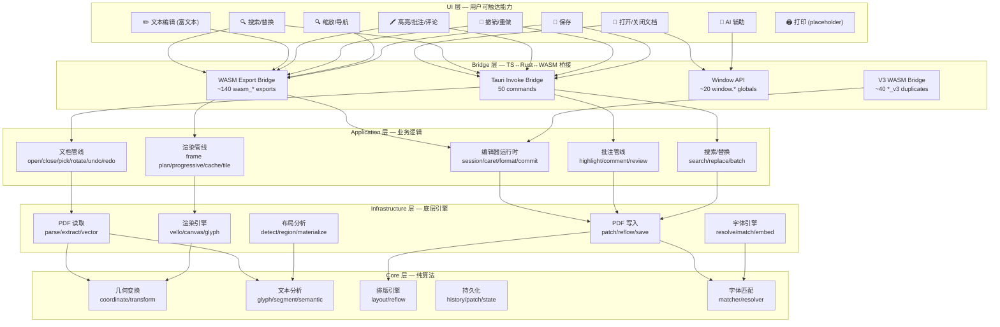
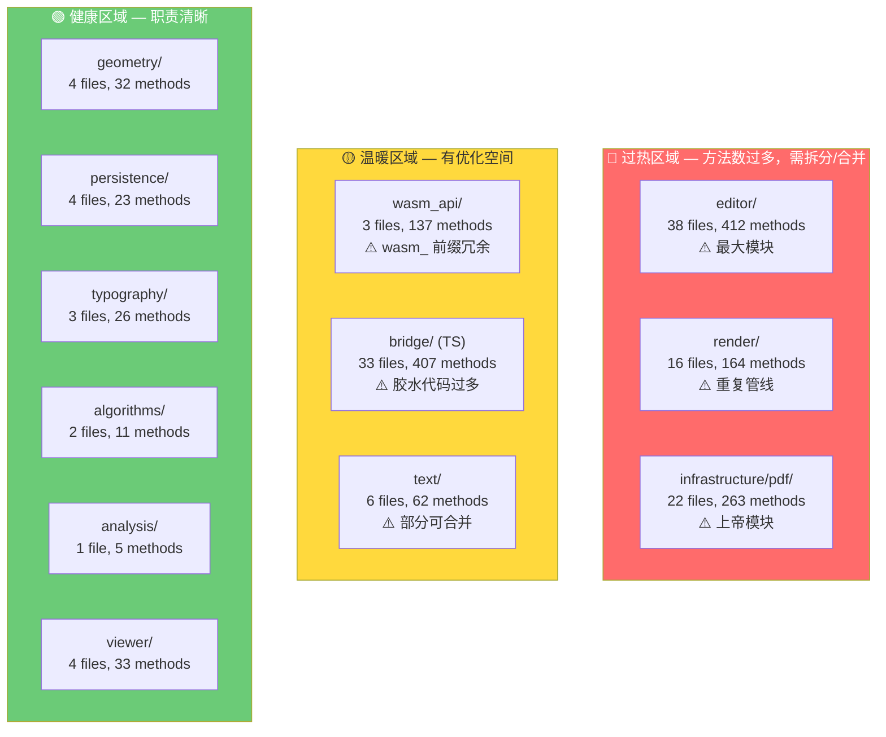

# Sovereignty PDF Viewer — 架构深度审计与能力图

> 审计范围：2,029 个方法（去噪后），204 个源文件，4 大层级
> 审计原则：精准、极简、无虚词、职责单一

---

## 1. 从顶到下能力图



---

## 2. 外部 API vs 内部 API 分类

| 层级 | 外部 API | 内部 API | 测试 | 合计 |
|------|---------|---------|------|------|
| **Frontend (TS)** | 42 | 363 | 0 | 405 |
| **Tauri Host (Rust)** | 50 | 289 | 3 | 342 |
| **WASM UI (Rust)** | 318 | 785 | 0 | 1,103 |
| **Kernel (Rust)** | 0 | 177 | 0 | 177 |
| **Utils** | 0 | 2 | 0 | 2 |
| **合计** | **410** | **1,616** | **3** | **2,029** |

### 2.1 外部 API 清单（410 个 — 跨边界调用入口）

**Tauri Commands (50)** — Frontend → Host 的 IPC 入口：
```
open_document, open_document_readonly, probe_document_kind,
release_document_cache, get_metadata, get_page_preview, prefetch_page_preview,
extract_page_info, extract_vector, extract_layout, extract_glyph_plan,
save_document, commit_document_edits, apply_region_patches,
undo_document, redo_document,
search_page_regions, search_document_regions,
extract_annotation_targets, extract_highlights, apply_highlight,
extract_comments, extract_comment_review, apply_comment, apply_comment_update,
delete_page_annotation, apply_batch_replace, apply_replace,
get_images, resolve_caret, resolve_hit, resolve_hit_target,
resolve_projection, resolve_params, init_demo, render_tile,
set_log_level, get_asset_url, pick_file, get_last_materialization_report
```

**WASM Exports (318)** — Frontend → WASM 的直接调用入口：
- `wasm_*` 前缀方法 ~140 个（编辑器/渲染/文档/缩放）
- `*_v3` 后缀方法 ~40 个（WASM V3 桥接层）
- 其他导出方法 ~138 个

**Window API (42)** — `window.*` 全局函数（UI 按钮绑定）：
```
openPdfFile, pdfPrevPage, pdfNextPage, pdfZoomChange,
pdfUndo, pdfRedo, pdfSave, pdfRotate,
toggleAddTextMode, toggleHighlightMode, toggleCommentMode,
pdfToggleBold, pdfToggleItalic, pdfToggleUnderline,
pdfSetColor, pdfSetFontFamily, pdfIncreaseFontSize, pdfDecreaseFontSize,
pdfSetFontSize, pdfSetCharSpacing, pdfSetLineHeight,
pdfSetAlignment, pdfSetListKind, pdfSetParagraphMode,
pdfSummarize, pdfToggleFind, pdfFindNext, pdfFindPrev, pdfCloseFind,
pdfToggleCommentReview, pdfToggleReview, closePdf, createDemoPdf
```

### 2.2 内部 API 分类

| 类别 | 方法数 | 说明 |
|------|--------|------|
| **渲染管线内部** | ~260 | frame plan / progressive / cache / tile / layer / scheduler |
| **编辑器内部** | ~250 | draft / session / source / target / commit / overlay |
| **PDF 读写内部** | ~200 | pdf_read / pdf_write / font_resolve / reflow / materialize |
| **缩放/视口内部** | ~120 | zoom animation / viewport culling / scroll / anchor |
| **桥接胶水代码** | ~180 | TS↔WASM 适配 / TS↔Tauri 适配 / DOM 操作 |
| **工具/辅助** | ~100 | bbox / sanitize / truncate / normalize / debug |
| **测试方法** | ~12 | 散落在生产代码中的 test_* |

---

## 3. 命名问题审计

### 3.1 🚩 严重问题：`wasm_` 前缀冗余（~40 对重复）

WASM 导出层存在 **40+ 对** `wasm_X` ↔ `X` 的完全重复命名。`wasm_` 前缀是技术实现细节，不应出现在方法名中：

| wasm_ 前缀名 | 等价内部名 | 建议 |
|---|---|---|
| `wasm_abort_render_frame` | `abort_render_frame` | 统一为 `abort_render` |
| `wasm_accept_all_review_changes` | `accept_all_review_changes` | 统一为 `accept_all_changes` |
| `wasm_apply_document_patch` | `apply_document_patch` | 统一为 `apply_patch` |
| `wasm_begin_render_frame` | `begin_render_frame` | 统一为 `begin_frame` |
| `wasm_build_editable_segments` | `build_editable_segments` | 保留内部名，导出名去掉前缀 |
| `wasm_calculate_editor_projection` | `calculate_editor_projection` | 统一为 `resolve_projection` |
| `wasm_cancel_progressive_render` | `cancel_progressive_render` | 统一为 `cancel_render` |
| `wasm_clear_find_session` | `clear_find_session` | 统一为 `clear_find` |
| `wasm_close_document_pipeline` | `close_document_pipeline` | 统一为 `close_pipeline` |
| `wasm_commit_render_frame` | `commit_render_frame` | 统一为 `commit_frame` |
| `wasm_navigate_next_page` | `navigate_next_page` | 统一为 `next_page` |
| `wasm_navigate_prev_page` | `navigate_prev_page` | 统一为 `prev_page` |
| `wasm_resolve_render_zoom` | `resolve_render_zoom` | 统一为 `resolve_zoom` |
| `wasm_start_progressive_render` | `start_progressive_render` | 统一为 `start_render` |
| `wasm_step_preview_tick` | `step_preview_host` | 统一为 `step_preview` |
| ... (共 ~40 对) | | |

**整改方案**：WASM 导出层用宏/属性自动加前缀，方法名本身不含 `wasm_`。

### 3.2 🚩 严重问题：`_v3` 后缀冗余（21 对重复）

`pkg/` 目录下存在 **21 对** `*_v3` ↔ 原名 的完全重复。这是版本迁移遗留：

```
build_editable_segments_v3 <-> build_editable_segments
build_page_region_context_v3 <-> build_page_region_context
build_persistable_save_plan_v3 <-> build_persistable_save_plan
clear_history_v3 <-> clear_history
collect_legacy_text_reflows_v3 <-> collect_legacy_text_reflows
collect_persistable_region_patches_v3 <-> collect_persistable_region_patches
convert_client_point_to_page_point_v3 <-> convert_client_point_to_page_point
derive_list_text_semantics_v3 <-> derive_list_text_semantics
distribute_text_across_runs_v3 <-> distribute_text_across_runs
is_colon_token_v3 <-> is_colon_token
looks_like_short_field_token_v3 <-> looks_like_short_field_token
measure_dom_to_page_scale_v3 <-> measure_dom_to_page_scale
preserve_changed_line_styles_v3 <-> preserve_changed_line_styles
redo_v3 <-> redo
resolve_field_hit_v3 <-> resolve_field_hit
split_runs_by_body_start_v3 <-> split_runs_by_body_start
undo_v3 <-> undo
wasm_apply_document_patch_v3 <-> wasm_apply_document_patch
wasm_render_page_v3 <-> wasm_render_page
```

**整改方案**：V3 已是唯一活跃版本，删除所有 `_v3` 后缀，旧版不存在则无需保留版本号。

### 3.3 🚩 方法名过长（40+ 字符，30+ 个）

| 方法名 | 长度 | 建议 |
|--------|------|------|
| `visual_bbox_uses_baseline_font_geometry_when_stored_bbox_is_baseline_down` | 73 | **测试名，应移至 tests/** |
| `source_text_stays_canonical_when_text_plan_has_synthetic_gap_slots` | 66 | **测试名，应移至 tests/** |
| `source_text_restores_pdf_visual_word_gaps_without_intra_word_noise` | 66 | **测试名，应移至 tests/** |
| `viewport_cull_region_covers_whole_row_for_tiled_path_suppression` | 64 | **测试名，应移至 tests/** |
| `source_layout_sanitizes_partial_underlines_for_editor_canvas` | 60 | **测试名，应移至 tests/** |
| `wasm_open_paragraph_editor_at_client_point_and_schedule_render` | 62 | → `open_editor_at_point` |
| `wasm_sync_and_commit_active_editor_text_and_schedule_render` | 59 | → `commit_editor_text` |
| `wasm_apply_active_editor_format_action_and_schedule_render` | 58 | → `apply_format` |
| `wasm_apply_region_text_replacements_and_schedule_render` | 55 | → `apply_replacements` |
| `wasm_apply_editor_input_command_and_schedule_render` | 51 | → `apply_input` |
| `sorts_unsorted_sfnt_records_without_touching_payload` | 52 | **测试名** → `sorts_unsorted_sfnt` |
| `sync_and_commit_active_editor_text_and_schedule_render` | 54 | → `commit_editor` |

**核心问题**：`_and_schedule_render` 后缀出现 **10+ 次**，这是副作用描述，不是方法名的一部分。渲染调度应由内部自动处理，不应暴露在方法签名中。

### 3.4 🚩 虚词/冗余词

| 模式 | 出现次数 | 示例 | 建议 |
|------|---------|------|------|
| `calculate_` | 3 | `calculate_editor_projection`, `calculate_reflow_displacements` | → `resolve_projection`, `resolve_displacements` |
| `get_model_` / `get_document_` | 5 | `get_pdf_metadata_from_app_state` | → `read_metadata` |
| `_from_app_state` | 4 | `get_vector_page_model_from_app_state` | → `read_vector_model` |
| `should_` | 8 | `should_merge_paragraph_objects` | 保留（布尔判断语义清晰） |
| `is_` | 15 | `is_decorative_text`, `is_cjk_unified` | 保留（布尔判断语义清晰） |
| `build_` | 40+ | `build_editable_segments`, `build_render_plan` | 保留（构造语义清晰） |
| `resolve_` | 30+ | `resolve_font_face`, `resolve_caret_index` | 保留（推导语义清晰） |

### 3.5 🚩 测试方法混入生产代码

以下 **12 个测试方法** 散落在生产源文件中，应移至 `tests/` 目录：

```
crates/pdf-viewer-core/src/geometry/layout_engine.rs:
  test_cjk_no_start_rule, test_justified_alignment

crates/pdf-viewer-ui/src/editor/document_plan.rs:
  test_bbox, test_layout_run, test_layout_run_with_char_gaps,
  test_paint_run, test_resolved_font, test_style, test_styled_run

crates/pdf-viewer-ui/src/editor/draft_layout.rs:
  test_run, test_run_with_origins

crates/pdf-viewer-ui/src/editor/source_geometry.rs:
  test_run

crates/pdf-viewer-ui/src/style_mapper.rs:
  test_deletion_at_head, test_deletion_multi_byte_chinese,
  test_full_deletion_protection
```

---

## 4. 可合并/删除的方法

### 4.1 🔴 应删除：V3 桥接层重复（21 个）

`pkg/pdf_viewer_ui/pdf_viewer_ui.d.ts` 中的 `*_v3` 方法与 `pkg/pdf_viewer_ui.d.ts` 中的 `wasm_*` 方法功能完全重复。V3 迁移完成后应删除旧版。

### 4.2 🔴 应合并：`_and_schedule_render` 模式（10 个）

所有 `*_and_schedule_render` 方法可合并为单一模式——方法本身只做逻辑操作，渲染调度由统一的 `schedule_render()` 自动触发：

| 当前名 | 合并为 |
|--------|--------|
| `wasm_apply_active_editor_format_action_and_schedule_render` | `apply_format` |
| `wasm_apply_editor_input_command_and_schedule_render` | `apply_input` |
| `wasm_apply_region_text_replacements_and_schedule_render` | `apply_replacements` |
| `wasm_close_active_editor_and_schedule_render` | `close_editor` |
| `wasm_open_paragraph_editor_at_client_point_and_schedule_render` | `open_editor_at_point` |
| `wasm_open_region_editor_and_schedule_render` | `open_region_editor` |
| `wasm_sync_active_editor_input_and_schedule_render` | `sync_input` |
| `wasm_sync_and_commit_active_editor_text_and_schedule_render` | `commit_editor` |
| `sync_active_editor_input_and_schedule_render` | `sync_input` |
| `sync_and_commit_active_editor_text_and_schedule_render` | `commit_editor` |

### 4.3 🔴 应合并：重复的渲染管线方法

WASM UI 层的 `render/` 目录有 **16 个文件、164 个方法**，但存在多套并行管线：

| 重复模式 | 文件 | 建议 |
|----------|------|------|
| `schedule_render_frame` | `facade.rs`, `scheduler.rs`, `runtime.rs`, `host_runtime.rs` | 合并到 `scheduler.rs` |
| `settle_render_frame` | `facade.rs`, `runtime.rs`, `workflow.rs` | 合并到 `workflow.rs` |
| `store_frame_cache_entry` | `facade.rs`, `runtime.rs`, `frame_cache.rs`, `tile_cache.rs` | 合并到 `frame_cache.rs` |
| `touch_frame_cache_entry` | `facade.rs`, `runtime.rs`, `frame_cache.rs`, `tile_cache.rs` | 合并到 `frame_cache.rs` |
| `reset_frame_cache` | `facade.rs`, `runtime.rs`, `frame_cache.rs` | 合并到 `frame_cache.rs` |
| `resolve_viewport_refresh` | `facade.rs`, `runtime.rs`, `frame_cache.rs` | 合并到 `frame_cache.rs` |
| `render_page` | `canvas.rs`, `progressive_workflow.rs`, `workflow.rs` | 合并入口到 `canvas.rs` |

**根因**：`present/facade.rs` → `present/runtime.rs` → `render/` 三层调用链中，facade 和 runtime 是几乎 1:1 的透传，可合并为一层。

### 4.4 🟡 应合并：bbox 工具函数散落

`bbox_height`, `bbox_width`, `bbox_intersects`, `union_bbox` 等方法在 3+ 个文件中重复定义：
- `editor/replacement_region.rs`
- `editor/source_geometry.rs`
- `editor/source_runs.rs`
- `render/effective_page_plan.rs`
- `render/source_suppression.rs`
- `render/path_suppression.rs`
- `viewport_culling.rs`

**建议**：提取到 `geometry/bbox_utils.rs`，其他文件引用。

### 4.5 🟡 应合并：sanitize 工具函数重复

`sanitize_non_negative`, `sanitize_positive` 在 3 个文件中重复：
- `host/layout.rs`
- `present/plan_builder.rs`
- `zoom/interaction.rs`

**建议**：提取到 `utils/sanitize.rs`。

### 4.6 🟡 应合并：truncate_debug_text 重复

`truncate_debug_text` 在 3 个文件中重复：
- `editor/draft_layout.rs`
- `editor/document_plan.rs`
- `render/canvas.rs`

**建议**：提取到 `utils/debug.rs`。

### 4.7 🟡 应删除：`execute_pdf_commands_v1` / `execute_pdf_commands_v1_inner`

`src-tauri/src/interfaces/multimedia/pdf.rs` 中：
- `execute_pdf_commands_v1` 只是透传到 `execute_pdf_commands_v1_inner`
- `_v1` 后缀暗示有 v2，但不存在
- **建议**：合并为 `execute_commands`

---

## 5. 能力复杂度热力图



### 过热区域详细分析

**editor/ (412 methods)** — 问题：
- `source_geometry.rs`, `source_runs.rs`, `source_text.rs`, `source_identity.rs` 四个 source_* 文件职责交叉
- `draft_layout.rs` (49 methods) 和 `edited_text_layout.rs` (3 methods) 应合并
- `engine_state.rs` (48 methods) 承担了过多 getter/setter，应拆为 data class + 行为方法
- `replacement_region.rs` (23 methods) 和 `replacement_snapshot.rs` (4 methods) 应合并

**render/ (164 methods)** — 问题：
- `facade.rs` ↔ `runtime.rs` 1:1 透传（~12 对重复方法）
- `effective_page_plan.rs` (38 methods) 过大，应拆为 `overlay_plan.rs` + `suppression_plan.rs`
- `source_suppression.rs` 和 `path_suppression.rs` 职责重叠

**infrastructure/pdf/ (263 methods)** — 问题：
- `pdf_write_font_resolver.rs` (46 methods) 是最大的单文件，应拆为 `font_resolve.rs` + `font_encode.rs` + `font_ttf.rs`
- `engine.rs` 承担了 PDF 服务的所有入口，应拆为 `read_service.rs` + `write_service.rs` + `geometry_service.rs`
- `region_materializer.rs` (25 methods) 过大，应拆为 `materialize_paragraph.rs` + `materialize_field.rs` + `materialize_list.rs`

---

## 6. 整改优先级路线图

### P0 — 立即执行（消除技术债务）

1. **删除 V3 重复**：移除 `pkg/pdf_viewer_ui/pdf_viewer_ui.d.ts` 中 21 个 `*_v3` 方法，统一到主 WASM 导出
2. **删除 `wasm_` 前缀**：40+ 对 `wasm_X` ↔ `X` 重复，WASM 导出用宏自动加前缀
3. **移除 `_and_schedule_render` 后缀**：10 个方法，渲染调度改为内部自动触发
4. **测试方法外迁**：12 个 `test_*` 方法从生产代码移至 `tests/`

### P1 — 短期整改（1-2 周）

5. **合并渲染管线**：`present/facade.rs` ↔ `present/runtime.rs` 合并，消除 12 对透传
6. **提取公共工具**：`bbox_*` → `geometry/bbox_utils.rs`，`sanitize_*` → `utils/sanitize.rs`，`truncate_*` → `utils/debug.rs`
7. **拆分 `pdf_write_font_resolver.rs`**：46 methods → 3 个文件
8. **合并 `execute_pdf_commands_v1` / `_inner`**：消除透传

### P2 — 中期优化（2-4 周）

9. **拆分 `editor/` 模块**：412 methods → 5 个子模块（source/draft/session/overlay/format）
10. **拆分 `engine.rs`**：263 methods → read/write/geometry 三个 service
11. **统一命名规范**：`calculate_` → `resolve_`，`get_model_` → `read_`，`get_document_` → 去掉
12. **清理 `window.*` API**：42 个全局函数改为类型安全的 `PdfViewerAPI` 接口

---

## 7. 不必要/过度复杂的方法

| 方法 | 问题 | 建议 |
|------|------|------|
| `wasm_step_preview_tick` | 名不副实（tick 不是预览动作） | → `step_preview` |
| `wasm_convert_client_point_to_page_point` | 过于具体 | → `resolve_page_point` |
| `wasm_measure_dom_to_page_scale` | DOM 概念不应出现在 WASM 层 | → `resolve_display_scale` |
| `wasm_editor_char_index_to_utf16_offset` | 编码转换属于基础设施 | → 移至 `text_index.rs`，不导出 |
| `wasm_editor_utf16_offset_to_char_index` | 同上 | → 移至 `text_index.rs`，不导出 |
| `wasm_get_wheel_render_pending` | 内部状态查询不应导出 | → 内部方法 |
| `wasm_set_wheel_render_pending` | 内部状态设置不应导出 | → 内部方法 |
| `wasm_peek_pending_anchor_layout` | 内部状态查询不应导出 | → 内部方法 |
| `wasm_peek_pending_anchor_scroll` | 内部状态查询不应导出 | → 内部方法 |
| `wasm_take_pending_anchor_layout` | 内部状态查询不应导出 | → 内部方法 |
| `wasm_take_pending_anchor_scroll` | 内部状态查询不应导出 | → 内部方法 |
| `wasm_take_ready_committed_frame` | 内部管线方法不应导出 | → 内部方法 |
| `wasm_queue_committed_frame` | 内部管线方法不应导出 | → 内部方法 |
| `wasm_queue_render_loop_frame` | 内部管线方法不应导出 | → 内部方法 |
| `wasm_advance_render_loop_frame` | 内部管线方法不应导出 | → 内部方法 |
| `wasm_is_render_frame_current` | 内部查询不应导出 | → 内部方法 |
| `wasm_mark_rendered_zoom` | 内部标记不应导出 | → 内部方法 |
| `wasm_store_frame_cache_entry` | 内部缓存操作不应导出 | → 内部方法 |
| `wasm_touch_frame_cache_entry` | 内部缓存操作不应导出 | → 内部方法 |
| `wasm_reset_frame_cache` | 内部缓存操作不应导出 | → 内部方法 |
| `wasm_set_visual_layout` | 内部设置不应导出 | → 内部方法 |
| `wasm_set_wheel_render_pending` | 内部状态不应导出 | → 内部方法 |

**统计**：318 个 WASM 导出中，约 **22 个** 是内部管线/缓存/状态方法，不应作为外部 API 暴露。实际外部 API 应为 **~296 个**。

---

**审计人**: Antigravity AI
**日期**: 2026-05-03
