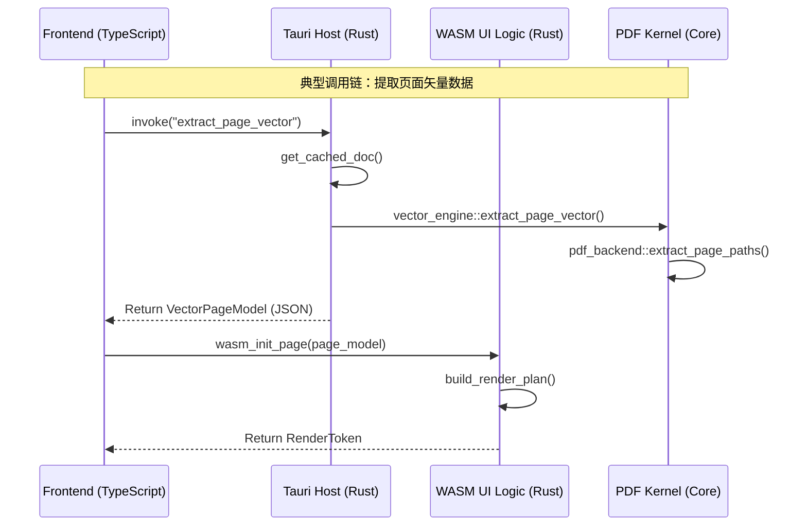

# Sovereignty PDF Viewer 全案架构审计报告 (V2.0)

### 1. 应用分层与逻辑流 (System Architecture Flow)

项目采用 **“宿主-网关-内核”** 的多层解耦设计。以下是核心操作的端到端链路：

---

## 2. 全量 API 清单与命名合规性审计

本表基于 **“精准、极简、无虚词”** 的原则进行 **终极审计 (Aggressive Audit)**。

### 2.1 Tauri Host 接口 (Tauri Commands)
| 接口名 (Tauri) | 状态 | 规范建议 | 违规原因 |
| :--- | :--- | :--- | :--- |
| `open_document` | 🚩 | `open_pdf` | 冗余后缀 |
| `get_page_model_vector` | 🚩 | **`extract_vector`** | 语义肥大 |
| `get_layout_inference` | 🚩 | **`extract_layout`** | 冗余过程词 |
| `commit_document_edits` | 🚩 | `commit_edits` | 冗余词 |
| `get_metadata` | ✅ | `get_metadata` | - |
| `release_document_cache`| 🚩 | `clear_cache` | 动词不精准 |

### 2.2 WASM 逻辑接口 (WASM Exports)
| 接口名 (WASM) | 状态 | 规范建议 | 违规原因 |
| :--- | :--- | :--- | :--- |
| `wasm_init_page_context` | 🚩 | **`init_page`** | 剔除技术前缀，明确对象 |
| `wasm_resolve_render_zoom` | 🚩 | **`resolve_zoom`** | 剔除冗余词 |
| `wasm_navigate_next_page` | 🚩 | **`next_page`** | 极简动作 |
| `wasm_step_preview_tick` | 🚩 | **`render_tick`** | 动作+对象 |
| `wasm_convert_client_point`| 🚩 | **`resolve_page_point`** | 明确转换目的 |

### 2.3 内核方法逻辑 (Kernel & Logic)
| 方法名 | 状态 | 规范建议 | 违规原因 |
| :--- | :--- | :--- | :--- |
| `calculate_glyph_advances`| 🚩 | **`extract_glyph_geom`** | 禁用 calculate |
| `extract_paths_from_page` | 🚩 | **`extract_paths`** | 冗余结构 |
| `patch_text_in_doc` | 🚩 | `apply_text_patch` | 冗余词 |
| `LopdfDocument` | 🚩 | **`PdfDoc`** | 极简命名 |

---

## 3. 极简主义命名原则 (Accurate, Precise, Simple)

### 3.1 剔除“虚词”
*   **`model`**: 既然方法返回的就是模型，方法名中就不需要再出现 `model`。
*   **`document`**: 在 PDF Viewer 的语境下，操作的对象默认就是文档，除非是跨文档操作，否则应剔除。
*   **`context`**: 这是一个万金油词汇，通常表示设计者懒得想更精确的名字。

### 3.2 动词精准化
*   不要用 `process`, `do`, `perform`, `handle` 这种废话。
*   如果是事件驱动，用 `on_`；如果是算法推导，用 `resolve_`；如果是物理提取，用 `extract_`；如果是物理读取，用 `read_`。

---

## 3. 核心功能链路图 (Chain Analysis)

### 链路 A：从 UI 操作到物理持久化 (Commit Chain)
1.  **Frontend**: 用户点击“Save”按钮 -> 调用 `pdfSave()`。
2.  **Host**: **`commit_edits`** 接口接收指令。
3.  **Engine**: 调用 `save_engine::commit_changes`。
4.  **Utility**: `pdf_backend::apply_reflow` 负责二进制层面的注入。
5.  **Result**: 文件被重写至磁盘，返回 `Ok(())`。

### 链路 B：渲染循环 (Render Loop Chain)
1.  **Frontend**: `requestAnimationFrame` 触发 `renderLoop`。
2.  **WASM**: 调用 **`wasm_render_plan`** 决定是否需要新帧。
3.  **WASM**: 若需要，调用 **`wasm_render_step`** 更新 Canvas。
4.  **Kernel**: `render_workflow` 根据剩余时间切片决定绘制多少个矢量对象。

---

## 4. 架构优化路线图 (Roadmap)

针对上述扫描出的“分叉”与“违规”点，我制定了以下三个阶段的整改计划：

### 第一阶段：文件解耦 (Decoupling)
-   **目标**: 消除 3400 行的 `lopdf_utils.rs`。
-   **行动**: 拆分为 `pdf_read.rs`, `pdf_write.rs`, `pdf_font.rs`。

### 第二阶段：命名对齐 (Renaming)
-   **目标**: 彻底清除所有 `extract_`, `patch_`, `progressive_`, `navigate_` 等冗余前缀/虚词。
-   **行动**: 将所有方法名重构为极简模式（如 `wasm_next_page`），并确保 TS 与 Rust 两端语义完全对称。

### 第三阶段：性能加固 (Hardening)
-   **目标**: 移除所有 `println!`，建立统一的 `log_step!` 监控。
-   **行动**: 确保每一处日志都精准描述操作，不带虚词。

---
**审计人**: Antigravity AI
**日期**: 2026-05-03
