# PDF 编辑器 API 架构方案

## 0. 全局命名冗余排查：结构体可表达 → 去前缀

> **原则**：一组函数共享同一前缀 → 它们属于同一领域对象 → 前缀应由结构体承载，不写在函数名里。
> 此原则适用于整个项目，不仅限于 editor 模块。

### 0.1 Rust 侧：151 个 `facade_xxx` 平铺函数 → 9 个结构体

| 领域 | facade 文件 | 函数数 | 当前命名示例 | 目标结构体 | 方法示例 |
|------|-----------|--------|------------|-----------|---------|
| 编辑器 | `editor/facade.rs` | 31 | `facade_open_editor(...)` | **`EditorSession`** | `.open_block()` |
| 文档 | `document/facade.rs` | 26 | `facade_open_document(...)` | **`DocumentSession`** | `.open()` |
| 渲染 | `render/wasm_facade.rs` | 14 | `facade_render_page(...)` | **`RenderPipeline`** | `.render_page()` |
| 标注 | `annotation/facade.rs` | 14 | `facade_add_annotation(...)` | **`AnnotationManager`** | `.add()` |
| 查看器 | `viewer/facade.rs` | 13 | `facade_set_zoom(...)` | **`Viewer`** | `.set_zoom()` |
| 搜索 | `find/*.rs` | 17 | `facade_find_text(...)` | **`FindSession`** | `.find()` |
| 缩放 | `zoom/facade.rs` | 9 | `facade_resolve_wheel_zoom(...)` | **`ZoomController`** | `.resolve_wheel()` |
| 审阅 | `review/facade.rs` | 7 | `facade_accept_change(...)` | **`ReviewSession`** | `.accept()` |
| 评论 | `comment/facade.rs` | 6 | `facade_add_comment(...)` | **`CommentManager`** | `.add()` |
| AI | `editor/ai_facade.rs` | 6 | `facade_ai_rewrite(...)` | **`AiSession`** | `.rewrite()` |
| 编辑搜索 | `editor/search_facade.rs` | 8 | `facade_search_in_editor(...)` | 并入 `EditorSession` | `.find_text()` |

### 0.2 Rust 侧：`wasm_api/viewer.rs` — 65 个平铺函数（最严重的"神文件"）

`viewer.rs` 将 5 个不相关的领域混在一个文件里，应拆为独立结构体：

| 子领域 | 函数数 | 当前函数示例 | 应属于 |
|--------|--------|------------|--------|
| 渐进渲染 | ~8 | `start_progressive_render`, `step_progressive_render` | `RenderPipeline` |
| 缩放/帧 | ~15 | `resolve_wheel_zoom`, `resolve_frame_plan`, `begin_render_frame` | `ZoomController` / `FrameManager` |
| 页面上下文 | ~5 | `init_page_context`, `update_page_viewport`, `set_page_dimensions` | `PageContext` |
| 帧缓存 | ~4 | `touch_frame_cache_entry`, `store_frame_cache_entry`, `reset_frame_cache` | `FrameCache` |
| 编辑器投影 | ~3 | `resolve_editor_projection`, `build_editable_segments` | `EditorSession` |

### 0.3 TypeScript 侧：同样的 `facadeXxx` 问题

| 文件 | 函数数 | 当前前缀 | 应改为 |
|------|--------|---------|--------|
| `editor/editor_facade.ts` | 31 | `facadeOpenEditor()` | `editor.openBlock()` |
| `editor/editor_wasm_api.ts` | ~15 | `createEditorWasmApi` 工厂 | 删除，由 `EditorSession` 替代 |
| `review/review_wasm_facade.ts` | 6 | `reviewAcceptChange()` | `review.accept()` |
| `find/find_facade.ts` | 2 | `findSetSession()` | `finder.setSession()` |
| `render/render_wasm_api.ts` | ~5 | 渲染相关 | `renderer.xxx()` |

### 0.4 内部函数的 `host_` 前缀

`wasm_api/*.rs` 中每个函数内部都调用 `host_xxx()` 函数（如 `host_start_progressive_render`）。
这个 `host_` 前缀表示"由 host 模块实现"，但调用者已经通过 `use crate::host::*` 导入，模块路径已经表达了这个信息。

**清理完成**：两轮共删除 **242 个** `as host_xxx` 别名（17 个文件）。

**第 1 轮**（140 个）：装饰性别名直接删除（7 Session API + 6 controller/store），调用方改用原函数名。
**第 2 轮**（102 个）：`wasm_api/{viewer,zoom_api,frame_api,document}.rs` 中存在结构性碰撞（WASM binding 名 = 底层函数名）。无需重命名底层函数，改用**模块路径调用**：
```rust
// Before:
use crate::render::progressive_workflow::start_progressive_render as host_start_progressive_render;
host_start_progressive_render()

// After:
use crate::render::progressive_workflow;
progressive_workflow::start_progressive_render()
```

**消歧别名的语义化**：与本地 `pub fn` / 同名导入碰撞的位置，改用语义前缀（`workflow_` / `session_` / `inner_` / `present_facade` / `zoom_host`）而非误导性的 `host_`，反映真实出处。

**剩余 38 个**：全部在 4 个 legacy `*/facade.rs`（v1 frozen 契约），TS 迁移完成后整体删除，无需清理。

### 0.5 优先级与实施进度

| 优先级 | 改造范围 | 影响函数数 | 状态 | 实际位置 |
|--------|---------|-----------|------|---------|
| **P0** | editor | 33 | ✅ 完成 | `editor/editor_api.rs` `EditorSession` |
| **P1** | `wasm_api/viewer.rs` 拆分 | 65 | ✅ 完成 | 拆为 `viewer.rs`(206) + `zoom_api.rs`(226) + `frame_api.rs`(207) |
| **P1** | document facade | 29 | ✅ 完成 | `document/document_api.rs` `DocumentSession` |
| **P2** | review | 7 | ✅ 完成 | `review/review_api.rs` `ReviewSession` |
| **P2** | comment | 16 | ✅ 完成 | `comment/comment_api.rs` `CommentManager` |
| **P2** | find | 17 | ✅ 完成 | `find/find_api.rs` `FindSession` |
| **P3** | render | 18 | ✅ 完成 | `render/render_api.rs` `RenderPipeline` |
| **P3** | zoom | 24 | ✅ 完成 | `zoom/zoom_api.rs` `ZoomController` |
| **P3** | annotation | 7 | ✅ 完成 | `annotation/annotation_api.rs` `AnnotationManager`（2 实现 + 5 stub）|
| **P4** | history | 8 | ✅ 完成 | `history/history_api.rs` `HistoryController`（Nutrient `instance.history` 对齐）|

#### 已固化的设计模式（P0–P3 一致）

1. **零大小 struct 作句柄** — `pub struct XxxSession;` + `#[wasm_bindgen(constructor)] pub fn new()`
2. **camelCase `js_name`** — Rust 用 snake_case，对 JS 暴露 camelCase
3. **薄层委托** — 所有方法 = 反序列化 + 调用 `host_*` + 序列化，零业务逻辑
4. **结构化错误** — `XxxError::NotImplemented { method }` / `InvalidState { expected, actual }` 等
5. **响应包装可选** — 有状态/有错误的 Session 用 `XxxResponse<T>`；纯 infallible delegation（如 `CommentManager`）省去
6. **类型分层** — 复杂类型放 `pdf_viewer_core::xxx::xxx_types`（无 `JsValue`）；UI 加 `ok_response`/`err_response` 辅助
7. **Facade 共存策略** — 旧 `xxxFacade*` / `xxxController*` 函数保留，TS 端可平滑迁移，不破坏冻结契约
8. **状态机仅在必要时引入** — `EditorSession` 因 `Viewing↔Editing↔EditingBlock` 才用 `SessionState` + `guard_state!`；其余 Session 各方法独立无需状态机

#### P0–P4 全部完成

9 个 Session API 共 **159 个方法**全部交付。`AnnotationManager` 的实现路径：
- 发现 PDF `/Annot` 基础设施已存在于 `document/comment.rs`（types: `PdfPageAnnotationTarget`，函数: `list_page_annotation_targets` / `delete_page_annotation`）
- 新建 `pdf_viewer_core::annotation::annotation_types` 抽出标准 PDF 域类型（`Annotation`、`AnnotationKind` 枚举、`AnnotationBBox`、`AnnotationError`、`AnnotationResponse<T>`）
- 新建 `crate::annotation::annotation_api::AnnotationManager`：
  - **已实现**（2 方法）：`list(path, pageIndex)`、`delete(path, pageIndex, id)` —— 委托现有 host
  - **保留 stub**（5 方法）：`get` / `add` / `update` / `flatten` / `readAll` —— Tauri 后端命令缺失
- **域分层**：`AnnotationManager` 负责 PDF spec `/Annot` CRUD；`CommentManager` 负责评论审阅 UX。两者共享后端存储，是 facet 而非父子。

#### TS 端迁移路径

旧 `xxxFacade*` / `xxxController*` 函数仍可调用，TS 端可以渐进式迁移：

```typescript
// Before (legacy flat function)
const result = wasm.findFacadeReadSession();
// After (struct API)
const finder = new FindSession();
const result = finder.readSession();
```

完成全部迁移后可删除 `*/facade.rs` 与 `wasm_api/zoom_api.rs` / `wasm_api/viewer.rs` / `wasm_api/frame_api.rs`（后三者目前是 P3 struct API 的内部委托对象，TS 不应直接调用）。

---

## 1. 开源/商业 PDF 框架公开 API 能力对比

### 1.1 六大框架 API 能力矩阵

| 能力域 | Nutrient (PSPDFKit) | PDF.js | pdf-lib | MuPDF | Apache PDFBox | Poppler |
|--------|:---:|:---:|:---:|:---:|:---:|:---:|
| **文档生命周期** | | | | | | |
| 加载/打开 | `load(config)` | `getDocument(src)` | `PDFDocument.load(bytes)` | `fz_open_document` | `Loader.loadPDF` | `poppler_document_new` |
| 保存/导出 | `exportPDF()` | `getData()` | `save()` / `saveAsBase64()` | `pdf_save_document` | `doc.save(file)` | — |
| 关闭/销毁 | `unload()` | `destroy()` | — | `fz_drop_document` | `doc.close()` | `g_object_unref` |
| **页面操作** | | | | | | |
| 获取页面 | `pageInfoForIndex(i)` | `getPage(i)` → `PDFPageProxy` | `getPage(i)` / `getPages()` | `fz_load_page` | `doc.getPage(i)` | `poppler_document_get_page` |
| 添加/删除页 | `applyOperations([...])` | — | `addPage()` / `removePage(i)` | `pdf_insert_page` / `pdf_delete_page` | `addPage()` / `removePage(i)` | — |
| 页面总数 | `totalPageCount` | `numPages` | `getPageCount()` | `fz_count_pages` | `getNumberOfPages()` | `poppler_document_get_n_pages` |
| **渲染** | | | | | | |
| 渲染到 canvas/image | `renderPageAsArrayBuffer` / `renderPageAsImageURL` | `page.render({canvasContext})` | — | `fz_new_pixmap_from_page` | — | `poppler_page_render` |
| 获取 viewport/变换 | `transformClientToPageSpace` / `transformPageToClientSpace` | `getViewport({scale, rotation})` | — | `fz_scale` / `fz_transform_page` | — | — |
| **文本提取** | | | | | | |
| 获取文本内容 | `getTextFromRects(page, rects)` | `getTextContent()` → `{items[{str, transform}]}` | — | `fz_new_stext_page_from_page` → `fz_stext_block` | `PDFTextStripper.getText()` | `poppler_page_get_text` |
| 按行获取 | `textLinesForPageIndex(i)` | `streamTextContent()` | — | 遍历 `fz_stext_line` | `PDFTextStripperByArea` | `poppler_page_get_text_for_area` |
| 获取文本选区 | `getTextSelection()` → `TextSelection` | — | — | — | — | — |
| **文本编辑** ⭐ | | | | | | |
| 开始编辑会话 | `beginContentEditingSession()` → `Session` | — | — | — | — | — |
| 获取文本块 | `session.getTextBlocks(page)` → `TextBlock[]` | — | — | — | — | — |
| 修改文本块 | `session.updateTextBlocks([{id, text, anchor}])` | — | `page.drawText(text, opts)` | `pdf_set_annot_contents` | `PDPageContentStream.showText` | — |
| 提交/丢弃 | `session.commit()` / `session.discard()` | — | `save()` | `pdf_save_document` | `doc.save()` | — |
| 会话状态查询 | `session.active` / `hasUnsavedContentEditingChanges()` | — | — | — | — | — |
| **批注** | | | | | | |
| 获取批注 | `getAnnotations(page)` | `page.getAnnotations()` | — | `pdf_load_annots` | `page.getAnnotations()` | `poppler_page_get_annot_mapping` |
| 创建/更新/删除 | `create(annots)` / `update(annots)` / `delete(id)` | — | — | `pdf_create_annot` / `pdf_set_annot_*` / `pdf_delete_annot` | `page.getAnnotations().add/remove` | `poppler_page_add_annot` / `poppler_page_remove_annot` |
| 选中批注 | `setSelectedAnnotations(ids)` / `getSelectedAnnotations()` | — | — | — | — | — |
| **表单** | | | | | | |
| 获取表单字段 | `getFormFields(page)` / `getFormFieldValues()` | `getFieldObjects()` | `getForm()` → `PDFForm` | `pdf_load_page_widgets` | `getDocumentCatalog().getAcroForm()` | `poppler_document_get_form_field` |
| 设置表单值 | `setFormFieldValues({name: value})` | `annotationStorage.setValue(id, v)` | `form.getTextField(name).setText(v)` | `pdf_set_widget_value` | `field.setValue(v)` | — |
| **书签/大纲** | | | | | | |
| 获取 | `getBookmarks()` / `getDocumentOutline()` | `getOutline()` | — | — | `getDocumentCatalog().getDocumentOutline()` | `poppler_index_iter_*` |
| 设置 | `setDocumentOutline(outline)` | — | — | — | `setDocumentOutline(outline)` | — |
| **搜索** | | | | | | |
| 文本搜索 | `search(query, opts)` / `startUISearch(query)` | — | — | `fz_search_stext_page` | — | `poppler_page_find_text` |
| **坐标变换** | | | | | | |
| client↔page | `transformClientToPageSpace` / `transformPageToClientSpace` | `viewport.convertToViewportPoint` | — | `fz_transform_point` | — | — |
| content 空间 | `transformContentClientToPageSpace` / `transformContentPageToClientSpace` | — | — | — | — | — |
| raw 空间 | `transformPageToRawSpace` / `transformRawToPageSpace` | — | — | — | — | — |
| **历史/撤销** | | | | | | |
| undo/redo | `history.undo()` / `history.redo()` / `history.canUndo` | — | — | — | — | — |
| **文档元数据** | | | | | | |
| 获取/设置 | `getDocumentPermissions()` | `getMetadata()` / `getDownloadInfo()` | `getTitle()` / `setTitle()` / `getAuthor()` / `setAuthor()` ... | `pdf_lookup_metadata` | `getDocumentInformation()` | `poppler_document_get_*` |
| **签名** | | | | | | |
| 数字签名 | `signDocument(args)` / `getSignaturesInfo()` | — | — | — | — | — |
| **事件系统** | | | | | | |
| 监听 | `addEventListener(type, handler)` / `removeEventListener` | — | — | — | — | — |
| 关键事件 | `annotations.willChange` / `annotations.didSave` / `viewState.change` | — | — | — | — | — |

### 1.2 关键发现

1. **只有 Nutrient 提供完整的文本编辑 Session API**（`beginContentEditingSession` → `getTextBlocks` → `updateTextBlocks` → `commit`）。其他框架要么只做渲染+提取（PDF.js、Poppler），要么只做低级内容流操作（pdf-lib、PDFBox）。

2. **Nutrient 的 Content Editor API 设计**：
   - 明确的会话生命周期：`begin → getBlocks → update → commit/discard`
   - `TextBlock` 是核心模型：`{ id, text, anchor: {x,y}, maxWidth, boundingBox }`
   - 单次只能有一个活跃会话
   - 批量更新：`updateTextBlocks` 接受数组

3. **PDF.js 的文本层设计**（我们渲染层的参考）：
   - `getTextContent()` 返回 `{ items: [{str, dir, transform, width, height, ...}] }`
   - 每个 item 是一个 text span，不是段落
   - 渲染流：`page.render({canvasContext})` → 纯 canvas 绘制
   - 文本层用 `TextLayerBuilder` 叠加 DOM span 实现选区

4. **MuPDF 的结构化文本模型**（底层参考）：
   - `fz_stext_page` → `fz_stext_block` → `fz_stext_line` → `fz_stext_char`
   - 每个 char 有 `origin`、`quad`、`font`、`size`、`color`
   - 命中测试在 block→line→char 层级逐级下钻

5. **坐标变换**：Nutrient 提供 6 个变换 API（client↔page、content↔page、raw↔page），其他框架最多 1-2 个。说明坐标变换是高频需求，应该作为独立能力暴露。

### 1.3 与本项目的能力映射

| 能力 | Nutrient 等价 API | 本项目当前实现 | 目标：`EditorSession` 方法（Rust / JS） |
|------|-------------------|---------------|----------|
| 开始编辑 | `beginContentEditingSession()` | `facadeSetEditMode(true)` + `syncTargets` | `.begin()` |
| 获取文本块 | `session.getTextBlocks(page)` | `facadeReadSnapshot().targets` | `.get_text_blocks()` / `.getTextBlocks()` |
| 点击判定 | — | 前端 div 点击 | `.hit_test(x, y, ...)` / `.hitTest(...)` |
| 打开某块 | UI 交互（点击） | `facadeOpenEditor({paragraphId, ...})` | `.open_block(id, x, y, ...)` / `.openBlock(...)` |
| 关闭当前块 | — | `facadeCloseEditor()` | `.close_block()` / `.closeBlock()` |
| 修改文本 | `session.updateTextBlocks([...])` | `facadeSyncInput({text, caretIndex})` | `.set_text(text, caret)` / `.setText(...)` |
| 插入/删除 | — | `facadeApplyCommand({command, insertedText})` | `.insert_text(text)` / `.delete_text(fwd)` |
| 移动光标 | — | `facadeMoveCaret({clientX, clientY, ...})` | `.move_caret(x, y, ...)` / `.moveCaret(...)` |
| 设置光标 | — | — | `.set_caret(index)` / `.setCaret(...)` |
| 设置选区 | — | — | `.set_selection(start, end)` |
| 格式化 | — | `facadeApplyFormat(action)` | `.apply_format(action)` / `.applyFormat(...)` |
| 获取格式状态 | — | — | `.get_format_state()` / `.getFormatState()` |
| 提交 | `session.commit()` | `facadeCommitEditor({draftText, caretIndex})` | `.commit()` |
| 丢弃 | `session.discard()` | `facadeCloseEditor()` | `.discard()` |
| 保存到文件 | `exportPDF()` / `save()` | `saveEditorSession()` | `.save(path, page_index)` |
| 会话状态查询 | `session.active` / `hasUnsavedChanges` | `facadeHasSessionChanges()` | `.is_active()` / `.has_unsaved_changes()` |
| 获取快照 | — | `facadeReadSnapshot(zoom)` | `.get_snapshot(zoom)` / `.getSnapshot(...)` |
| 绘制 canvas | — | `facadeRender(canvas)` | `.paint(canvas, zoom)` |
| 坐标变换 | `transformClientToPageSpace(point, page)` | 内嵌在各函数中 | 内嵌于 `hit_test`/`open_block`/`move_caret` |
| 搜索 | `search(query)` | — | `.find_text(query)` / `.replace_text(query, text)` |
| 撤销/重做 | `history.undo()` / `history.redo()` | — | `.undo()` / `.redo()` |

> **命名规范**：
>
> `editor_` 前缀由结构体 `EditorSession` 承载，方法名只含 **动词 + 宾语**：
>
> ```
> Rust:  let editor = EditorSession::new();
>        editor.open_block("p1", ...);
>        editor.insert_text("hello");
>        editor.commit();
>
> JS:    const editor = new EditorSession();
>        editor.openBlock("p1", ...);
>        editor.insertText("hello");
>        editor.commit();
> ```
>
> | 动词前缀 | 语义 | 示例 |
> |---------|------|------|
> | `begin` / `commit` / `discard` | 生命周期 | `.begin()`、`.commit()`、`.discard()` |
> | `open_` / `close_` | 激活/关闭 | `.open_block(id)`、`.close_block()` |
> | `get_` | 只读查询 | `.get_snapshot()`、`.get_text_blocks()`、`.get_format_state()` |
> | `is_` / `has_` | 状态谓词 | `.is_active()`、`.has_unsaved_changes()` |
> | `set_` | 设置状态 | `.set_caret()`、`.set_selection()`、`.set_text()` |
> | `insert_` / `delete_` | 文本变更 | `.insert_text()`、`.delete_text()` |
> | `move_` | 光标移动 | `.move_caret()` |
> | `apply_` | 应用操作 | `.apply_format()` |
> | `find_` / `replace_` | 搜索替换 | `.find_text()`、`.replace_text()` |
> | `hit_` | 命中测试 | `.hit_test()` |
> | `save` / `paint` | 持久化/渲染 | `.save()`、`.paint()` |

---

## 2. 当前问题

### 2.1 Rust 层 (`crates/pdf-viewer-ui/src/editor/`)

| 问题 | 证据 |
|------|------|
| **模块职责模糊** | `mode.rs` vs `host_mode.rs` vs `engine_state.rs` — 都在管"是否在编辑" |
| **命名重复** | `host_runtime.rs`、`host_snapshot.rs`、`host_workflow.rs` 全部冠以 `host_` 前缀，无明确区分 |
| **上帝模块** | `runtime.rs` 达 26KB，混杂格式状态、编辑器开关、光标、补丁创建 |
| **坐标逻辑分散** | `activation.rs`、`format/text_geometry.rs`、`draft/draft_layout.rs` 都做坐标变换 |
| **过多间接层** | `facade.rs` → `host_workflow.rs` → `activation.rs` → `runtime.rs` → `mode.rs` |

### 2.2 TypeScript 层 (`src/bridge/editor/`)

| 问题 | 证据 |
|------|------|
| **`editor_host.ts` 达 44KB** | 混杂会话管理、DOM 操作、输入处理、诊断日志 |
| **类型定义重复** | `EditorFacadeResult` 在 TS 和 Rust 各定义一份 |
| **TS 里做坐标计算** | `positionEditorShell`、`resolveTargetReferenceBox` 计算本应由 WASM 拥有的坐标 |
| **方法名过度描述实现** | `openEditorFromRootPoint`、`resolveTargetReferenceBox`、`scheduleOpenFocusStabilization` |

### 2.3 Facade 桥接层 (WASM↔JS)

| 问题 | 证据 |
|------|------|
| **27 个导出函数** | `editorFacadeOpen`、`editorFacadeMoveCaret`、`editorFacadeCommit`、`editorFacadeCommitSilent` 等 |
| **返回类型不一致** | 有的返回 `EditorFacadeResult`，有的返回 `bool`，有的返回裸 `JsValue` |
| **无批量操作** | 每次操作单独一次 JS↔WASM 调用，每次都 `build_frame_request` |

---

## 3. 新架构方案

### 3.1 WASM 公共 API（导出给 JS）

参照 Nutrient 的 `session.xxx()` 模式。**所有公共 API 集中在 `api.rs`，通过 `EditorSession` 结构体暴露**。

> `EditorSession` 是 WASM→JS 的唯一入口。内部委托给 `session.rs`、`hit_test.rs` 等模块。
> 结构体本身不持有状态（状态在 `thread_local!` 全局），仅作为命名空间和 API 边界。

```rust
#[wasm_bindgen]
pub struct EditorSession;

#[wasm_bindgen]
impl EditorSession {

    // ═══════════════════════════════════════════════
    // 构造
    // ═══════════════════════════════════════════════

    #[wasm_bindgen(constructor)]
    pub fn new() -> EditorSession { EditorSession }

    // ═══════════════════════════════════════════════
    // 1. 会话生命周期  [本次实现]
    //    对齐 Nutrient: beginContentEditingSession / commit / discard
    // ═══════════════════════════════════════════════

    pub fn begin(&self) -> JsValue;                    // → EditorResponse<Vec<TextBlock>>
    pub fn commit(&self) -> JsValue;                   // → EditorResponse<()>
    pub fn discard(&self) -> JsValue;                  // → EditorResponse<()>
    pub fn has_unsaved_changes(&self) -> bool;         // Nutrient: hasUnsavedContentEditingChanges
    pub fn is_active(&self) -> bool;                   // Nutrient: session.active
    pub fn get_state(&self) -> JsValue;                // → SessionState 枚举值

    // ═══════════════════════════════════════════════
    // 2. 点击判定 & 块操作  [本次实现]
    //    MuPDF 参考: block→line→char 逐级下钻
    // ═══════════════════════════════════════════════

    pub fn hit_test(&self,                             // → HitResult { block_id, page_x, page_y }
        client_x: f32, client_y: f32,
        ref_left: f32, ref_top: f32,
        ref_width: f32, ref_height: f32,
        page_width: f32, page_height: f32,
    ) -> JsValue;

    pub fn open_block(&self,                           // → EditorResponse<OpenResult>
        block_id: &str,
        client_x: f32, client_y: f32,
        ref_left: f32, ref_top: f32,
        ref_width: f32, ref_height: f32,
    ) -> JsValue;

    pub fn close_block(&self) -> JsValue;              // → EditorResponse<()>

    // ═══════════════════════════════════════════════
    // 3. 光标 & 选区  [本次实现]
    // ═══════════════════════════════════════════════

    pub fn move_caret(&self,                           // → EditorResponse<Option<u32>>
        client_x: f32, client_y: f32,                 //    null = 空白区域（退出信号）
        ref_left: f32, ref_top: f32,
        ref_width: f32, ref_height: f32,
    ) -> JsValue;

    pub fn set_caret(&self, char_index: u32) -> JsValue;
    pub fn set_selection(&self, start: u32, end: u32) -> JsValue;
    pub fn select_all(&self) -> JsValue;               // [预留] 全选当前块文本
    pub fn get_selection(&self) -> JsValue;            // [预留] → { start, end, text }
                                                       // Nutrient: getTextSelection()

    // ═══════════════════════════════════════════════
    // 4. 文本变更  [本次实现]
    //    对齐 Nutrient: updateTextBlocks
    // ═══════════════════════════════════════════════

    pub fn insert_text(&self, text: &str) -> JsValue;       // 光标处插入
    pub fn delete_text(&self, forward: bool) -> JsValue;    // 退格/向前删
    pub fn set_text(&self, text: &str, caret: u32) -> JsValue; // IME 整体替换

    pub fn update_text_blocks(&self,                   // [预留] 批量更新多个块
        blocks_js: JsValue,                            // Nutrient: session.updateTextBlocks([...])
    ) -> JsValue;

    // ═══════════════════════════════════════════════
    // 5. 剪贴板  [预留]
    //    标准编辑器必备，当前 stub
    // ═══════════════════════════════════════════════

    pub fn cut(&self) -> JsValue;                      // [预留] → { text, ok }
    pub fn copy(&self) -> JsValue;                     // [预留] → { text }
    pub fn paste(&self, text: &str) -> JsValue;        // [预留]

    // ═══════════════════════════════════════════════
    // 6. 撤销/重做  [预留]
    //    对齐 Nutrient: history.undo() / history.redo()
    // ═══════════════════════════════════════════════

    pub fn undo(&self) -> JsValue;                     // [预留]
    pub fn redo(&self) -> JsValue;                     // [预留]
    pub fn can_undo(&self) -> bool;                    // [预留] Nutrient: history.canUndo
    pub fn can_redo(&self) -> bool;                    // [预留] Nutrient: history.canRedo

    // ═══════════════════════════════════════════════
    // 7. 格式  [本次实现]
    // ═══════════════════════════════════════════════

    pub fn apply_format(&self, action_js: JsValue) -> JsValue;
    pub fn get_format_state(&self) -> JsValue;

    // ═══════════════════════════════════════════════
    // 8. 搜索/替换  [预留]
    //    对齐 Nutrient: search(query) / MuPDF: fz_search_stext_page
    // ═══════════════════════════════════════════════

    pub fn find_text(&self, query: &str, case_sensitive: bool) -> JsValue; // [预留] → Vec<FindMatch>
    pub fn find_next(&self) -> JsValue;                // [预留] 下一个匹配
    pub fn find_prev(&self) -> JsValue;                // [预留] 上一个匹配
    pub fn replace_text(&self,                         // [预留] 替换当前匹配
        query: &str, replacement: &str,
    ) -> JsValue;
    pub fn replace_all(&self,                          // [预留] 全部替换
        query: &str, replacement: &str,
    ) -> JsValue;

    // ═══════════════════════════════════════════════
    // 9. 坐标变换  [预留]
    //    Nutrient 提供 6 个变换 API，本项目至少需要 2 个
    // ═══════════════════════════════════════════════

    pub fn client_to_page(&self,                       // [预留] Nutrient: transformClientToPageSpace
        client_x: f32, client_y: f32,
        ref_left: f32, ref_top: f32,
        ref_width: f32, ref_height: f32,
        page_width: f32, page_height: f32,
    ) -> JsValue;                                      // → { page_x, page_y }

    pub fn page_to_client(&self,                       // [预留] Nutrient: transformPageToClientSpace
        page_x: f32, page_y: f32,
        ref_left: f32, ref_top: f32,
        ref_width: f32, ref_height: f32,
        page_width: f32, page_height: f32,
    ) -> JsValue;                                      // → { client_x, client_y }

    // ═══════════════════════════════════════════════
    // 10. 文本提取 & 结构  [预留]
    //     对齐 PDF.js: getTextContent / Nutrient: textLinesForPageIndex
    // ═══════════════════════════════════════════════

    pub fn get_text_content(&self) -> JsValue;         // [预留] → 当前块的完整文本内容
    pub fn get_text_lines(&self) -> JsValue;           // [预留] → Vec<TextLine> 按行返回
                                                       // Nutrient: textLinesForPageIndex
    pub fn get_char_rects(&self,                       // [预留] 获取字符级 bbox
        start: u32, end: u32,                          // MuPDF: fz_stext_char.quad
    ) -> JsValue;

    // ═══════════════════════════════════════════════
    // 11. 块管理  [预留]
    //     对齐 Nutrient: updateTextBlocks 可增删块
    // ═══════════════════════════════════════════════

    pub fn add_text_block(&self,                       // [预留] 在页面添加新文本块
        x: f32, y: f32,
        max_width: f32,
        text: &str,
    ) -> JsValue;                                      // → TextBlock

    pub fn delete_text_block(&self,                    // [预留] 删除文本块
        block_id: &str,
    ) -> JsValue;

    pub fn resize_text_block(&self,                    // [预留] 调整块宽度
        block_id: &str, max_width: f32,
    ) -> JsValue;

    pub fn move_text_block(&self,                      // [预留] 移动块位置
        block_id: &str, x: f32, y: f32,               // Nutrient: updateTextBlocks([{anchor}])
    ) -> JsValue;

    // ═══════════════════════════════════════════════
    // 12. 查询 & 渲染  [本次实现]
    // ═══════════════════════════════════════════════

    pub fn get_snapshot(&self, zoom: f32) -> JsValue;
    pub fn get_text_blocks(&self) -> JsValue;          // Nutrient: session.getTextBlocks(page)
    pub fn paint(&self, canvas: JsValue, zoom: f32) -> bool;

    // ═══════════════════════════════════════════════
    // 13. 事件通知  [预留]
    //     对齐 Nutrient: addEventListener / willChange / didSave
    // ═══════════════════════════════════════════════

    pub fn on_change(&self, callback: JsValue);        // [预留] 文本/格式变更通知
    pub fn on_state_change(&self, callback: JsValue);  // [预留] 会话状态变更通知
    pub fn on_selection_change(&self, callback: JsValue); // [预留] 选区变更通知

    // ═══════════════════════════════════════════════
    // 14. 持久化  [本次实现]
    // ═══════════════════════════════════════════════

    pub async fn save(&self, path: String, page_index: u16) -> JsValue;
    pub fn export_patch(&self) -> JsValue;             // [预留] 导出编辑补丁（不写文件）
    pub fn import_patch(&self, patch_js: JsValue) -> JsValue; // [预留] 导入补丁

    // ═══════════════════════════════════════════════
    // 15. 诊断 & 调试  [本次实现]
    // ═══════════════════════════════════════════════

    pub fn get_diagnostics(&self) -> JsValue;          // → 运行时诊断信息
    pub fn get_debug_snapshot(&self) -> JsValue;       // → 详细内部状态（开发用）
}
```

> **共 19 个本次实现 + 25 个预留 = 44 个方法**
> 预留方法标记 `[预留]`，实现时返回 `EditorError::NotImplemented`，不影响现有功能。
> 后续迭代按优先级逐步实现，每个预留都有对应的框架参考。

JS 调用示例：

```js
const editor = new EditorSession();
editor.begin();
const hit = editor.hitTest(clientX, clientY, ...);
if (hit.blockId) {
    editor.openBlock(hit.blockId, clientX, clientY, ...);
    editor.insertText("hello");
    editor.commit();
}
```

### 3.2 返回类型

```rust
/// 状态变更操作的统一返回。
struct EditorResult {
    ok: bool,                       // 操作是否成功/状态是否变化
    render: Option<RenderFrame>,    // 若有值，TS 需要重绘
}

/// 命中测试结果。
struct HitResult {
    block_id: Option<String>,  // null = 空白区域
    page_x: f32,
    page_y: f32,
}

/// TS 渲染用快照。
struct EditorSnapshot {
    active: bool,
    block_id: Option<String>,
    text: Option<String>,
    caret: u32,
    blocks: Vec<TextBlock>,    // 页面上所有文本块
    dirty: bool,
}

/// 页面上的一个文本块。
struct TextBlock {
    id: String,
    text: String,
    bbox: BoundingBox,  // 页面坐标系
}
```

### 3.3 Rust 内部模块结构

```
crates/pdf-viewer-ui/src/editor/
├── mod.rs              // 仅 pub re-export
├── api.rs              // WASM 导出（EditorSession struct + 19 个方法，唯一含 #[wasm_bindgen] 的文件）
├── session.rs          // 会话管理：begin/commit/discard/is_dirty/is_active
├── hit_test.rs         // 点击判定：坐标→文本块，strict + nearest
├── caret.rs            // 光标定位 + 空白检测
├── text_ops.rs         // 文本操作：insert/delete/sync
├── format_ops.rs       // 格式操作：bold/italic/color/font/list
├── layout.rs           // 文字排版：run bbox 计算
├── paint.rs            // canvas 绘制：字形、光标、选区
├── patch.rs            // 编辑补丁持久化（diff from 源 PDF）
└── types.rs            // TextBlock、EditorState 等共享类型
```

**规则：**
- 每个模块 ≤ 500 行
- 单模块最多 import 3 个兄弟模块
- `api.rs` 是唯一含 `#[wasm_bindgen]` 的文件
- 不再有 `host_` 前缀

### 3.4 TypeScript 层

```
src/bridge/editor/
├── index.ts            // 编排层：createEditor(container)，< 300 行
├── api.ts              // WASM 调用薄包装，1:1 映射，无逻辑
├── input.ts            // textarea/IME/键盘管理
├── view.ts             // shell/canvas DOM 创建 & 定位（位置从 WASM snapshot 取）
└── types.ts            // TS 接口，镜像 Rust 类型
```

**规则：**
- `index.ts` < 300 行 — 纯编排
- `api.ts` — 与 WASM `EditorSession` 1:1 对应，不含业务逻辑
- `input.ts` — 所有 textarea/键盘相关隔离于此
- `view.ts` — 仅 DOM 创建，坐标全部从 WASM snapshot 获取
- **TS 层不做任何坐标计算** — 全部由 WASM 完成

#### `types.ts` — 镜像 Rust 类型

```typescript
// ─── 响应类型 ─────────────────────────────────────
export interface EditorResponse<T = void> {
  ok: boolean;
  data?: T;
  error?: EditorError;
  render: boolean;          // TS 是否需要重绘
}

export interface EditorError {
  type: 'InvalidState' | 'NotFound' | 'Internal' | 'IoError' | 'NotImplemented';
  message: string;
}

// ─── 核心模型 ─────────────────────────────────────
export interface TextBlock {
  id: string;
  text: string;
  bbox: BoundingBox;
}

export interface BoundingBox {
  left: number; top: number; right: number; bottom: number;
}

export interface HitResult {
  blockId: string | null;
  pageX: number;
  pageY: number;
}

export interface OpenResult {
  blockId: string;
  text: string;
  caret: number;
  bbox: BoundingBox;
}

export interface EditorSnapshot {
  active: boolean;
  blockId: string | null;
  text: string | null;
  caret: number;
  blocks: TextBlock[];
  dirty: boolean;
}

export type SessionState = 'Viewing' | 'Editing' | 'EditingBlock' | 'Committing' | 'Saving';

// ─── 选区/搜索 ───────────────────────────────────
export interface TextSelection { start: number; end: number; text: string; }
export interface FindMatch { index: number; start: number; end: number; text: string; }
export interface FormatState { bold: boolean; italic: boolean; fontSize: number; fontFamily: string; color: string; }
export interface TextLine { text: string; bbox: BoundingBox; charCount: number; }
export interface PagePoint { pageX: number; pageY: number; }
export interface ClientPoint { clientX: number; clientY: number; }

// ─── 格式操作枚举 ─────────────────────────────────
export type FormatAction =
  | { type: 'ToggleBold' }
  | { type: 'ToggleItalic' }
  | { type: 'SetFontSize'; size: number }
  | { type: 'SetFontFamily'; family: string }
  | { type: 'SetColor'; color: string }
  | { type: 'SetAlignment'; align: 'left' | 'center' | 'right' }
  | { type: 'ToggleList'; listType: 'bullet' | 'numbered' };
```

#### `api.ts` — WASM 1:1 薄包装（完整接口，含预留）

```typescript
import type {
  EditorResponse, HitResult, OpenResult, TextBlock, EditorSnapshot,
  SessionState, FormatState, TextSelection, FindMatch, TextLine,
  PagePoint, ClientPoint, FormatAction,
} from './types';

// EditorSession WASM 实例（单例）
let _session: any = null;
function getSession() {
  if (!_session) { _session = new (getWasm().EditorSession)(); }
  return _session;
}

// ═══════════════════════════════════════════════════
// 1. 会话生命周期
// ═══════════════════════════════════════════════════
export function begin(): EditorResponse<TextBlock[]>   { return getSession().begin(); }
export function commit(): EditorResponse               { return getSession().commit(); }
export function discard(): EditorResponse              { return getSession().discard(); }
export function hasUnsavedChanges(): boolean            { return getSession().has_unsaved_changes(); }
export function isActive(): boolean                     { return getSession().is_active(); }
export function getState(): SessionState                { return getSession().get_state(); }

// ═══════════════════════════════════════════════════
// 2. 点击判定 & 块操作
// ═══════════════════════════════════════════════════
export function hitTest(cx: number, cy: number, rl: number, rt: number,
  rw: number, rh: number, pw: number, ph: number): HitResult {
  return getSession().hit_test(cx, cy, rl, rt, rw, rh, pw, ph);
}
export function openBlock(id: string, cx: number, cy: number,
  rl: number, rt: number, rw: number, rh: number): EditorResponse<OpenResult> {
  return getSession().open_block(id, cx, cy, rl, rt, rw, rh);
}
export function closeBlock(): EditorResponse           { return getSession().close_block(); }

// ═══════════════════════════════════════════════════
// 3. 光标 & 选区
// ═══════════════════════════════════════════════════
export function moveCaret(cx: number, cy: number,
  rl: number, rt: number, rw: number, rh: number): EditorResponse<number | null> {
  return getSession().move_caret(cx, cy, rl, rt, rw, rh);
}
export function setCaret(index: number): EditorResponse { return getSession().set_caret(index); }
export function setSelection(start: number, end: number): EditorResponse {
  return getSession().set_selection(start, end);
}
export function selectAll(): EditorResponse             { return getSession().select_all(); }      // [预留]
export function getSelection(): TextSelection | null    { return getSession().get_selection(); }   // [预留]

// ═══════════════════════════════════════════════════
// 4. 文本变更
// ═══════════════════════════════════════════════════
export function insertText(text: string): EditorResponse { return getSession().insert_text(text); }
export function deleteText(forward: boolean): EditorResponse { return getSession().delete_text(forward); }
export function setText(text: string, caret: number): EditorResponse {
  return getSession().set_text(text, caret);
}
export function updateTextBlocks(blocks: TextBlock[]): EditorResponse {                            // [预留]
  return getSession().update_text_blocks(blocks);
}

// ═══════════════════════════════════════════════════
// 5. 剪贴板  [预留]
// ═══════════════════════════════════════════════════
export function cut(): EditorResponse<string>          { return getSession().cut(); }
export function copy(): EditorResponse<string>         { return getSession().copy(); }
export function paste(text: string): EditorResponse    { return getSession().paste(text); }

// ═══════════════════════════════════════════════════
// 6. 撤销/重做  [预留]
// ═══════════════════════════════════════════════════
export function undo(): EditorResponse                 { return getSession().undo(); }
export function redo(): EditorResponse                 { return getSession().redo(); }
export function canUndo(): boolean                     { return getSession().can_undo(); }
export function canRedo(): boolean                     { return getSession().can_redo(); }

// ═══════════════════════════════════════════════════
// 7. 格式
// ═══════════════════════════════════════════════════
export function applyFormat(action: FormatAction): EditorResponse {
  return getSession().apply_format(action);
}
export function getFormatState(): FormatState           { return getSession().get_format_state(); }

// ═══════════════════════════════════════════════════
// 8. 搜索/替换  [预留]
// ═══════════════════════════════════════════════════
export function findText(query: string, caseSensitive: boolean): FindMatch[] {
  return getSession().find_text(query, caseSensitive);
}
export function findNext(): FindMatch | null           { return getSession().find_next(); }
export function findPrev(): FindMatch | null           { return getSession().find_prev(); }
export function replaceText(q: string, r: string): EditorResponse {
  return getSession().replace_text(q, r);
}
export function replaceAll(q: string, r: string): EditorResponse {
  return getSession().replace_all(q, r);
}

// ═══════════════════════════════════════════════════
// 9. 坐标变换  [预留]
// ═══════════════════════════════════════════════════
export function clientToPage(cx: number, cy: number,
  rl: number, rt: number, rw: number, rh: number,
  pw: number, ph: number): PagePoint {
  return getSession().client_to_page(cx, cy, rl, rt, rw, rh, pw, ph);
}
export function pageToClient(px: number, py: number,
  rl: number, rt: number, rw: number, rh: number,
  pw: number, ph: number): ClientPoint {
  return getSession().page_to_client(px, py, rl, rt, rw, rh, pw, ph);
}

// ═══════════════════════════════════════════════════
// 10. 文本提取 & 结构  [预留]
// ═══════════════════════════════════════════════════
export function getTextContent(): string               { return getSession().get_text_content(); }
export function getTextLines(): TextLine[]             { return getSession().get_text_lines(); }
export function getCharRects(start: number, end: number): BoundingBox[] {
  return getSession().get_char_rects(start, end);
}

// ═══════════════════════════════════════════════════
// 11. 块管理  [预留]
// ═══════════════════════════════════════════════════
export function addTextBlock(x: number, y: number, maxWidth: number, text: string): TextBlock {
  return getSession().add_text_block(x, y, maxWidth, text);
}
export function deleteTextBlock(id: string): EditorResponse { return getSession().delete_text_block(id); }
export function resizeTextBlock(id: string, maxWidth: number): EditorResponse {
  return getSession().resize_text_block(id, maxWidth);
}
export function moveTextBlock(id: string, x: number, y: number): EditorResponse {
  return getSession().move_text_block(id, x, y);
}

// ═══════════════════════════════════════════════════
// 12. 查询 & 渲染
// ═══════════════════════════════════════════════════
export function getSnapshot(zoom: number): EditorSnapshot { return getSession().get_snapshot(zoom); }
export function getTextBlocks(): TextBlock[]           { return getSession().get_text_blocks(); }
export function paint(canvas: HTMLCanvasElement, zoom: number): boolean {
  return getSession().paint(canvas, zoom);
}

// ═══════════════════════════════════════════════════
// 13. 事件通知  [预留]
// ═══════════════════════════════════════════════════
export function onChange(cb: () => void): void         { getSession().on_change(cb); }
export function onStateChange(cb: (s: SessionState) => void): void { getSession().on_state_change(cb); }
export function onSelectionChange(cb: (s: TextSelection) => void): void {
  getSession().on_selection_change(cb);
}

// ═══════════════════════════════════════════════════
// 14. 持久化
// ═══════════════════════════════════════════════════
export async function save(path: string, pageIndex: number): Promise<EditorResponse> {
  return getSession().save(path, pageIndex);
}
export function exportPatch(): unknown                 { return getSession().export_patch(); }     // [预留]
export function importPatch(patch: unknown): EditorResponse {                                      // [预留]
  return getSession().import_patch(patch);
}

// ═══════════════════════════════════════════════════
// 15. 诊断 & 调试
// ═══════════════════════════════════════════════════
export function getDiagnostics(): unknown              { return getSession().get_diagnostics(); }
export function getDebugSnapshot(): unknown            { return getSession().get_debug_snapshot(); }
```

> `api.ts` 共 44 个函数，与 Rust `EditorSession` **严格 1:1 对应**。
> TS 函数签名使用 camelCase，Rust 方法使用 snake_case，`wasm_bindgen` 自动转换。

### 3.5 统一点击流

```
用户点击页面任意位置
  │
  ▼
root.onPointerDown（单一处理器，不用 div 拦截）
  │
  ├─ 当前状态 = Viewing？
  │   └─ editor.begin()                             ← (Viewing → Editing)
  │       └─ editor.hitTest(clientX, clientY, ...)
  │           ├─ 返回 blockId → editor.openBlock(blockId, ...)   (Editing → EditingBlock)
  │           └─ 返回 null → editor.discard()                    (Editing → Viewing)
  │
  ├─ 当前状态 = Editing（瞬态，通常不会到这里）？
  │   └─ editor.discard()                           ← (Editing → Viewing)
  │
  └─ 当前状态 = EditingBlock？
      ├─ 点击在 shell 内？
      │   └─ editor.moveCaret(clientX, clientY, ...)
      │       ├─ 返回 caretIndex → 更新 textarea
      │       └─ 返回 null（空白）→ editor.close_block()   (EditingBlock → Viewing)
      │
      └─ 点击在 shell 外？
          └─ editor.hitTest(clientX, clientY, ...)
              ├─ 返回同一 block → 忽略（已在编辑）
              ├─ 返回不同 block → editor.openBlock(新id)   (auto-commit A → EditingBlock(B))
              └─ 返回 null → editor.close_block()          (EditingBlock → Viewing)
```

---

## 4. 命名对照

| 当前（差） | 新命名（`EditorSession` 方法） | Nutrient 参考 | 消除了什么冗余 |
|-----------|--------|-------------|------|
| `activate_editor_from_client_point` | `.open_block()` | UI click → open | 去掉 `activate_`、`_from_client_point` |
| `resolve_target_at_page_point` | `.hit_test()` | — | 去掉 `resolve_target_at_`，用行业术语 |
| `move_caret_to_client_point` | `.move_caret()` | — | 去掉 `_to_client_point` |
| `is_click_on_paragraph_runs` | `is_on_text()`（内部函数） | — | 精简，领域清晰 |
| `collect_paragraph_interaction_targets` | `.get_text_blocks()` | `getTextBlocks` | 行业标准，`editor_` 由结构体承载 |
| `resolve_page_point_from_projected_shell` | `client_to_page()`（内部函数） | `transformClientToPageSpace` | 描述做什么不描述怎么做 |
| `find_paragraph_shell_bbox` | `block_bbox()`（内部函数） | `boundingBox` | 简短明确 |
| `EditorVisibilityAction` | `EditorResult` | — | 不是关于 "visibility" |
| `ParagraphInteractionTarget` | `TextBlock` | `TextBlock` | 行业标准术语 |
| `host_mode` / `host_runtime` / `host_workflow` | 合并为 `session.rs` | `Session` | 去掉 `host_` 前缀 |
| `editorFacadeOpen` | `.open_block()` | session 对象方法 | 去掉 `editor` + `Facade` 双重前缀 |
| `editorFacadeMoveCaret` | `.move_caret()` | — | 同上 |
| `editorFacadeCommit` | `.commit()` | `session.commit()` | 完全对齐 Nutrient |
| `facadeHasSessionChanges` | `.has_unsaved_changes()` | `hasUnsavedChanges` | 去掉 `facade` + `Session` |
| `facadeReadSnapshot` | `.get_snapshot()` | — | 去掉 `facade` + `Read`→`get` |
| `facadeApplyFormat` | `.apply_format()` | — | 去掉 `facade` |

---

## 5. 调用链路分析

### 5.1 当前链路（以"点击打开编辑器"为例，深度 8 层）

```
用户点击
 → editor_host_view.ts: bindPrimaryPress / onRootPointerDown       ① DOM 事件
  → editor_host.ts: openEditorFromRootPoint                        ② TS 编排
   → editor_facade.ts: facadeSetEditMode                           ③ TS 包装（1 行透传）
    → facade.rs: facade_set_edit_mode                              ④ Rust facade（1 行透传）
     → host_mode.rs: set_text_edit_mode                            ⑤ Rust 中间层（1 行透传）
      → mode.rs: set_text_edit_mode_enabled                        ⑥ 实际逻辑
   → editor_facade.ts: facadeOpenEditor                            ③ TS 包装（1 行透传）
    → facade.rs: facade_open_editor                                ④ Rust facade
     → render_transaction.rs: host_open_editor_tx                  ⑤ 事务包装
      → activation.rs: activate_editor_from_client_point           ⑥ Rust 激活
       → activation.rs: resolve_target_at_page_point               ⑦ 命中测试
   → editor_facade.ts: facadeReadSnapshot                          ③ TS 包装
    → facade.rs: facade_read_snapshot                              ④ Rust facade
     → host_snapshot.rs: resolve_editor_host_snapshot              ⑤ 快照组装
```

**③④⑤ 三层全是纯透传**，无任何业务逻辑。

### 5.2 目标链路（深度 4-5 层）

```
用户点击
 → view.ts: root.onPointerDown                                    ① DOM 事件
  → index.ts: handleClick                                         ② TS 编排
   → api.ts: editor.openBlock(clientX, clientY, ref...)            ③ TS→WASM（1:1 调用）
    → api.rs: EditorSession::open_block                           ④ Rust 入口（含 hit_test + 状态切换）
```

**关键改动**：消灭 `editor_facade.ts`、`facade.rs`、`host_workflow.rs`、`render_transaction.rs` 四层透传。

### 5.3 Rust 侧应删除的纯透传层

| 文件 | 行数 | 内容 | 处理 |
|------|------|------|------|
| `host_workflow.rs` | 23 | 3 个函数全是 1 行透传到 `activation.rs` | **删除** |
| `host_mode.rs` | 39 | `toggle`/`set` 仅加 commit 守卫后调 `mode.rs` | **并入 `session.rs`** |
| `host_runtime.rs` | 64 | `begin_commit`/`finish_commit`/`set_display_zoom` | **并入 `session.rs`** |
| `host_snapshot.rs` | 177 | 快照组装 + 诊断类型 | **快照并入 `session.rs`，诊断类型移 `types.rs`** |
| `render_transaction.rs` | ~200 | 每函数 = 调业务 + build_frame_request + 包 render_frame | **删除**，`api.rs` 统一处理 |

---

## 6. TS 函数逐一分析

### 6.1 `editor_facade.ts`（303 行）→ **整个文件删除**

| 内容 | 处理 |
|------|------|
| 7 个 Request/Result 类型 | 与 Rust 重复 → 移到 `types.ts` |
| `callFacade` 通用包装 | 动态查 WASM 函数名，不类型安全 → 删除 |
| 14 个 `facadeXxx` 函数 | 每个 1 行 `callFacade(...)` → `api.ts` 直接调 WASM |
| 7 个 Stub 函数 | 未实现 → 删除 |

### 6.2 `editor_host_diagnostics.ts`（376 行）→ **删除**

全是日志格式化和过滤。应并入 Rust 结构化日志，TS 只需 `console.log(JSON.stringify(snapshot))`。

### 6.3 `editor_wasm_api.ts`（213 行）→ **大部分删除**

| 内容 | 处理 |
|------|------|
| `EditorFormatAction` 类型 | **保留** → 移到 `types.ts` |
| `RegionTextReplace*` / `Review*` 类型 | 不属于 editor → 移到各自领域的类型文件 |
| `createEditorWasmApi` 工厂函数 | 全是透传 → **删除** |

### 6.4 `editor_host.ts`（1121 行）→ **拆分+精简到 ~300 行**

#### 可以移到 Rust 的（TS 不该做的事）

| 函数 | 行 | 原因 | Rust 替代 |
|------|----|------|----------|
| `resolveRustOwnedOpenCaret` | 6 | TS 在猜 Rust 的 caret → Rust 直接返回 | `.open_block()` 返回值含 `caret` |
| `buildPointerPayload` | 11 | 每次组装 referenceBox → WASM 应自持 | WASM 持有 rootRect，TS 只传 clientX/Y |
| `resolveTargetReferenceBox` | 15 | 从 DOM 计算 target rect → WASM 已有 target 位置 | `.get_snapshot()` 直接给 client rect |
| `readRequiredRustDraftText` | 9 | 从 snapshot 取 draftText → 应保证有值 | `.get_snapshot()` 保证 `text` 非 null |
| `enableTextEditModeForPointer` | 6 | enable + syncTargets → 应是一个原子操作 | `.begin()` 内部处理 |
| `isTextEditEnabled` | 2 | 每次 round-trip 读 snapshot → Rust 缓存 | `.is_active()` |
| `commitEditor` | 33 | 从 TS 传 draftText 回 Rust → **Rust 自持 draft** | `.commit()` 无参数 |
| `commitForSave` | 31 | 同上，silent 版 | 合并到 `.commit(silent?)` |

**重点**：当前 `commitEditor` 需要 TS 把 `draftText` 和 `caretIndex` 传回 Rust，这意味着 Rust 不信任自己的状态。重构后 **Rust 自持 draft text**，TS 只管 `editor.commit()`。

#### 应删除的（调试代码/死代码）

| 函数 | 行 | 原因 |
|------|----|------|
| `scanBlueRunInCanvas` | 55 | 纯调试：扫描 canvas 蓝色像素 |
| `scanActiveBlueEvidence` | 20 | 组合多 canvas 扫描（调试） |
| `scheduleRustDiagnosticsFlush` | 11 | 延迟刷诊断日志 |
| `syncFormatButtons`（当前实现） | 15 | 硬编码默认值，未真正同步 |

#### 应合并简化的

| 当前 | 行 | 合并为 |
|------|----|--------|
| `openEditor` + `openEditorFromRootPoint` | 94+75=169 | 统一 `handleOpen`（~40 行）：都是 facadeOpen → render → positionShell → setText |
| `commitEditor` + `commitForSave` | 33+31=64 | 统一 `handleCommit(silent?)`（~15 行）：`editor.commit()` |

#### 必须保留在 TS 的（Rust 做不了）

| 函数 | 原因 |
|------|------|
| `withSuppressedNativeInput` | 浏览器 input 事件抑制 |
| `readTextareaCaret` / `writeTextareaCaret` | textarea selectionStart/End 操作 |
| `clearDomSelection` | `window.getSelection()` 清除 |
| `scheduleOpenFocusStabilization` | 延迟 focus 防 caret 跳动（浏览器行为） |
| `runFacadeRender` | 触发 TS 渲染管线 |
| textarea 事件绑定（keydown/beforeinput/composition/blur） | 浏览器 DOM API |
| shell/canvas/textarea DOM 创建 | 浏览器 DOM API |
| overlay suspend/restore | 操作其他层的 DOM display |

### 6.5 `editor_host_view.ts`（471 行）→ **精简到 ~250 行**

| 函数 | 处理 |
|------|------|
| `ensureInteractionRoot` | **保留**（纯 DOM） |
| `ensureEditorHostView` | **保留但简化**：CSS 注入只做一次，不每次检查 |
| `positionEditorShell` | **简化**：去掉 textarea font 设置（已 off-screen 不需要） |
| `renderInteractionTargets` | **简化**：target div 只做视觉（pointer-events:none），不绑事件 |
| `bindTextareaEvents` | **保留** → 移到 `input.ts` |
| overlay 管理 | **保留** |
| `bindPrimaryPress` + 去重逻辑 | **保留** |

---

## 7. 总量统计

### TS 层

| 指标 | 当前 | 重构后 |
|------|------|--------|
| 文件数 | 5 | 4（`index.ts` + `api.ts` + `input.ts` + `view.ts`） |
| 总行数 | ~2500 | ~800 |
| WASM 调用包装 | `editor_facade.ts` 303 行 | `api.ts` ~60 行 |
| 主逻辑 | `editor_host.ts` 1121 行 | `index.ts` ~300 行 |
| DOM 操作 | `editor_host_view.ts` 471 行 | `view.ts` ~250 行 |
| 输入处理 | 散在 `editor_host.ts` + `editor_host_view.ts` | `input.ts` ~190 行 |
| 诊断 | `editor_host_diagnostics.ts` 376 行 | 删除 |

### Rust 层

| 指标 | 当前 | 重构后 |
|------|------|--------|
| 透传层文件数 | 5（host_workflow/host_mode/host_runtime/host_snapshot/render_transaction） | 0 |
| facade 导出函数 | 27 | 18 |
| 总模块数 | ~30 | ~10 |

---

## 8. 错误处理策略

> **参考**：Nutrient 每个 API 方法都有明确的 `Throws` 声明；Rust 生态标准用 `Result<T, E>` + `thiserror`。

### 8.1 错误分类

| 类型 | 说明 | 处理方式 | 示例 |
|------|------|---------|------|
| **前置条件违反** | 在非法状态下调用 API | 返回 `EditorError::InvalidState` | 未 `.begin()` 就调 `.open_block()` |
| **业务失败** | 操作逻辑上无法完成 | 返回 `EditorError::NotFound` | `.hit_test()` 没有命中任何块 |
| **内部错误** | 不应发生的 bug | `tracing::error!` + 返回 `EditorError::Internal` | 空 paint plan |
| **IO 错误** | 文件保存失败 | 返回 `EditorError::IoError(msg)` | `.save()` 磁盘满 |

### 8.2 Rust 错误类型

```rust
#[derive(Debug, Clone, Serialize)]
pub enum EditorError {
    /// 在当前状态下不允许此操作（如未 .begin() 就 .open_block()）
    InvalidState { expected: &'static str, actual: &'static str },
    /// 目标未找到（如 block_id 不存在）
    NotFound { entity: &'static str, id: String },
    /// 内部错误（不应发生）
    Internal { message: String },
    /// IO 错误
    IoError { message: String },
}

/// 所有 API 返回统一 Result
#[derive(Serialize)]
pub struct EditorResponse<T: Serialize> {
    pub ok: bool,
    pub data: Option<T>,
    pub error: Option<EditorError>,
    pub render: bool,  // TS 是否需要重绘
}
```

### 8.3 JS 侧处理

```typescript
// api.ts — 统一错误处理
function callWasm<T>(fn: () => JsValue): EditorResponse<T> {
    const result = fn();
    if (!result.ok) {
        console.error(`[editor] ${result.error.type}: ${result.error.message}`);
        // InvalidState → 不弹 UI，只 log
        // IoError → 弹 toast 通知用户
    }
    return result;
}
```

### 8.4 状态守卫（参考 Nutrient Throws 语义）

每个方法入口做状态检查，不满足则立即返回错误：

```rust
// api.rs — EditorSession impl 内部
pub fn open_block(&self, block_id: &str, ...) -> JsValue {
    // 守卫：必须在编辑模式
    guard_state!(SessionState::Editing, "open_block");
    // 守卫：不能已有活跃块
    if get_active_block().is_some() {
        return err_response(EditorError::InvalidState {
            expected: "no active block",
            actual: "block already open",
        });
    }
    // ... 正常逻辑
}
```

---

## 9. 会话状态机

> **参考**：Nutrient 明确声明"只能有一个活跃会话"，且 UI 会话和 API 会话互斥。Bevy ECS 用 `States` enum 管理 app 状态。

### 9.1 状态定义

```rust
#[derive(Debug, Clone, Copy, PartialEq, Eq)]
pub enum SessionState {
    /// 查看模式，不可编辑
    Viewing,
    /// 编辑模式已激活，显示可编辑块高亮，但未打开任何块（瞬态）
    Editing,
    /// 正在编辑某个具体块
    EditingBlock { /* block_id 存在 session 中 */ },
    /// 正在保存到磁盘（防重入，异步）
    Saving,
}
```

> **注**：不需要 `Committing` 状态 — `commit()` 是同步操作，直接 `EditingBlock → Viewing`。
> 只有 `save()` 涉及异步 IO，需要 `Saving` 状态防重入。

### 9.2 状态转换图

```
                   .begin()            .open_block(id)
    Viewing ─────────────────► Editing ──────────────────► EditingBlock
       ▲                          │                          │   │   │
       │                          │ hit miss                 │   │   │
       │  .discard()              │ = .discard()             │   │   │
       ◄──────────────────────────┘                          │   │   │
       │                                                     │   │   │
       │                    .close_block()                    │   │   │
       ◄─────────────────────────────────────────────────────┘   │   │
       │                    .commit()                             │   │
       ◄─────────────────────────────────────────────────────────┘   │
       │                    .discard()                                │
       ◄─────────────────────────────────────────────────────────────┘

    块切换（EditingBlock → EditingBlock）：
       EditingBlock(A) ──.open_block(B)──► EditingBlock(B)
       （内部自动 commit A，然后打开 B）

    保存（从 EditingBlock 触发）：
       EditingBlock ──.save()──► Saving ──(完成)──► Viewing
```

> **设计原则**：
> - `close` = 关闭 = 回到 Viewing。关闭就是关闭，不承担"保持编辑态以便切换"的职责。
> - `commit` = 提交 + 关闭 = 回到 Viewing。
> - `Editing` 是瞬态：只在 `begin()` → `open_block()` 之间短暂存在（一次事件循环内完成）。
> - 块切换通过 `open_block()` 在 `EditingBlock` 状态直接调用实现（内部 auto-commit 当前块）。

### 9.3 合法转换矩阵

| 当前状态 | 允许调用 | 结果状态 | 禁止调用 |
|---------|---------|---------|---------|
| **Viewing** | `.begin()` | → Editing | `.open_block()`, `.commit()`, `.insert_text()`, ... |
| **Editing** | `.open_block(id)` | → EditingBlock | `.insert_text()`, `.move_caret()`（无活跃块） |
| **Editing** | `.discard()` | → Viewing | |
| **EditingBlock** | `.insert_text()`, `.delete_text()`, `.move_caret()`, `.apply_format()` | → EditingBlock | `.begin()`（已在编辑） |
| **EditingBlock** | `.close_block()` | → **Viewing** | |
| **EditingBlock** | `.commit()` | → **Viewing** | |
| **EditingBlock** | `.discard()` | → **Viewing** | |
| **EditingBlock** | `.open_block(新id)` | → EditingBlock(新) | （auto-commit 当前块后切换） |
| **EditingBlock** | `.save()` | → Saving → Viewing | |
| **Saving** | — (全部拒绝，防重入) | | 一切操作 |

> **关键变化**：`close_block()` 和 `commit()` 都回到 `Viewing`，不再保持 `Editing`。
> "关闭就是关闭" — 方法名语义与行为一致。
> 块切换不通过 close 实现，而是直接 `open_block(新id)` 切换。

### 9.4 实现

```rust
// session.rs
use std::cell::Cell;

thread_local! {
    static STATE: Cell<SessionState> = Cell::new(SessionState::Viewing);
}

macro_rules! guard_state {
    ($expected:pat, $fn_name:expr) => {
        let current = STATE.with(|s| s.get());
        if !matches!(current, $expected) {
            tracing::warn!(
                fn_name = $fn_name,
                expected = stringify!($expected),
                actual = ?current,
                "invalid state transition"
            );
            return err_response(EditorError::InvalidState {
                expected: stringify!($expected),
                actual: current.as_str(),
            });
        }
    };
}
```

### 9.5 统一实现模板（P0-P3 复用）

P0 的三个设计模式 — **struct 方法 + 状态守卫 + `EditorResponse<T>`** — 是所有预留方法的实现骨架。
每个方法（无论 P0 还是 P3）都遵循同一模板：

```rust
// api.rs — 统一模板
#[wasm_bindgen]
impl EditorSession {
    /// 模板结构（所有方法通用）：
    /// 1. guard_state! — 状态守卫
    /// 2. 业务逻辑委托
    /// 3. 状态转换（如有）
    /// 4. 返回 EditorResponse<T>
    pub fn xxx(&self, ...) -> JsValue {
        guard_state!(SessionState::EditingBlock, "xxx");  // ① 守卫
        let result = xxx_impl(...);                        // ② 委托
        // STATE.with(|s| s.set(...));                     // ③ 转换（可选）
        ok_response(result, need_render)                   // ④ 返回
    }
}
```

#### P0 本次实现 — 会话 + 块 + 文本 + 格式

```rust
// 会话生命周期
pub fn begin(&self) -> JsValue {
    guard_state!(SessionState::Viewing, "begin");
    let blocks = session::begin_editing();
    STATE.with(|s| s.set(SessionState::Editing));
    ok_response(blocks, true)
}

pub fn commit(&self) -> JsValue {
    guard_state!(SessionState::EditingBlock, "commit");
    let patch = patch::build_and_apply();           // 委托给 patch.rs
    STATE.with(|s| s.set(SessionState::Viewing));   // 提交 = 完成，回 Viewing
    ok_response(patch, true)
}

// 文本变更
pub fn insert_text(&self, text: &str) -> JsValue {
    guard_state!(SessionState::EditingBlock, "insert_text");
    let result = text_ops::insert(text);            // 委托给 text_ops.rs
    ok_response(result, true)
}

// 格式
pub fn apply_format(&self, action_js: JsValue) -> JsValue {
    guard_state!(SessionState::EditingBlock, "apply_format");
    let action: FormatAction = serde_wasm_bindgen::from_value(action_js)?;
    let result = format_ops::apply(action);         // 委托给 format_ops.rs
    ok_response(result, true)
}
```

#### P1 预留 — 剪贴板/撤销/搜索 **复用同一模板**

```rust
// 剪贴板 — 守卫相同，委托目标不同
pub fn cut(&self) -> JsValue {
    guard_state!(SessionState::EditingBlock, "cut");    // 同样的守卫
    // P1 实现时：
    // let selected = selection::get_selected_text();
    // text_ops::delete_selection();
    // ok_response(selected, true)
    err_response(EditorError::NotImplemented("cut"))     // 当前返回 NotImplemented
}

// 撤销 — 守卫 + 委托
pub fn undo(&self) -> JsValue {
    guard_state!(SessionState::EditingBlock, "undo");
    // P1 实现时：
    // let op = undo_history::pop_undo();
    // text_ops::apply_inverted(op);
    // ok_response((), true)
    err_response(EditorError::NotImplemented("undo"))
}

// 搜索 — 守卫范围更宽（Editing 或 EditingBlock 都可搜索）
pub fn find_text(&self, query: &str, case_sensitive: bool) -> JsValue {
    guard_state!(SessionState::Editing | SessionState::EditingBlock, "find_text");
    // P2 实现时：
    // let matches = search::find_all(query, case_sensitive);
    // ok_response(matches, false)  // 搜索不触发渲染
    err_response(EditorError::NotImplemented("find_text"))
}
```

#### P2 预留 — 块管理 **同样复用**

```rust
pub fn add_text_block(&self, x: f32, y: f32, max_width: f32, text: &str) -> JsValue {
    guard_state!(SessionState::Editing, "add_text_block");  // 必须在 Editing（非 EditingBlock）
    // P2 实现时：
    // let block = block_mgr::create(x, y, max_width, text);
    // ok_response(block, true)
    err_response(EditorError::NotImplemented("add_text_block"))
}
```

#### P3 预留 — 事件通知 **不需要守卫，但返回格式统一**

```rust
pub fn on_change(&self, callback: JsValue) -> JsValue {
    // 事件注册不需要状态守卫，任何状态都可以注册
    let func: js_sys::Function = callback.dyn_into().map_err(|_| ...)?;
    session::set_change_callback(func);
    ok_response((), false)  // 不触发渲染
}
```

#### 复用总结

| 模式 | P0 方法 | P1-P3 预留方法 | 复用方式 |
|------|---------|---------------|---------|
| `guard_state!` 宏 | `begin`, `commit`, `insert_text` 等 19 个 | `cut`, `undo`, `find_text` 等 25 个 | **完全相同** — 只是 `$expected` 状态不同 |
| `EditorResponse<T>` | `ok_response(data, render)` | `err_response(NotImplemented)` → 实现后切换为 `ok_response` | **完全相同** — T 类型不同 |
| struct 委托 | `text_ops::insert()`, `format_ops::apply()` | `search::find_all()`, `undo_history::pop()` | **相同模式** — 只是委托目标模块不同 |
| 状态转换 | `Viewing→Editing`, `EditingBlock→Editing` | `Editing→Editing`（搜索不转换） | **相同机制** — `STATE.with(|s| s.set(...))` |

> **关键**：预留方法的骨架代码（guard + return NotImplemented）在 Phase 1 就全部写好。
> 后续实现只需把 `err_response(NotImplemented)` 替换为真实的业务委托 + `ok_response`。
> **不需要修改 api.rs 的签名、不需要修改 TS api.ts、不需要修改 types.ts**。

---

## 10. 迁移路径与时间评估

### Phase 1：Rust API Shell + 删透传层（~3 天）
1. 创建 `api.rs`，定义 `EditorSession` struct + 19 个方法，直接调业务模块（跳过 facade/host_xxx/render_transaction）
2. 创建 `session.rs`（合并 `mode.rs` + `host_mode.rs` + `host_runtime.rs` + 状态机）
3. 创建 `types.rs`（`TextBlock`、`EditorResult`、`EditorError`、`SessionState`）
4. 删除 `host_workflow.rs`（23 行纯透传）
5. 旧 `facade.rs` 暂保留（TS 还在用）

### Phase 2：TS 重写（~3 天）
1. 创建 `api.ts`（~60 行），封装 `new EditorSession()` 并暴露 typed 方法
2. 创建 `types.ts`，统一类型定义
3. 创建 `input.ts`，从 `editor_host.ts` + `editor_host_view.ts` 抽出输入相关
4. 创建 `view.ts`，从 `editor_host_view.ts` 保留纯 DOM 操作
5. 创建 `index.ts`（~300 行），合并 `openEditor`+`openEditorFromRootPoint`，简化 commit

### Phase 3：删旧代码 + 日志替换（~2 天）
1. 删除 `editor_facade.ts`（303 行）
2. 删除 `editor_host.ts`（1121 行）
3. 删除 `editor_host_view.ts`（471 行）
4. 删除 `editor_host_diagnostics.ts`（376 行）
5. 删除 `editor_wasm_api.ts` 中 editor 相关（保留 review/document 类型）
6. 删除 `facade.rs` 旧导出
7. 删除 `render_transaction.rs`
8. 删除 `host_snapshot.rs`
9. 接入 `tracing` + `tracing-wasm`，替换 `dbg_event` / `[CHAIN]` 日志

### Phase 4：验证 + 回归测试（~2 天）
1. 手动验证编辑器核心流程（打开/编辑/提交/保存）
2. 验证列表标记、多段落、格式化等边缘场景
3. 激活 E2E 测试骨架，确认不回归
4. 修复集成问题

### 总时间评估

| 阶段 | 内容 | 预估工时 | 风险 |
|------|------|---------|------|
| Phase 1 | Rust API Shell + session.rs + types.rs + 删透传 | **3 天** | 低：主要是重组现有代码 |
| Phase 2 | TS 4 文件重写 + 接入新 WASM API | **3 天** | 中：DOM 事件绑定容易漏 |
| Phase 3 | 删旧代码 + 日志替换 | **2 天** | 低：已有新代码接管 |
| Phase 4 | 验证 + 回归修复 | **2 天** | 高：可能发现隐藏耦合 |
| **总计** | | **~10 个工作日** | |

> **风险因素**：
> - `runtime.rs`（26KB）的内部状态与多个模块耦合，拆分时可能发现隐式依赖
> - `editor_host.ts` 中 textarea/IME 处理有浏览器特定行为，移植需逐 case 验证
> - 现有 E2E 测试全部 `it.skip`，缺少自动化回归网，需增加手动验证时间

---

## 11. 日志与可调试性架构

### 11.1 当前问题

| 问题 | 证据 |
|------|------|
| **日志泛滥** | 355 处 `dbg_event` 调用，每次操作输出几十条，关键信息淹没 |
| **两套并行系统** | `debug_trace.rs`（ring buffer 240 条）+ `edit_chain_trace.rs`（`[CHAIN]` 前缀）互不关联 |
| **无级别过滤** | 所有日志同一优先级，无法只看 ERROR/WARN |
| **无结构化输出** | `web_sys::console::log_1` 纯文本，无法程序化查询 |
| **TS 侧 376 行诊断代码** | `editor_host_diagnostics.ts` 只做格式化，混淆责任 |
| **无 span/链路追踪** | 无法关联"一次点击"产生的所有日志 |

### 11.2 行业参考

#### Rust `tracing` 生态（tokio-rs/tracing）
- **分级**：`ERROR` > `WARN` > `INFO` > `DEBUG` > `TRACE`
- **Span 层级**：每个操作创建 span，子操作自动继承上下文
- **结构化字段**：`tracing::info!(block_id = %id, caret = %idx, "editor opened")`
- **按 target 过滤**：`editor::hit_test=debug,editor::paint=warn`
- **`tracing-wasm`**：将 tracing 输出路由到 `console.log`/`console.group`，支持 User Timing API

#### Typst 的做法
- 只在关键节点打日志（编译入口、输出阶段）
- 测试失败时生成 HTML 报告含完整 diff

### 11.3 新日志架构

```
┌────────────────────────────────────────────┐
│            tracing (Rust 标准)              │
│  ┌──────────┐  ┌──────────┐  ┌──────────┐ │
│  │  TRACE   │  │  DEBUG   │  │   INFO   │ │
│  │ 每字符   │  │ 每操作   │  │ 每会话   │ │
│  │ bbox计算 │  │ hit_test │  │ open/    │ │
│  │ run遍历  │  │ caret    │  │ commit/  │ │
│  │          │  │ format   │  │ save     │ │
│  └──────────┘  └──────────┘  └──────────┘ │
│  ┌──────────┐  ┌──────────┐               │
│  │   WARN   │  │  ERROR   │               │
│  │ 异常回退 │  │ 不可恢复 │               │
│  │ 降级处理 │  │ panic前  │               │
│  └──────────┘  └──────────┘               │
├────────────────────────────────────────────┤
│       tracing-wasm Subscriber              │
│  • console.group 按 span 折叠              │
│  • 按 target+level 过滤                    │
│  • User Timing API 性能标记                │
├────────────────────────────────────────────┤
│       浏览器 DevTools                       │
│  • 默认只显示 INFO+                        │
│  • 开发者可切换到 DEBUG/TRACE              │
│  • console filter: "editor::hit_test"      │
└────────────────────────────────────────────┘
```

### 11.4 日志分级规范

| 级别 | 使用场景 | 频率 | 示例 |
|------|---------|------|------|
| **ERROR** | 不可恢复错误，需要用户介入 | 极少 | `"patch save failed: IO error"` |
| **WARN** | 可恢复的异常，降级处理 | 每会话 < 5 条 | `"font fallback: requested X, using Y"` |
| **INFO** | 关键业务节点 | 每操作 1-2 条 | `"editor opened block=p-1 caret=5"` |
| **DEBUG** | 操作细节 | 每操作 3-5 条 | `"hit_test: nearest block=p-1 dist=12.5"` |
| **TRACE** | 算法内部 | 大量 | `"run[3] bbox=(10,20,80,35) contains=true"` |

### 11.5 Span 设计

每个 API 入口创建一个 span，所有子调用自动关联：

```rust
use tracing::{info, debug, instrument, span, Level};

#[instrument(level = "info", skip(self, client_x, client_y), fields(block_id))]
pub fn open_block(&self, block_id: &str, client_x: f32, client_y: f32, ...) -> JsValue {
    // 自动创建 span: open_block{block_id="p-1"}
    let hit = hit_test(client_x, client_y);  // 内部 debug 日志自动归属此 span
    info!(caret = %result.caret, "opened");
}

#[instrument(level = "debug")]
fn hit_test(page_x: f32, page_y: f32) -> Option<TextBlock> {
    debug!(targets = %count, "scanning");
    // TRACE 级别的逐 run 检测不会在 INFO 模式下输出
    for run in runs {
        trace!(run_id = %i, bbox = ?run.bbox, "checking");
    }
}
```

### 11.6 实现方案

```toml
# Cargo.toml
[dependencies]
tracing = "0.1"
tracing-wasm = "0.2"        # WASM → console.log 路由
tracing-subscriber = { version = "0.3", features = ["env-filter"] }
```

```rust
// lib.rs 初始化
use tracing_wasm::WASMLayerConfigBuilder;

#[wasm_bindgen(start)]
pub fn init() {
    let config = WASMLayerConfigBuilder::default()
        .set_max_level(tracing::Level::INFO)  // 默认只输出 INFO+
        .build();
    tracing_wasm::set_as_global_default_with_config(config);
}

// 运行时切换级别（供 DevTools 调用）
#[wasm_bindgen]
pub fn set_log_level(level: &str) {
    // "trace", "debug", "info", "warn", "error"
    // 动态切换 tracing-subscriber filter
}

// 运行时按模块过滤
#[wasm_bindgen]
pub fn set_log_filter(filter: &str) {
    // "editor::hit_test=debug,editor::paint=warn"
}
```

### 11.7 迁移：删除旧日志系统

| 旧系统 | 处理 |
|--------|------|
| `debug_trace.rs`（ring buffer 240 条） | **删除** → 用 `tracing` TRACE 级别替代 |
| `edit_chain_trace.rs`（`[CHAIN]` 前缀） | **删除** → 用 `tracing` INFO 级别 + span 替代 |
| `editor_host_diagnostics.ts`（376 行） | **删除** → 浏览器 DevTools 直接看 console.group |
| 355 处 `dbg_event` 调用 | **替换为 `tracing::debug!`/`trace!`** |
| `web_sys::console::log_1` 直接调用 | **替换为 `tracing::info!`** |

---

## 12. 测试架构

### 12.1 当前状况

| 层级 | 状况 |
|------|------|
| 单元测试 | 14 个文件含 `#[cfg(test)]`，覆盖布局/几何等纯逻辑 |
| WASM 集成测试 | **无** |
| E2E 测试 | `tests/e2e/` 有骨架（wdio + tauri-driver），但所有 case `it.skip` |
| 视觉回归测试 | **无** |
| 性能基准测试 | **无** |

### 12.2 行业参考

#### Typst 测试架构
- **结构**：`tests/suite/` 按功能组织输入文件，`tests/ref/` 存参考图/哈希
- **三种测试**：
  1. 断言测试（`assert.eq`）— 验证逻辑正确性
  2. 诊断测试（`// Error: 2-7 message`）— 验证错误报告
  3. 视觉测试（渲染 → 对比参考 PNG）— 验证渲染输出
- **失败报告**：自动生成 HTML diff 报告
- **哈希参考**：大文件只存哈希避免仓库膨胀

#### PDF.js 测试架构
- 单元测试：Jasmine
- 集成测试：自动渲染 PDF → canvas → 像素对比参考图
- 浏览器测试：headless Chrome/Firefox

#### Rust WASM 测试
- `wasm-bindgen-test`：在浏览器或 Node.js 中运行 Rust 测试
- 支持 headless Chrome/Firefox

### 12.3 新测试架构

```
tests/
├── unit/                          # Rust 纯逻辑单元测试
│   ├── hit_test_test.rs           # 命中测试算法
│   ├── caret_test.rs              # 光标定位算法
│   ├── layout_test.rs             # 文字排版
│   ├── text_ops_test.rs           # 文本操作（insert/delete）
│   └── patch_test.rs              # 补丁生成/应用
│
├── wasm/                          # WASM 集成测试（wasm-bindgen-test）
│   ├── editor_lifecycle_test.rs   # begin → open → edit → commit → save
│   ├── hit_test_wasm_test.rs      # 真实 PDF 数据的命中测试
│   └── format_test.rs             # 格式操作端到端
│
├── visual/                        # 视觉回归测试
│   ├── fixtures/                  # 测试用 PDF 文件
│   │   ├── simple_text.pdf
│   │   ├── multiline_paragraph.pdf
│   │   ├── list_with_markers.pdf
│   │   └── mixed_fonts.pdf
│   ├── ref/                       # 参考 PNG（或哈希）
│   │   ├── simple_text_edit.png
│   │   └── ...
│   ├── store/                     # 测试运行产生的实际输出（.gitignore）
│   └── runner.rs                  # 渲染 → 对比 → 生成 diff 报告
│
├── e2e/                           # 端到端测试（现有 wdio 框架）
│   ├── fixtures/
│   ├── specs/
│   │   ├── editor_open_close.spec.ts
│   │   ├── editor_blank_click.spec.ts
│   │   ├── editor_format.spec.ts
│   │   └── editor_save.spec.ts
│   └── wdio.conf.ts
│
└── bench/                         # 性能基准
    ├── hit_test_bench.rs          # 1000 个段落的命中测试延迟
    ├── paint_bench.rs             # 编辑器 canvas 绘制帧时间
    └── layout_bench.rs            # 文字排版性能
```

### 12.4 各层测试策略

#### 第一层：Rust 单元测试

```rust
// tests/unit/hit_test_test.rs
#[cfg(test)]
mod tests {
    use super::*;

    fn make_block(id: &str, left: f32, top: f32, right: f32, bottom: f32) -> TextBlock {
        TextBlock { id: id.into(), bbox: BoundingBox { left, top, right, bottom }, .. }
    }

    #[test]
    fn hit_inside_block() {
        let blocks = vec![make_block("p1", 10.0, 10.0, 100.0, 30.0)];
        let result = hit_test_blocks(&blocks, 50.0, 20.0);
        assert_eq!(result.unwrap().id, "p1");
    }

    #[test]
    fn hit_blank_returns_none() {
        let blocks = vec![make_block("p1", 10.0, 10.0, 100.0, 30.0)];
        let result = hit_test_blocks(&blocks, 500.0, 500.0);
        assert!(result.is_none());
    }

    #[test]
    fn hit_nearest_within_threshold() {
        let blocks = vec![make_block("p1", 10.0, 10.0, 100.0, 30.0)];
        // 距离 p1 边缘 20px（< 30px 阈值）
        let result = hit_test_blocks(&blocks, 120.0, 20.0);
        assert_eq!(result.unwrap().id, "p1");
    }

    #[test]
    fn hit_nearest_beyond_threshold() {
        let blocks = vec![make_block("p1", 10.0, 10.0, 100.0, 30.0)];
        // 距离 p1 边缘 50px（> 30px 阈值）
        let result = hit_test_blocks(&blocks, 150.0, 20.0);
        assert!(result.is_none());
    }
}
```

#### 第二层：WASM 集成测试

```rust
// tests/wasm/editor_lifecycle_test.rs
use wasm_bindgen_test::*;

wasm_bindgen_test_configure!(run_in_browser);

#[wasm_bindgen_test]
fn open_and_commit() {
    // 加载测试 PDF
    init_test_page("fixtures/simple_text.pdf", 0);
    let editor = EditorSession::new();

    // 命中测试
    let hit = editor.hit_test(50.0, 20.0, 0.0, 0.0, 600.0, 800.0, 612.0, 792.0);
    assert!(hit.block_id.is_some());

    // 打开
    let result = editor.open_block(&hit.block_id.unwrap(), 50.0, 20.0, ...);
    assert!(result.ok);
    assert!(editor.is_active());

    // 编辑
    editor.insert_text("hello");
    assert!(editor.has_unsaved_changes());

    // 提交
    let commit = editor.commit();
    assert!(commit.ok);
    assert!(!editor.is_active());
}
```

#### 第三层：视觉回归测试

参照 Typst 模式：

```rust
// tests/visual/runner.rs
fn run_visual_test(fixture: &str, test_name: &str, operations: impl FnOnce()) {
    // 1. 加载 fixture PDF
    let page = load_test_pdf(fixture, 0);

    // 2. 执行编辑操作
    operations();

    // 3. 渲染到 PNG
    let actual = render_page_to_png(&page, 2.0); // 2x 缩放

    // 4. 对比参考图
    let ref_path = format!("tests/visual/ref/{}.png", test_name);
    if Path::new(&ref_path).exists() {
        let reference = load_png(&ref_path);
        let diff = pixel_diff(&actual, &reference);
        if diff > THRESHOLD {
            // 保存 diff 图到 store/
            save_diff_report(test_name, &actual, &reference, &diff);
            panic!("visual regression: {} (diff={})", test_name, diff);
        }
    } else {
        // 首次运行，保存为参考
        save_png(&ref_path, &actual);
    }
}

#[test]
fn visual_simple_text_edit() {
    run_visual_test("simple_text.pdf", "simple_text_edit", || {
        let editor = EditorSession::new();
        editor.open_block("p1", ...);
        editor.insert_text("INSERTED");
        editor.commit();
    });
}
```

#### 第四层：E2E 测试

已有 wdio 框架，需要：
1. 准备含已知坐标段落的 fixture PDF
2. 取消 `it.skip`
3. 基于新 API 重写 helper

#### 第五层：性能基准

```rust
// tests/bench/hit_test_bench.rs
use criterion::{criterion_group, criterion_main, Criterion};

fn bench_hit_test(c: &mut Criterion) {
    let blocks = generate_blocks(1000); // 1000 个随机段落
    c.bench_function("hit_test_1000_blocks", |b| {
        b.iter(|| hit_test_blocks(&blocks, 300.0, 400.0))
    });
}

criterion_group!(benches, bench_hit_test);
criterion_main!(benches);
```

### 12.5 测试命令

```bash
# 单元测试（快，纯 CPU）
cargo test --lib

# WASM 集成测试（需要浏览器环境）
wasm-pack test --headless --chrome -- --test wasm

# 视觉回归测试
cargo test --test visual

# 更新视觉参考图（审核后提交）
cargo test --test visual -- --update-refs

# 性能基准
cargo bench

# E2E 测试（需要构建完整 app）
cd tests/e2e && npx wdio run wdio.conf.ts

# 全部测试
cargo test --workspace && wasm-pack test --headless --chrome
```

### 12.6 CI 集成

```yaml
# .github/workflows/test.yml
jobs:
  unit:
    steps:
      - cargo test --lib --workspace
  wasm:
    steps:
      - wasm-pack test --headless --chrome
  visual:
    steps:
      - cargo test --test visual
      - upload-artifact: tests/visual/store/  # 失败时上传 diff
  bench:
    steps:
      - cargo bench -- --output-format bencher
      # 对比 main 分支基线，超 10% 回归则失败
```

---

## 13. 架构图集

> 软件开发常用图型：系统架构图、模块依赖图、类图、状态机图、数据流图、序列图、组件图。
> 以下从**全局到细节**逐层展开，最后用数据流分析合理性。

### 13.1 系统架构图（C4 Level 1 — Context）

整体运行环境和外部依赖：

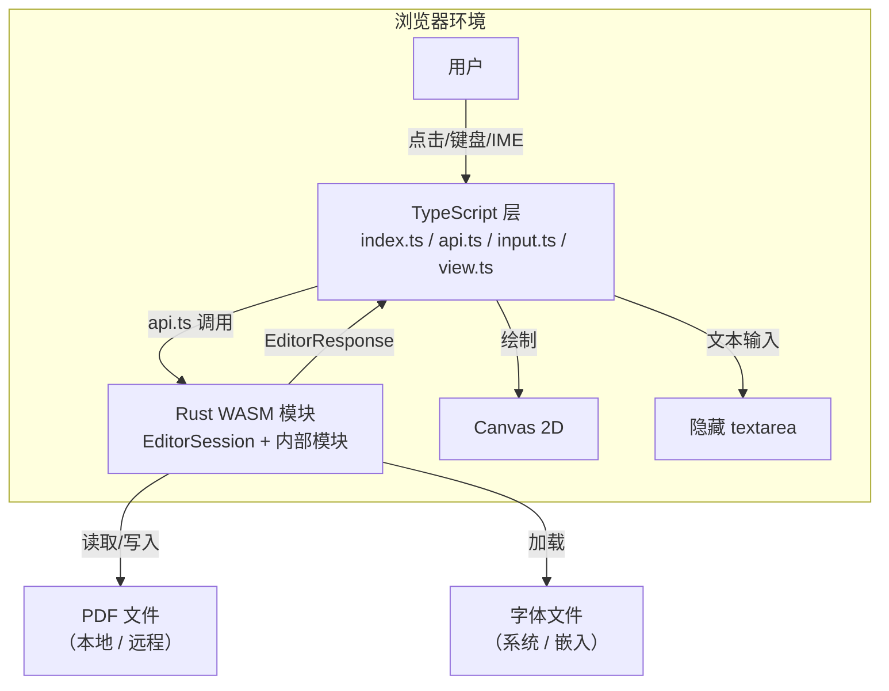

### 13.2 组件图（C4 Level 2 — Container）

TS 与 WASM 的分工边界：

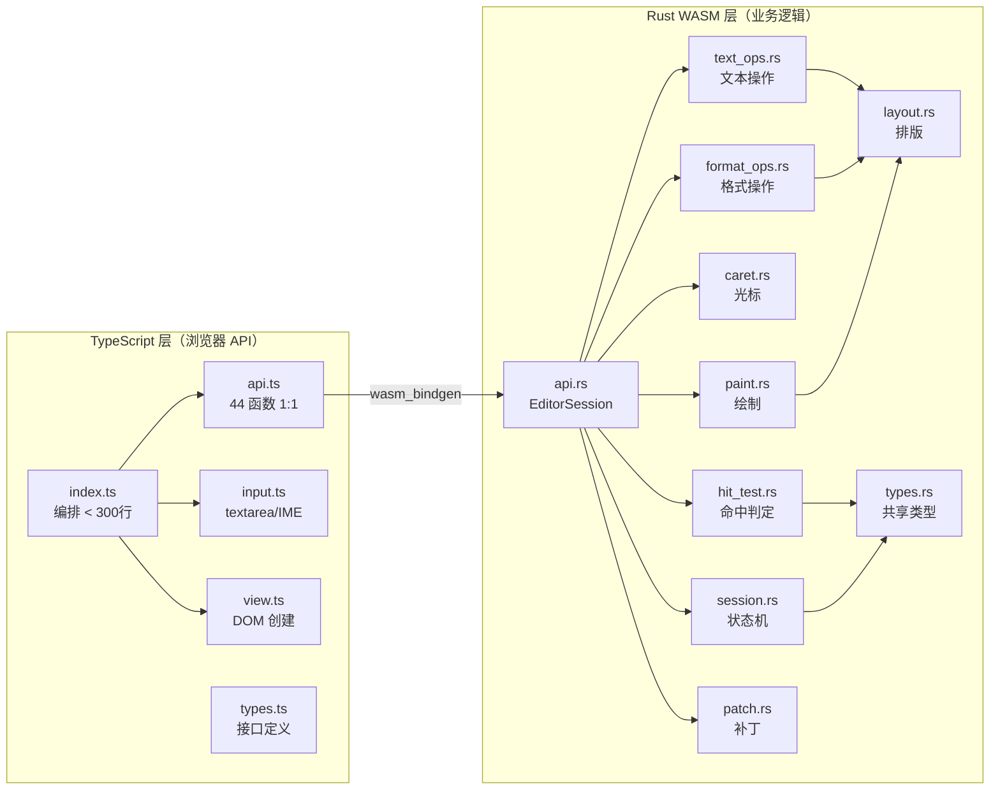

### 13.3 类图（核心类型关系）

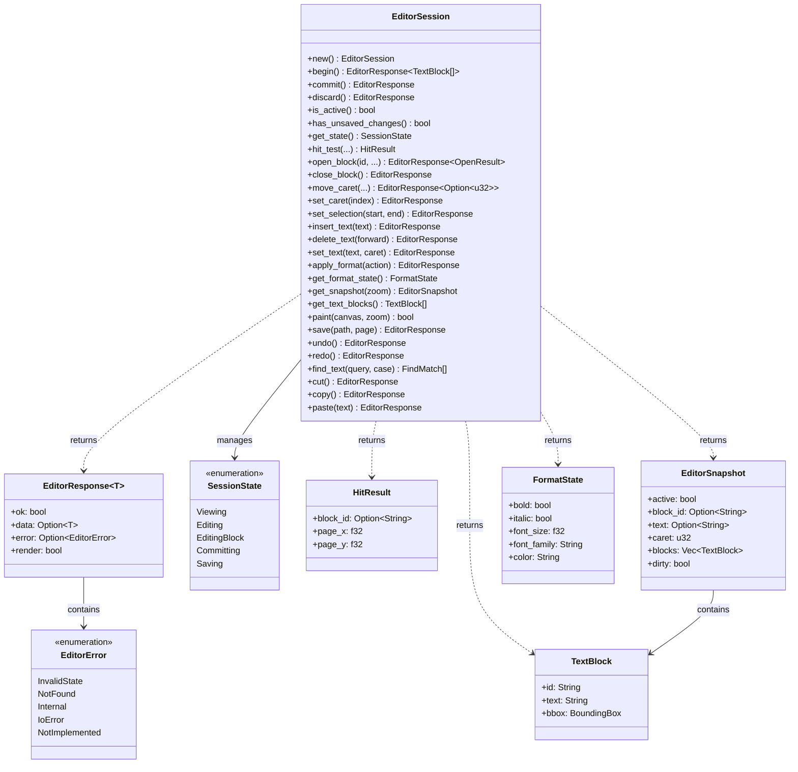

### 13.4 状态机图（Mermaid 版）

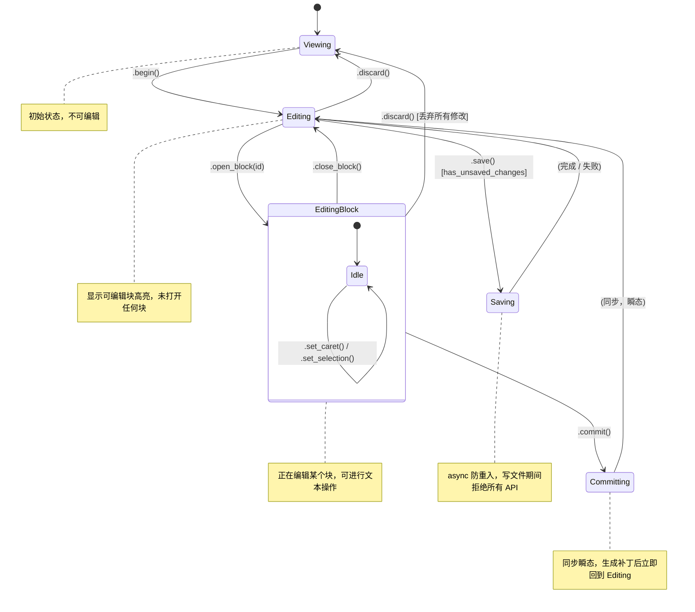

### 13.5 数据流图（DFD Level 0 + Level 1）

#### Level 0：全局数据流

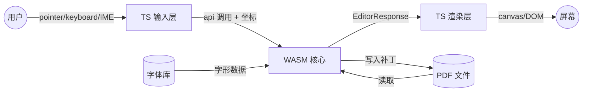

#### Level 1：点击→编辑完整数据流

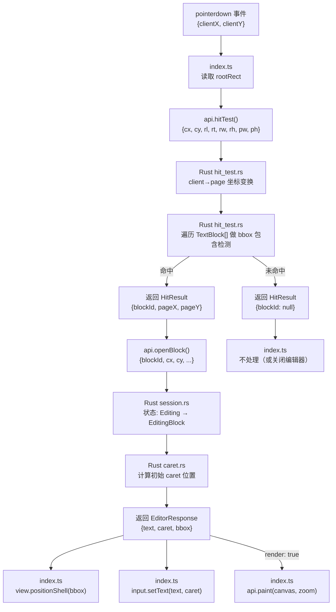

#### Level 1：输入→渲染数据流

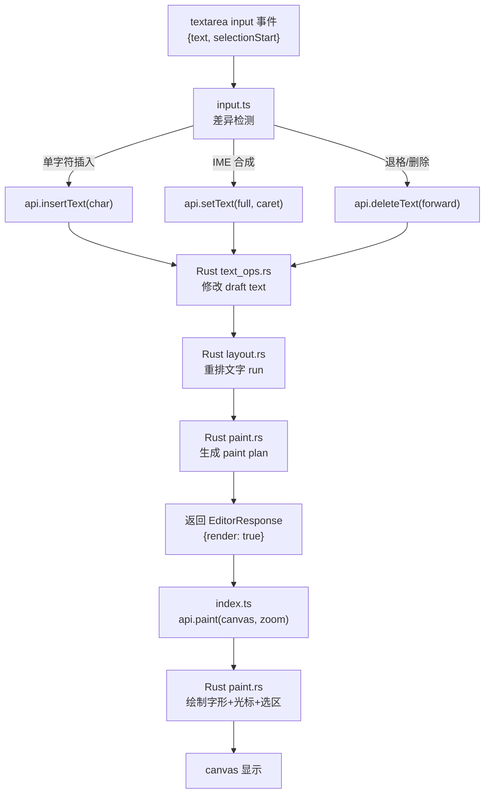

### 13.6 序列图（关键场景）

#### 场景 1：点击进入编辑

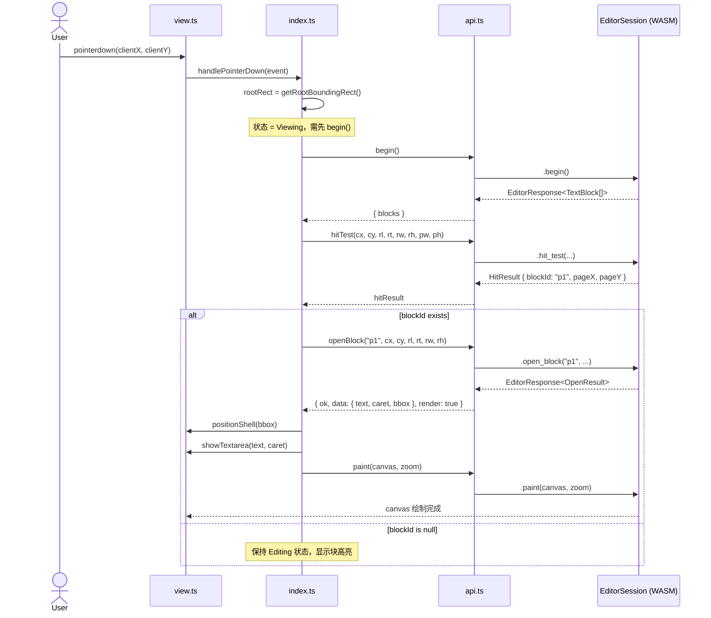

#### 场景 2：打字输入

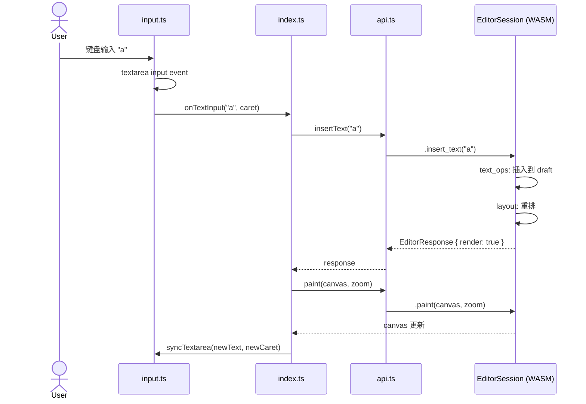

#### 场景 3：提交并保存

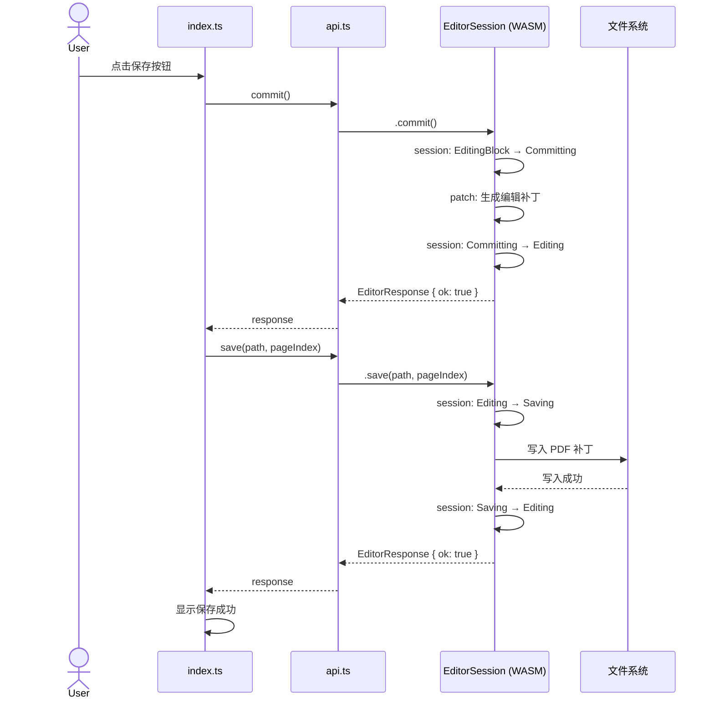

#### 场景 4：切换到另一个块（EditingBlock 状态下点击 shell 外）

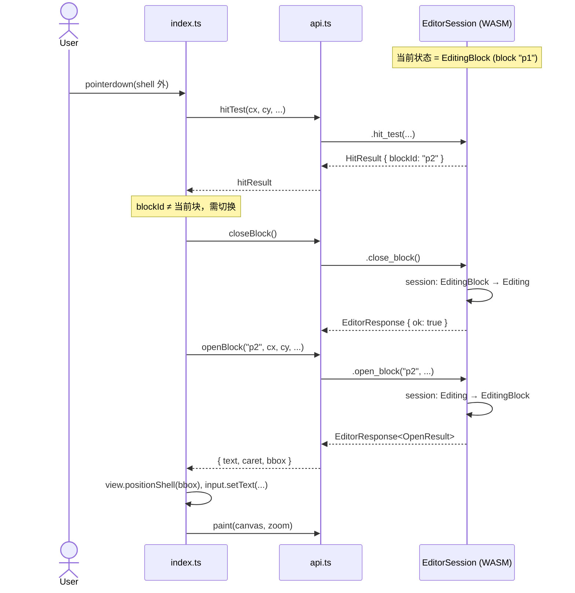

### 13.7 对照开源框架的全面合理性分析

> 对照三个层面的参考：
> - **Nutrient (PSPDFKit)**：唯一提供完整 Content Editor Session API 的商业 PDF 框架
> - **ProseMirror**：业界公认最佳富文本编辑器架构（Transaction + 不可变状态）
> - **Slate.js / Tiptap**：ProseMirror 思路的现代实现

---

#### 13.7.1 状态机对照

**Nutrient 的实际状态模型**（来源：[Content Editor API 文档](https://www.nutrient.io/guides/web/editor/content-editor-api/)）：

```
Inactive ──begin()──► Active ──commit()──► Inactive（会话结束）
                         │
                         └───discard()──► Inactive（会话结束）
```

- Nutrient 只有 **2 个状态**：Active / Inactive
- `commit()` = 保存更改 + **结束会话**
- `discard()` = 丢弃更改 + **结束会话**
- **没有 block 级别的打开/关闭** — 所有块通过 `updateTextBlocks([...])` 批量操作
- 只允许一个活跃会话，重复调用 `beginContentEditingSession()` 抛异常

**ProseMirror 的状态模型**：

```
始终 Active — 没有 begin/commit 的概念
State_n ──Transaction──► State_n+1 ──Transaction──► State_n+2
```

- **无会话概念** — 编辑器始终可编辑
- 状态不可变：`EditorState { doc, selection, storedMarks }`
- 每次修改产生 Transaction，`state.apply(tr)` 生成新状态
- Undo 通过反转 Step 实现

**本项目的 5 状态模型对照**：

| 检查项 | 结论 | 分析 |
|--------|------|------|
| Viewing → Editing 分离 | ✅ 合理 | Nutrient 也分 Inactive/Active，我们的 Viewing/Editing 等价。多出的分离让 TS 层能区分"显示块高亮"和"什么都不显示" |
| EditingBlock 子状态 | ✅ 合理但为本项目特有 | Nutrient **没有**此状态（它不用 canvas overlay 编辑单个块）。本项目用 canvas overlay + 隐藏 textarea 编辑，必须知道当前激活的是哪个块，所以 EditingBlock 是必要的 |
| Committing 瞬态 | ⚠️ 需重新考虑 | Nutrient 的 `commit()` 是 **async**（返回 Promise），写入可能耗时。但我们的 commit 是同步生成补丁（不写文件），瞬态是合理的。**不过**：如果补丁生成涉及 layout 重排，可能不是瞬间完成，建议保留此状态作为防御 |
| Saving 异步状态 | ✅ 合理 | Nutrient 的 `saveContentEditingSession()` 同样是 async + 防重入（"Throws if the session is currently being saved"）。完全对齐 |
| `commit()` 不结束会话 | ⚠️ **与 Nutrient 不同** | Nutrient: `commit()` = 保存 + 结束会话。本项目: `commit()` = 保存当前块 + 回到 Editing（可继续编辑其他块）。**这是有意为之的设计差异**：因为我们支持逐块编辑，用户可能连续编辑多个块再统一保存文件。Nutrient 没有这个需求因为它不做 block-level 激活 |

**状态机结论**：

> ✅ 核心设计合理。与 Nutrient 的关键差异是 `commit()` 语义不同（Nutrient = 结束会话，本项目 = 提交当前块）。
> 这是架构差异导致的合理偏离：我们用 canvas overlay 做单块编辑，Nutrient 用批量 API 做全页编辑。
>
> **建议**：在 API 注释中明确写出此差异，避免对齐 Nutrient 时产生误解。

---

#### 13.7.2 数据流对照

**ProseMirror 的数据流**（业界标杆）：

```
DOM Event → dispatchTransaction(tr) → state.apply(tr) → new State → view.updateState(newState)
     ↑                                                                        │
     └────────────────────── DOM 更新 ◄────────────────────────────────────────┘
```

- **严格单向**：事件 → Transaction → 新状态 → 渲染
- State 不可变，Transaction 是纯函数
- View 从新 State 差异更新 DOM

**本项目的数据流**：

```
DOM Event → api.ts (1:1 调用) → WASM EditorSession → EditorResponse → TS 渲染
     ↑                                                                    │
     └──────────────────── canvas/textarea 更新 ◄─────────────────────────┘
```

| 检查项 | 结论 | 对照分析 |
|--------|------|---------|
| **单向数据流** | ✅ 完全对齐 ProseMirror | `DOM Event → WASM → Response → 渲染`，无环形依赖。与 ProseMirror 的 `Event → Transaction → State → View` 等价 |
| **状态不可变性** | ⚠️ 部分对齐 | ProseMirror 每次生成新 State 对象。本项目用 `thread_local!` 可变状态。不影响正确性（WASM 单线程），但不利于 undo/snapshot。**建议**：undo 实现时可采用 ProseMirror 的 Step 反转模式 |
| **状态单一源** | ✅ 完全对齐 | ProseMirror: State 在 JS 内存。本项目: State 在 WASM `thread_local!`。都是单一来源 |
| **渲染触发机制** | ✅ 更优 | ProseMirror: 每次 `updateState()` 都触发 diff + DOM 更新。本项目: `EditorResponse.render=true` 时才渲染，查询操作（`is_active`、`get_format_state`）不触发渲染。**更精细** |
| **TS 层无业务逻辑** | ✅ 比 ProseMirror 更严格 | ProseMirror 的 Plugin、NodeView 在 JS 侧含业务逻辑。本项目 TS 层纯编排 + DOM，所有判断在 WASM。更干净的分层 |
| **坐标变换位置** | ✅ 对齐 Nutrient | Nutrient 提供 `transformClientToPageSpace` 等 6 个 API。本项目将坐标变换内嵌在 `hit_test`/`open_block`/`move_caret` 的参数中（传 refRect），同时预留独立的 `client_to_page`/`page_to_client`。合理 |
| **draft text 归属** | ✅ 优于 Nutrient | Nutrient: TS 侧调 `updateTextBlocks([{text: "new"}])` 传文本。本项目: WASM 自持 draft text，TS 不持有文本副本。**更安全** — 避免 TS/WASM 文本不同步 |

---

#### 13.7.3 流程对照（关键场景）

**场景 A：首次点击进入编辑**

| 步骤 | Nutrient | 本项目 | 对齐？ |
|------|---------|--------|--------|
| 1 | `instance.beginContentEditingSession()` | `editor.begin()` | ✅ |
| 2 | `session.getTextBlocks(0)` | `begin()` 返回值含 blocks | ✅ 更高效（合并为一次调用） |
| 3 | UI 自动高亮所有块 | TS 根据 blocks 显示高亮 | ✅ |
| 4 | 用户点击某块 → UI 进入块编辑 | `hitTest() + openBlock()` | ✅ 本项目显式化了这一步 |

**场景 B：编辑文本**

| 步骤 | Nutrient | ProseMirror | 本项目 | 分析 |
|------|---------|-------------|--------|------|
| 输入 | `updateTextBlocks([{id, text}])` | `state.tr.insertText("a")` | `editor.insertText("a")` | Nutrient 是整块替换，ProseMirror/本项目是增量。**本项目对齐 ProseMirror** ✅ |
| 格式 | 无（Nutrient 不支持行内格式） | `toggleMark(schema.marks.bold)` | `editor.applyFormat({type:'ToggleBold'})` | 对齐 ProseMirror ✅ |
| 撤销 | 无（Nutrient Content Editor 无 undo） | `history.undo()` — 反转 Step | `editor.undo()` [预留] | 预留合理 ✅ |
| 选区 | `getTextSelection()` | `state.selection` | `editor.getSelection()` [预留] | 对齐 ProseMirror ✅ |

**场景 C：提交并保存**

| 步骤 | Nutrient | 本项目 | 差异分析 |
|------|---------|--------|---------|
| 1 | `session.commit()` — 保存 + 结束会话 | `editor.commit()` — 保存当前块 | ⚠️ 语义不同但合理（见 13.7.1） |
| 2 | `instance.exportPDF()` / `instance.save()` | `editor.save(path, pageIndex)` | ✅ |
| 3 | `session.active === false` | `editor.isActive() === true`（仍在 Editing） | ⚠️ 差异同上 |

> **Nutrient 还有一个我们没有的**：`exportContentEditorPDF()` — 导出带未提交变更的 PDF **不结束会话**。
> 我们的 `export_patch()` [预留] 类似，但导出的是补丁而非完整 PDF。

---

#### 13.7.4 发现的问题与改进建议

| # | 问题 | 严重性 | 来源 | 建议 |
|---|------|--------|------|------|
| 1 | `close_block()` 对未保存修改的行为未定义 | 🔴 高 | Nutrient 没有此场景参考 | 明确语义：`close_block()` 应**自动 commit 当前块**再关闭，否则用户切换块时丢失修改。或者引入 `close_block(auto_commit: bool)` |
| 2 | `commit()` 语义与 Nutrient 不同 | 🟡 中 | Nutrient `commit()` = 结束会话 | 在 API 注释和文档中明确说明差异。可考虑增加 `end()` 方法 = `commit() + discard session` 对齐 Nutrient 的 commit 语义 |
| 3 | undo/redo 实现策略未定义 | 🟡 中 | ProseMirror 用 Step 反转 | 建议采用 ProseMirror 的 inverted Step 模式，而非文本快照。每次 `insert_text`/`delete_text`/`apply_format` 生成可反转 Operation |
| 4 | `begin()` 应该是幂等的 | 🟡 中 | Nutrient 重复调用抛异常 | 如果当前已经是 Editing/EditingBlock，`begin()` 应返回 `EditorError::InvalidState` 而非静默忽略。与 Nutrient "Throws if a session is already in progress" 对齐 |
| 5 | `getTextBlocks()` 缺少 pageIndex 参数 | 🟡 中 | Nutrient: `session.getTextBlocks(pageIndex)` | 当前设计只支持当前页。应增加 `page_index` 参数，或至少在注释中说明"仅返回当前编辑页的块" |
| 6 | Nutrient 所有 API 返回 Promise（async），本项目大部分 sync | 🟢 低 | Nutrient 的 server-backed 模式需要 async | 本项目 WASM 已加载，sync 更高效。合理差异，但 `save()` async 是对的 |
| 7 | 事件回调（`on_change` 等）WASM→TS 方向需技术验证 | 🟡 中 | ProseMirror 用 `dispatchTransaction` 拦截 | `wasm_bindgen` 的 `Closure<dyn FnMut()>` 可实现，但有内存管理注意事项（需手动 `forget` 或存储 Closure） |

---

#### 13.7.5 总体结论

| 维度 | 评估 | 说明 |
|------|------|------|
| **状态机设计** | ✅ 合理 | 5 状态比 Nutrient 的 2 状态更精细，适配 canvas overlay 单块编辑场景。EditingBlock 是本项目的合理创新 |
| **数据流方向** | ✅ 完全对齐业界标杆 | 与 ProseMirror 的单向数据流一致：Event → State Change → Render |
| **状态归属** | ✅ 合理 | WASM 侧持有所有状态（含 draft text），比 Nutrient（TS 传文本给 API）更安全 |
| **API 粒度** | ✅ 合理 | 增量操作（`insert_text`/`delete_text`）对齐 ProseMirror，批量操作（`update_text_blocks`）对齐 Nutrient。两种模式都预留 |
| **渲染效率** | ✅ 优于参考 | `EditorResponse.render` 精确控制渲染，避免 ProseMirror 每次 transaction 都 diff DOM |
| **需关注** | ⚠️ 3 项 | ① `close_block()` 语义需明确 ② undo 实现建议用 Step 反转 ③ 事件回调需技术验证 |

> 核心架构经得起对照检验。与 Nutrient 的差异是场景差异导致的合理偏离（我们是 canvas overlay 编辑，Nutrient 是批量 API 编辑）。
> 数据流完全对齐 ProseMirror 的单向不可变模式，且在渲染效率上有优势。

---

## 14. 已发现问题根因分析与修复计划

### 14.1 🔴 P0：退不出编辑状态（commit 后卡在 Editing）

#### 根因

`commit()` 的语义设计为"提交当前块，保持编辑模式"（对齐 Nutrient 的 `updateTextBlocks` 而非 `commit`），但**缺少从 Editing 回到 Viewing 的自动触发路径**。

**当前代码链路：**

```
用户首次点击
  → enableTextEditModeForPointer() → text_edit_enabled = true     (进入 Editing)
  → openEditorFromRootPoint() → 打开块                           (进入 EditingBlock)

用户 commit
  → commitEditor() → facadeCommitEditor()
    → commit_active_editor_text() → close_active_editor()        (关闭当前块)
    → text_edit_enabled 仍为 true ← ❌ 没人关闭它！              (留在 Editing)
  → syncTargets() → target 高亮重新显示

用户点击空白
  → openEditorFromRootPoint() → facadeOpenEditor({paragraphId: ''})
    → hit test miss → openedResult.changed = false
    → hideEditorShell() ← 只隐藏 shell
    → text_edit_enabled 仍为 true ← ❌ 再次没人关闭它！
```

**唯一退出路径**：外部调用 `setTextEditEnabled(false)` — 必须由工具栏按钮触发。如果用户不点按钮，永远无法退出。

#### 代码证据

1. `editor_host.ts:500-517` — `onRootPointerDown` 强制 `enableTextEditModeForPointer()`，只管进不管出
2. `editor_host.ts:840-842` — hit miss 时仅 `hideEditorShell()`，不调 `setTextEditEnabled(false)`
3. `session.rs:126-136` — Rust 注释承认 "有路径绕过了 commit"
4. `render_transaction.rs:198-201` — P0 止血注释："原实现直接丢弃 live state…会丢失编辑"

#### 修复方案（已实施 ✅）

**原则**：只在**明确用户意图**的路径退出编辑模式，不在 blur 路径退出（blur 可能由格式按钮/工具栏点击引起）。

**已修复的 3 条退出路径：**

1. **`openEditorFromRootPoint()` hit miss** — 用户点击 PDF 空白区域：
```typescript
// editor_host.ts:840-847
if (!openedResult?.changed) {
    hideEditorShell();
    // P0 fix: hit miss + 无活跃块 → 退出编辑模式
    if (!readEditorSnapshot()?.activeTarget) {
        facadeSetEditMode(false);
        syncTargets(getLastDisplayZoom());
    }
    return;
}
```

2. **`onShellPointerDown` blank click** — 用户点击编辑框内空白：
```typescript
// editor_host.ts:498-505
if (!caretResult?.changed) {
    void commitEditor().then(() => {
        facadeSetEditMode(false);
        syncTargets(getLastDisplayZoom());
    });
    return;
}
```

3. **`onCommitRequested` (Escape / Ctrl+Enter)** — 用户显式关闭：
```typescript
// editor_host.ts:385-391
onCommitRequested: () => {
    void commitEditor().then(() => {
        facadeSetEditMode(false);
        syncTargets(getLastDisplayZoom());
    });
},
```

**未修复（有意保留）的路径：**

- **`onBlurCommitRequested`** — blur 只 commit 当前块，不退出编辑模式。
  原因：blur 可由格式按钮、工具栏点击等引起，此时 textarea 失焦但用户仍在编辑。
  如果 blur 也退出，用户点"加粗"按钮会导致退出编辑模式 → 体验灾难。
- **`onBlurCommitSuppressed`** — 同上，不退出。

**方案 B（新架构，根本解决）：**

在新 `EditorSession` 中：
- `discard()` 明确从任何状态回到 Viewing
- `close_block()` 内部自动 commit 当前块 → 回到 Editing
- 点击空白时 TS 层判断：如果处于 Editing（无活跃块）且点击空白 → 调 `discard()` 退出
- 格式按钮操作全部由 TS 通过 WASM API 完成，不经过 textarea blur 流程

---

### 14.2 🔴 P0：`close_block()` 对未保存修改的行为未定义

#### 问题

当用户在 EditingBlock 状态下点击另一个块时，流程是 `closeBlock() + openBlock(新块)`。
但 `close_block()` 如果不自动 commit，当前块的修改会丢失。

#### 当前代码行为

`render_transaction.rs:198-228` 的 `close_editor_tx` 已经做了止血：

```rust
pub fn close_editor_tx(...) -> EditorRenderTransactionResult {
    // P0 止血：当存在 live draft 时强制走 commit
    if let Some(draft_text) = active_editor_draft_text() {
        let action = commit_active_editor_text(draft_text);
        ...
    }
    let changed = close_active_editor();
    ...
}
```

所以当前 **close = 自动 commit + 关闭**。这个行为是正确的。

#### 新架构中的处理

明确定义 `close_block()` 语义为 **auto-commit + 关闭**：

```rust
// api.rs
pub fn close_block(&self) -> JsValue {
    // 1. 如果有 dirty draft → 自动 commit 生成 patch
    if self.has_dirty_draft() {
        self.commit_current_block_internal();
    }
    // 2. 清除 active block → 回到 Editing 状态
    self.state = SessionState::Editing;
    // 3. 返回 EditorResponse
}
```

在 API 注释中标注：`close_block()` = implicit commit + close。如果用户想丢弃当前块修改，应先调 `discard_block_changes()` [预留] 再 close。

---

### 14.3 🟡 P1：`commit()` 语义需与 Nutrient 显式区分

#### 复用模板实现

```rust
// api.rs — 复用 guard_state! + EditorResponse<T> + 状态转换
/// 提交当前活跃块的编辑内容，生成 patch 并应用到文档。
///
/// ⚠️ 与 Nutrient `session.commit()` 语义对齐：
/// - Nutrient: commit = 保存所有更改 + **结束会话** (session.active → false)
/// - 本项目: commit = 保存当前块 + **回到 Viewing** (关闭就是关闭)
///
/// 若需切换到另一个块，直接调 `.open_block(新id)` 即可（auto-commit 当前块）。
pub fn commit(&self) -> JsValue {
    guard_state!(SessionState::EditingBlock, "commit");       // ← 复用 §9.4 守卫
    let patch = patch::build_and_apply();                      // ← 委托
    STATE.with(|s| s.set(SessionState::Viewing));              // ← 关闭就是关闭，回 Viewing
    ok_response(patch, true)                                   // ← 复用 EditorResponse<T>
}

/// 提交所有未保存修改 + 结束编辑会话，等价于 Nutrient 的 session.commit()。
pub fn end(&self) -> JsValue {
    guard_state!(SessionState::Editing | SessionState::EditingBlock, "end");
    if matches!(STATE.with(|s| s.get()), SessionState::EditingBlock) {
        patch::build_and_apply();
    }
    STATE.with(|s| s.set(SessionState::Viewing));
    ok_response((), true)
}
```

---

### 14.4 🟡 P1：`begin()` 重复调用应报错

#### 复用模板实现

```rust
// api.rs — guard_state! 天然实现此需求，无需额外代码
pub fn begin(&self) -> JsValue {
    guard_state!(SessionState::Viewing, "begin");   // ← 非 Viewing 时直接返回 InvalidState 错误
    let blocks = session::begin_editing();
    STATE.with(|s| s.set(SessionState::Editing));
    ok_response(blocks, true)                        // ← EditorResponse<Vec<TextBlock>>
}
// 当 state != Viewing 时，guard_state! 返回：
// EditorResponse { ok: false, error: { type: "InvalidState", message: "..." }, render: false }
// 对齐 Nutrient: "Throws if a session is already in progress"
```

---

### 14.5 🟡 P1：undo/redo 实现策略

#### 内部数据结构（委托目标模块 `undo.rs`）

```rust
// undo.rs — P0 的 text_ops.rs/format_ops.rs 在执行时自动压栈
pub struct EditOperation {
    kind: OpKind,
    position: usize,
    content: String,
    format: Option<FormatAction>,
}

impl EditOperation {
    pub fn invert(&self) -> EditOperation { /* ProseMirror inverted Step 模式 */ }
}

pub struct UndoHistory {
    undo_stack: Vec<EditOperation>,
    redo_stack: Vec<EditOperation>,
}

pub fn push_op(op: EditOperation) { /* 压入 undo_stack, 清空 redo_stack */ }
pub fn pop_undo() -> Option<EditOperation> { /* 弹出并返回 inverted op */ }
pub fn pop_redo() -> Option<EditOperation> { /* 弹出并返回 inverted op */ }
```

#### 复用模板实现（api.rs 层）

```rust
// api.rs — 与 insert_text/apply_format 完全相同的 4 步模板
pub fn undo(&self) -> JsValue {
    guard_state!(SessionState::EditingBlock, "undo");       // ① 复用守卫
    let Some(op) = undo::pop_undo() else {                  // ② 委托 undo.rs
        return ok_response((), false);  // 无可撤销，不触发渲染
    };
    text_ops::apply_inverted(&op);                          // ③ 复用 text_ops
    ok_response((), true)                                   // ④ 复用 EditorResponse
}

pub fn redo(&self) -> JsValue {
    guard_state!(SessionState::EditingBlock, "redo");
    let Some(op) = undo::pop_redo() else {
        return ok_response((), false);
    };
    text_ops::apply_inverted(&op);
    ok_response((), true)
}

pub fn can_undo(&self) -> bool { undo::has_undo() }  // 谓词不需要守卫/Response
pub fn can_redo(&self) -> bool { undo::has_redo() }
```

#### P0 方法如何自动压栈（复用的关键连接点）

```rust
// text_ops.rs — insert/delete 执行时自动记录
pub fn insert(text: &str) -> TextOpResult {
    let op = EditOperation { kind: OpKind::InsertText, position: caret(), content: text.into(), .. };
    undo::push_op(op);    // ← P1 时加这一行即可，不改 api.rs 签名
    // ... 执行插入逻辑
}
```

---

### 14.6 🟡 P1：`getTextBlocks()` 缺少 pageIndex 参数

#### 复用模板实现

```rust
// api.rs — 守卫允许 Editing 或 EditingBlock（查询类 API）
pub fn get_text_blocks(&self, page_index: u16) -> JsValue {
    guard_state!(SessionState::Editing | SessionState::EditingBlock, "get_text_blocks");
    let blocks = session::get_blocks_for_page(page_index);   // 委托 session.rs
    ok_response(blocks, false)                                // 查询不触发渲染
}
```

```typescript
// api.ts — 复用同一 1:1 映射模式
export function getTextBlocks(pageIndex: number): EditorResponse<TextBlock[]> {
    return getSession().get_text_blocks(pageIndex);
}
```

---

### 14.7 🟡 P1：WASM→TS 事件回调技术验证

#### 复用模板实现

```rust
// api.rs — 事件注册不需要状态守卫，但返回格式统一
pub fn on_change(&self, callback: JsValue) -> JsValue {
    // 事件注册允许在任何状态调用（不用 guard_state!）
    let func: js_sys::Function = match callback.dyn_into() {
        Ok(f) => f,
        Err(_) => return err_response(EditorError::Internal("callback must be a function")),
    };
    session::set_change_callback(func);
    ok_response((), false)                                    // ← 复用 EditorResponse
}

pub fn on_state_change(&self, callback: JsValue) -> JsValue {
    // 同上模式
    let func: js_sys::Function = callback.dyn_into().map_err(|_| ...)?;
    session::set_state_change_callback(func);
    ok_response((), false)
}
```

#### 内部触发（session.rs 委托模块中）

```rust
// session.rs — 状态转换时自动通知
fn set_state(new_state: SessionState) {
    STATE.with(|s| s.set(new_state));
    // 复用 notify 模式
    if let Some(cb) = STATE_CHANGE_CB.with(|c| c.borrow().clone()) {
        let _ = cb.call1(&JsValue::NULL, &JsValue::from_str(new_state.as_str()));
    }
}
```

```typescript
// api.ts — 1:1 映射，与其他 44 个函数格式完全一致
export function onChange(cb: () => void): EditorResponse      { return getSession().on_change(cb); }
export function onStateChange(cb: (s: SessionState) => void): EditorResponse {
    return getSession().on_state_change(cb);
}
```

#### 注意事项
- `js_sys::Function` 不需要 `Closure` 包装（由 JS 侧管理生命周期）
- 避免使用 `Closure::forget()`（内存泄漏）
- `discard()` 实现中调用 `session::clear_all_callbacks()` 自动清除

---

### 14.8 优先级排序与落地状态

| 优先级 | 编号 | 修复内容 | 状态 | 落地点 |
|--------|------|---------|:---:|--------|
| **P0** | 14.1 | 退不出编辑状态 — 方案 A 止血 | ✅ | `editor_host.ts` 三条退出路径 |
| **P0** | 14.2 | `close_block` auto-commit 语义明确 | ✅ | `render_transaction.rs::close_editor_tx` |
| **P1** | 14.3 | commit/end 语义注释 + 增加 `end()` | ✅ | `EditorSession::end` (`editor_api.rs`) |
| **P1** | 14.4 | `begin()` 重复调用报错 | ✅ | `guard_state!(SessionState::Viewing, "begin")` |
| **P1** | 14.5 | undo/redo Step 反转设计 | ⏸️ Phase 2 | 待 `text_ops` / `format_ops` 加 `push_op` 钩子 |
| **P1** | 14.6 | `getTextBlocks(pageIndex)` 参数 | ✅ | `EditorSession::get_text_blocks(u16)` |
| **P1** | 14.7 | 事件回调技术验证 | ✅ | `EditorSession::onStateChange` / `onChange`，`editor_store::{set_state_change_callback, set_change_callback}` |
