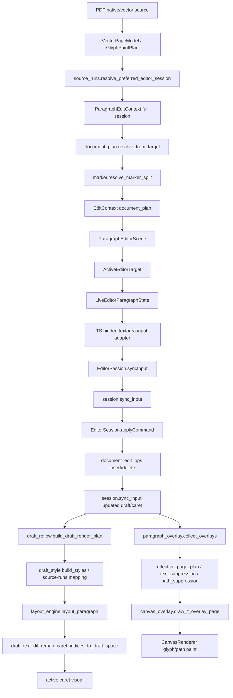
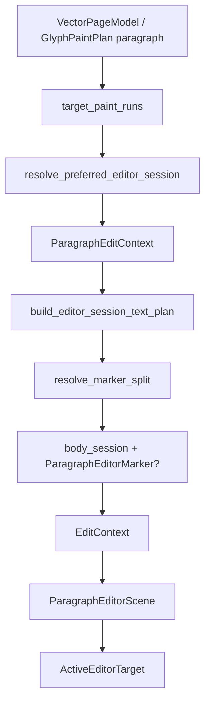
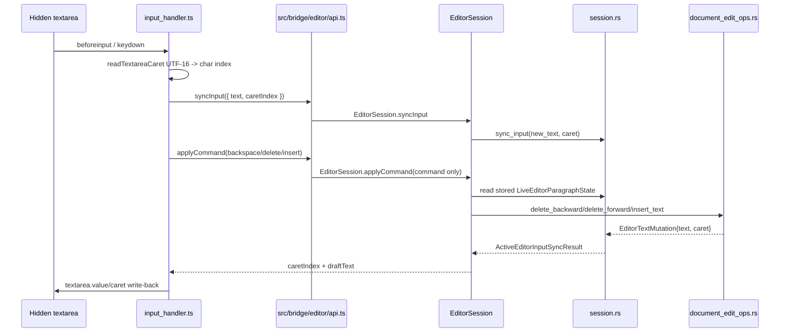
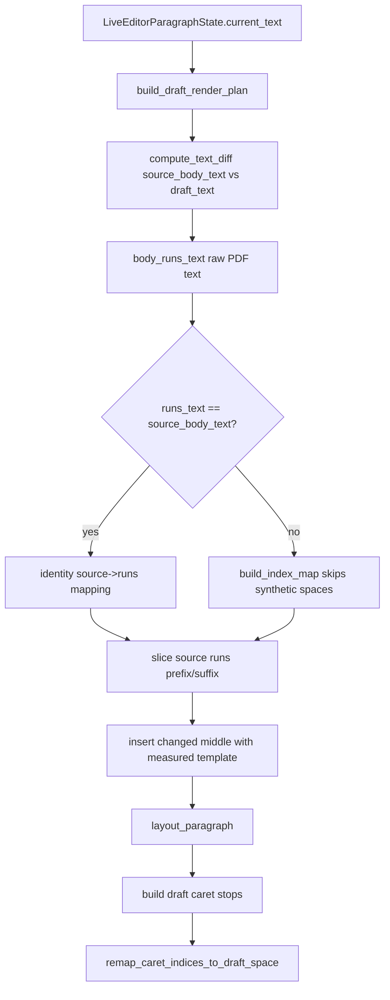
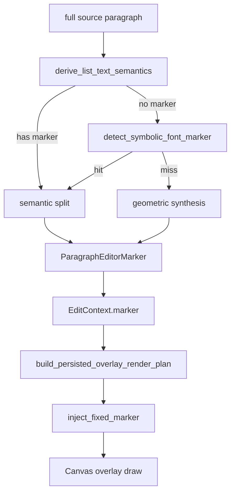
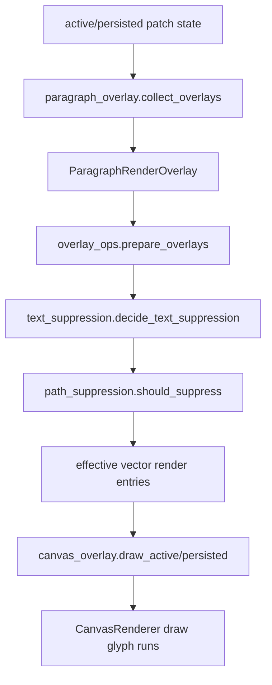

# Editor Core Execution Flow

> 当前代码链路文档。目的不是提出新方案，而是把 PDF 编辑核心从 source geometry、caret/index、mutation、draft layout、marker、overlay/suppression 到 canvas paint 的执行流和验证点一次性讲清楚。
>
> 动任何编辑器/marker/删除相关代码前，先用本文确认自己改的是哪一条链路、输入输出属于哪个坐标/索引空间，以及该链路已有的离线验证是否覆盖。

---

## 1. 全局执行流总览



核心原则：

1. **textarea 只捕获输入，不拥有视觉文本。** 可见编辑文本必须来自 Rust/WASM 的 glyph/canvas 链路。
2. **删除命令只接受 Rust char index。** DOM UTF-16 offset 必须先转换成 Rust char index。
3. **PDF raw runs 与 editor source text 可以不是同一个字符空间。** synthetic gap/space 只能用于编辑体验和 caret mapping，不能直接当 PDF raw run index 使用。
4. **marker 的几何语义必须唯一。** `advance`、`anchor_bbox.left`、`body bbox left`、`marker bbox left` 不能在不同路径中混用。
5. **overlay 与 suppression 必须共享同一个 target/source identity。** 否则就会出现原文残留、双绘制、marker 跑位。

---

## 2. 链路一：source geometry -> document plan -> active target

### 2.1 执行流



关键文件：

| 阶段 | 文件 | 责任 |
| --- | --- | --- |
| source runs 选择 | `crates/pdf-viewer-core/src/edit/source_runs.rs` | 从 vector/paint plan 中选出编辑目标对应的源 runs。 |
| bbox 计算 | `crates/pdf-viewer-core/src/geometry/source_geometry.rs` | 计算 session/run/caret line bbox。 |
| document plan | `crates/pdf-viewer-core/src/edit/document_plan.rs` | 生成 `EditContext`，它是后续 draft/overlay 的核心输入。 |
| marker 分裂/合成 | `crates/pdf-viewer-core/src/edit/document_plan/marker.rs` | 把 marker 与 body 分开或从几何上合成 marker。 |
| scene | `crates/pdf-viewer-core/src/edit/paragraph_scene.rs` | `ParagraphEditorScene.document_plan` 是单一事实来源。 |
| active target | `crates/pdf-viewer-core/src/edit/active_target.rs` | 序列化给 UI/session 的激活编辑目标。 |

### 2.2 `EditContext` 的关键字段

`EditContext` 是 draft layout、caret、overlay 的共同输入，关键字段包括：

| 字段 | 含义 | 常见风险 |
| --- | --- | --- |
| `shell_bbox` | 编辑 shell 的 page-space bbox | 如果只含 body 不含 marker，遮盖/点击区域会错。 |
| `body_session` | marker 分离后的正文 session | 后续 body layout 应以它为准。 |
| `source_body_text` | editor 语义文本，可含 synthetic spaces | 不能直接拿它当 raw PDF run 字符索引。 |
| `body_text_plan` | glyph slots/gaps/caret hit-test 数据 | DOM/Rust caret 错位常在这里暴露。 |
| `marker` | `ParagraphEditorMarker` | `advance` 语义必须一致，否则 marker/body/caret 都会错。 |
| `original_runs` | 原始 source runs | suppression/replacement identity 依赖它。 |

---

## 3. 链路二：textarea 输入 -> Rust caret -> 删除/插入

### 3.1 执行流



当前实现的额外约束：

- `EditorSession.applyCommand` 只接收 command/insertedText，不接收 host text/caret 作为命令状态。
- `syncInput` 会先把 textarea 快照同步进 Rust；随后命令执行通过 `command.effective-state` 读取 Rust stored `LiveEditorParagraphState`。
- `command.effective-state` 日志仍记录 `hostTextIgnored`/`hostCaretIndex`，用于确认 TS 侧快照是否只是诊断输入，未覆盖 Rust 编辑态。

### 3.2 索引空间

| 空间 | 类型 | 入口/出口 | 说明 |
| --- | --- | --- | --- |
| DOM offset | UTF-16 code unit | `textarea.selectionStart` | 浏览器原生选择范围，emoji/代理对会与 Rust char index 不同。 |
| Rust char index | Unicode scalar char count | `utf16ToCharIndex` / `charToUtf16Offset` | core mutation 只接受这个空间。 |
| source reconstructed index | `source_body_text` chars | `EditorSessionTextPlan.text` | 可包含 synthetic spaces/gaps。 |
| raw PDF run index | concatenated `LayoutRun.text` chars | `body_runs_text` | PDF content-stream 真实字符空间。 |

### 3.3 删除语义不变量

| 命令 | core 语义 | 预期 |
| --- | --- | --- |
| backspace | 删除 `caret - 1` | 光标前一个字符被删除，caret 左移 1。 |
| delete | 删除 `caret` | 光标后的字符被删除，caret 不动。 |
| insert | 在 `caret` 插入 | caret 增加插入字符数。 |

当前 core 删除函数位于：

- `crates/pdf-viewer-core/src/edit/document_edit_ops.rs`

如果出现“Backspace 删除了光标后的字”，优先怀疑进入 core 前的 caret 已经错位，而不是 `delete_backward` 本身。

### 3.4 必须抓取的日志字段

每次 beforeinput / applyCommand 至少需要这些字段：

| 阶段 | 字段 |
| --- | --- |
| TS beforeinput | command、selectionStart、selectionEnd、convertedCharCaret、textarea UTF-16 length、textarea char count、lastRustCaretIndex |
| Rust command input | command、storedText、storedCaretIndex、effectiveText、effectiveCaretIndex、hostTextIgnored、hostCaretIndex |
| Rust session sync | beforeText、beforeCaretIndex、requestedText、requestedCaretIndex、normalizedCaretIndex、afterText、afterCaretIndex、textChanged、caretChanged |
| Core mutation | beforeText、caretBefore、removedText、removeIndex、afterText、caretAfter、isPristine、isSlotBacked |
| TS write-back | result.caretIndex、result.draftText char count、selectionStart/selectionEnd after write |

---

## 4. 链路三：draft layout / synthetic gap / caret remap

### 4.1 执行流



关键文件：

- `crates/pdf-viewer-core/src/edit/draft_reflow.rs`
- `crates/pdf-viewer-core/src/edit/draft_style.rs`
- `crates/pdf-viewer-core/src/edit/draft_text_diff.rs`
- `crates/pdf-viewer-core/src/geometry/layout_engine.rs`

### 4.2 synthetic spaces 的核心规则

PDF raw runs 可能是：

```text
编程语言:Rust
```

editor source text 可能是：

```text
编程语言: Rust
```

中间空格是 synthetic gap，用于编辑体验和 caret hit-test。它不能：

- 被当成 PDF raw run 中真实存在的字符；
- 让 suffix/prefix 切片越界；
- 让 caret stop 映射超过 draft 文本长度；
- 让删除命令删除 raw run 空间中的相邻字符。

验证点：

- `build_index_map(source_text, runs_text)`
- `remap_caret_indices_to_draft_space(...)`
- `build_styles(...)` 的 `prefixRunsEnd/suffixRunsStart/finalRunsText`

---

## 5. 链路四：marker 解析、布局、绘制

### 5.1 marker 来源



### 5.2 两种 marker 路径的语义风险

| 路径 | 代码 | `advance` 当前来源 | 风险 |
| --- | --- | --- | --- |
| semantic split | `split_editor_session` | `body_bbox.left - session.anchor_bbox.left` | 如果 anchor 是整行左边界，`anchor + advance == body_left` 成立。 |
| geometric synthesis | `synthesize_marker_from_paragraph` | `body_origin_x - marker_bbox.left` | 如果后续仍用 `anchor + advance`，而 anchor 已接近 body left，就可能 double apply。 |

后续 caret/body offset 现在会使用：

```text
body_left = body_session.anchor_bbox.left + marker.advance
```

涉及：

- `crates/pdf-viewer-ui/src/editor/format/text_geometry.rs`
- `crates/pdf-viewer-ui/src/editor/overlay/visual.rs`

因此必须验证：

```text
body_session.anchor_bbox.left + marker.advance == 实际 body visual left
```

对 semantic split 和 geometric synthesis 都必须成立；否则同一页不同行会表现不同。

### 5.3 marker 变大的风险

marker 绘制最终会走：

- `crates/pdf-viewer-core/src/edit/draft_reflow.rs` 的 `inject_fixed_marker`
- `crates/pdf-viewer-ui/src/render/canvas_overlay.rs` 的 `draw_persisted_paragraph_overlay_page`
- `crates/pdf-viewer-ui/src/editor/format/text_geometry.rs` 的 `measure_text_width`

当前固定 marker 注入逻辑中，`inject_fixed_marker` 会优先使用 PDF source geometry 计算 marker 宽度：

- 先按 `ParagraphEditorMarker.runs[*].char_widths` 累加 marker 文本对应字符宽度；
- 若字符宽度不可用，再用 marker source `bbox.right - bbox.left`；
- 只有 source geometry 不可用时才回退到 UI 传入的 `measure_width`（浏览器 canvas `measureText`）。

这样单字符符号 marker（例如 `•`）不会因为 `text_geometry::measure_text_width` 的 single-origin canvas fallback 而扩大 marker/body gap。

---

## 6. 链路五：overlay collect -> suppression -> canvas paint



关键不变量：

| 不变量 | 违反症状 |
| --- | --- |
| overlay.source_object_indices 与原 PDF object/run identity 匹配 | 原文未被 suppress，出现双影/残留。 |
| replacement region 覆盖 marker + body | marker 区域原文残留或被重复绘制。 |
| active overlay 与 persisted overlay 使用同一 render plan | 编辑中与提交后位置/大小不一致。 |
| editor shell canvas 只画 caret | 两个 canvas 各画一份文本造成 sub-pixel ghosting。 |

关键文件：

- `crates/pdf-viewer-ui/src/editor/overlay/paragraph_overlay.rs`
- `crates/pdf-viewer-core/src/render/overlay_ops.rs`
- `crates/pdf-viewer-core/src/render/text_suppression.rs`
- `crates/pdf-viewer-core/src/edit/replacement_region.rs`
- `crates/pdf-viewer-ui/src/render/canvas_overlay.rs`
- `crates/pdf-viewer-ui/src/editor/overlay/visual.rs`

---

## 7. 离线验证矩阵

| 链路 | 测试/日志 | 当前状态 | 预期 |
| --- | --- | --- | --- |
| DOM caret -> Rust caret | verbose TS diagnostic + Rust debug trace | 待真实浏览器日志确认；TS/Rust 诊断字段已具备 | host char caret、stored caret、result caret 可解释且一致。 |
| backspace/delete | core unit test | 已通过 `cargo test -p pdf-viewer-core document_edit_ops -- --nocapture`（4 passed） | backspace 删除 `caret-1`，delete 删除 `caret`。 |
| Unicode scalar caret | core unit test | 已通过 `mutations_count_unicode_scalars_not_bytes` | emoji/中文按 Rust char index 计数，不按 byte/UTF-16。 |
| semantic text vs raw runs | core unit test | 已通过 `mutation_uses_semantic_text_not_raw_slot_text` | synthetic gap 属于 editor semantic text，不误用 raw slot text。 |
| synthetic gap mapping | core unit test | 已通过 `cargo test -p pdf-viewer-core draft_text_diff -- --nocapture`（10 passed） | source/runs 双向映射不越界，caret remap 不超过 draft len。 |
| semantic marker | core unit test | 已通过 `cargo test -p pdf-viewer-core document_plan -- --nocapture` 中 marker split tests | `anchor_left + advance == body_left`。 |
| geometric marker | core unit test | 已通过 `geometric_marker_synthesis_accepts_only_same_line_left_candidates` | 不发生 double apply；marker left/body left 与原 bbox 一致。 |
| marker width/source geometry | core unit test | 已通过 `cargo test -p pdf-viewer-core draft_layout -- --nocapture`（23 passed），覆盖单字符 marker `char_widths` 优先与 bbox fallback | 单字符 marker overlay 使用原 PDF source width，不由 canvas `measureText` 放大 marker/body gap。 |
| overlay identity/suppression | WASM overlay test/debug trace | `keeps_overlay_source` 已解除 ignore 并纳入 `cargo test -p pdf-viewer-core document_plan -- --nocapture`；当前 9 passed, 0 ignored | source object indices 命中，overlay 只插入/绘制一次。 |
| WASM package build | `npm run wasm:pdf-viewer-ui` | 已通过 | `crates/pdf-viewer-ui/pkg` 可生成。 |
| TS/Vite build | `npm run build` | 已通过；仅 Vite dynamic/static import chunk warning | TS bridge 与生成 WASM pkg 类型/调用匹配。 |
| Tauri debug no-bundle | `npm run e2e:build` | 已通过；生成 `target/debug/pdf-viewer-standalone.exe` | native backend + web dist 可打包成 debug app。 |

备注：`cargo test -p pdf-viewer-ui` 在默认 native target 下当前不适用，会因 `web-sys`/`js-sys`/`wasm_bindgen_futures` 依赖被 `target_arch = "wasm32"` gating 而失败；应以 `wasm-pack build/test` 或浏览器环境验证该 crate 的 WASM 路径。

---

## 8. 建议验证命令

```bash
cargo test -p pdf-viewer-core
wasm-pack test --node ./crates/pdf-viewer-ui
npm run wasm:pdf-viewer-ui
npm run build
npm run tauri -- build --debug --no-bundle
```

如果 Node WASM 测试因 `web-sys`/canvas 环境限制失败，改用：

```bash
wasm-pack test --headless --chrome ./crates/pdf-viewer-ui
```

---

## 9. 根因分析顺序

遇到截图中的三类症状时，按这个顺序排查：

### 9.1 Backspace 删除了光标后的字

1. 看 TS beforeinput 日志：DOM UTF-16 offset -> char caret 是否正确。
2. 看 `session.sync`：Rust live_state caret 是否被 sync 成同一个值。
3. 看 `command.effective-state`：applyCommand 是否使用了预期 caret。
4. 看 `mutation.backspace`：`removeIndex` 是否等于 `caretBefore - 1`。
5. 如果 1-3 已错，修输入/caret 同步；如果 4 错，才修 core mutation。

### 9.2 marker 跑到尾部/位置不同行不同

1. 看 marker 来源：semantic split 还是 geometric synthesis。
2. 验证 `anchor_left + advance` 是否等于 body visual left。
3. 看 `inject_fixed_marker` 后 marker run `origin_x` 和 body first run `origin_x`。
4. 看 overlay line summary：marker 是否是 first run，body 是否被错误 shift。

### 9.3 marker 明显比原 marker 大

1. 看 marker run 是否带 `char_widths` / bbox width。
2. 看 overlay 测宽是否走了 canvas `measureText` fallback。
3. 看 marker font 是否是 symbolic font，是否被替换成普通字体。
4. 对比 original marker bbox width 与 overlay marker measured width。

---

## 10. 当前怀疑点（需测试证实/排除）

| 编号 | 假设 | 证据状态 |
| --- | --- | --- |
| H1 | 删除错字来自 DOM caret/Rust caret 在 beforeinput + render refresh 后不同步 | core 删除语义已通过；仍需真实浏览器日志验证 DOM→Rust sync。当前命令执行以 Rust stored state 为准，`command.effective-state` 可确认 host snapshot 未覆盖命令状态。 |
| H2 | geometric marker 的 `advance` 与后续 `anchor + advance` 公式不兼容，导致不同行表现不同 | document_plan targeted tests 已覆盖 semantic/geometric 基本路径；仍需截图样本对应日志确认具体 marker 来源。 |
| H3 | 单字符 marker 走 canvas measureText，未使用 PDF 原始 bbox/char_width，导致 marker 变大 | 已修复并补测试：固定 marker 注入优先使用 source `char_widths`，再 fallback source bbox，最后才用 `measure_width`；`draft_layout` targeted tests 23 passed。 |
| H4 | overlay suppression target identity 不完整，导致原 marker/body 未被正确 suppress 或重复绘制 | `keeps_overlay_source` 已恢复为常规测试并通过，source identity 基本覆盖已闭环；若真实页面仍双绘制，下一步抓 overlay source indices / effective-plan trace。 |

结论必须来自测试和日志，不再凭截图直接改公式。
