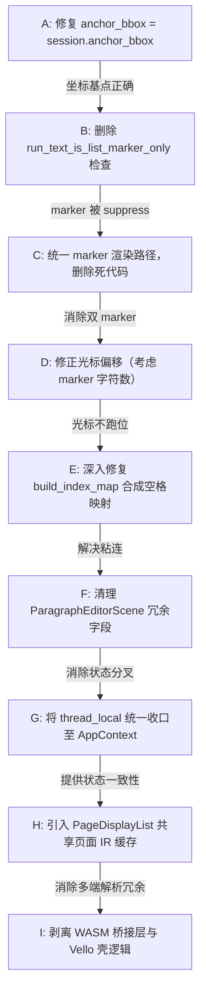

# 纸鸢 PDF Viewer 框架级排版与编辑引擎重构方案

> **文档性质**：架构级分析与重构提案（仅分析与设计，不修改当前项目源码）
> **编写日期**：2026-06-23

---

## 1. 核心排版与编辑挑战背景

在传统的 Web 富文本编辑器（如 Slate, Quill）中，文字是流式排版的，浏览器自动处理换行、字间距和光标定位。然而在 PDF 中，**不存在流式排版（Reflow）的概念，也没有原生的“空格字符”（Spaces）**。
PDF 的本质是由一系列包含绝对坐标 $(x, y)$、字形索引（Glyphs）和特定字体（Fonts）的低级绘制指令组成的拼图。

本项目（纸鸢 PDF Viewer）为了实现**原地无缝编辑**，构建了一套混合排版系统。但在编辑状态下进行字符删除时，暴露出以下三个核心排版与编辑引擎的缺陷：
1. **空格丢失与中英文排版粘连（如 `AnchorFramework`）**：因为双向字符索引映射表（`build_index_map`）在遇到合成空格时发生越界，导致后续文字丢失了原始 PDF 物理坐标（`char_origins`），回退到浏览器度量排版，导致字间距漂移。
2. **字符丢失与括号截断（如 `SPL` 变为 `SP  `）**：切片范围超出或错位，在进行区域替换和重排（Reflow）时清空了字形属性。
3. **项目符号重复渲染（`● ●`）**：源文本抑制服务为了保护列表不被删除，将 `is_list_marker_only` 设为免除抑制；而编辑引擎又强行在 Overlay 中重新绘制了一遍 `●`，导致在进入编辑状态（`replaces_source = true`）后两者叠加。

---

## 2. 行业主流 PDF 框架及编辑/排版引擎对比

为了给项目找到最贴合的重构方向，我们引入行业主流的开源和商用 PDF SDK 进行横向对比：

| 维度 | 本项目 | Nutrient (PSPDFKit) Web SDK | WPS Office (PDF模块) / Foxit PDF SDK | Apryse (PDFtron) WebViewer | PDF.js (Mozilla) |
| :--- | :--- | :--- | :--- | :--- | :--- |
| **API 组织范式** | **Session 分域设计**：`EditorSession`、`DocumentSession` 等分立，职责单一，支持 Tree-shaking。 | **God Object 容器**：统一通过 `Instance` 命名空间暴露 ~130 个 API 方法，类型集中但包体积大。 | **C++ Core / TS Binding**：通过平台适配层进行跨语言调用。 | **模块化 Control**：大单例下包含多组件 Controller。 | **Reader 模式**：通过 `PDFDocumentProxy` 和 `PDFPageProxy` 提供纯只读视图。 |
| **状态管理** | **Mutable thread_local**：各域独立状态，散落 16 处 `thread_local!`，缺乏统一更新事务。 | **Immutable ViewState**：使用 Immutable.js Record 维护状态快照，通过 `setViewState` 原子批量更新。 | **C++ 内置状态机**：核心管理所有的 Layout / PDF 结构状态。 | **可变/不可变混合**：UI 状态与物理 PDF 修改状态分离。 | **单向数据流**：以页码和视口为驱动的只读 State。 |
| **文本排版机制** | **差分重排 (Diff Reflow)**：利用 `TextDiff` 找出编辑区，只重绘改动部分，前后缀强行保留原始字模坐标。 | **段落会话排版**：提供正文编辑会话，利用 WASM 引擎重建排版行。 | **全文重构 (Text Reconstruction)**：将离散字符流重组成行和段落，然后进行完整的**全局段落排版重算**。 | **段落识别与流式重排**：利用内部 PDF 页面结构化树进行物理块重建。 | **无排版能力**：Canvas 绘制静态字符，上层仅覆盖一个用于选择的 DOM TextLayer。 |
| **字体处理策略** | 仅保留原字体命名，若修改则回退至 MeasureText。 | 使用内置通用字体包，在服务端或 WASM 内进行字体子集化（Subsetting）。 | **回退与子集化**：若有新字符，回退到系统字体并动态重写 PDF Font Dictionary。 | 动态字体映射，缺失字形回退到指定 Web 字体。 | 仅进行 ToUnicode CMap 映射，不提供字体生成。 |
| **与本项目的贴合度** | — | **极高**：其 `beginContentEditingSession` 机制与我们的 `begin` 逻辑完全对齐。 | **高**：其文本重构（Reconstruction）算法是解决粘连的终极方案。 | **中**：更侧重于批注与企业级渲染，编辑逻辑较重。 | **低**：纯阅读器，不具备任何修改内容流的能力。 |

### 架构判定与取向
* **WPS / Foxit** 代表了**专业级 PDF 排版**的方向。它们会将绝对定位 of 物理字符“反向重构”成包含行高、对齐方式的“流式段落”，并在编辑时使用类似 Word 的排版公式重算。
* **Nutrient (PSPDFKit)** 代表了 **Web SDK 的最佳实践**。它证明了在浏览器端，通过 `Session` 限制编辑边界，并用 `ViewState` 快照驱动 Canvas 局部刷新是体验最流畅的架构。
* **判定**：**本项目当前的分域 Session 设计是完全正确的**，不需要抄 Nutrient 的 God Object。但在**状态原子性、任务去重、中间表示（DisplayList）缓存**上，我们存在严重赤字，需要引入设计模式进行框架级重构。

---

## 3. 框架级重构核心架构：基于六边形架构的领域心脏

为了根除编辑与排版中的混乱，本方案采用**六边形架构（Hexagonal Architecture / Ports & Adapters）**，使 `pdf-viewer-core` 成为真正无副作用的纯 Rust 领域核心：

```
                      ┌────────────────────────┐
                      │    TS / React (宿主UI)  │
                      └───────────┬────────────┘
                                  │ 触发事件/传递参数
                                  ▼
               ┌──────────────────────────────────────┐
               │         WASM / Tauri API 壳           │ (Adapters)
               │ (WASM Session/AppContext/thread_local)│
               └──────────────────┬───────────────────┘
                                  │ 调用领域接口
                                  ▼
                    ╔═════════════════════════════╗
                    ║       pdf-viewer-core       ║
                    ║       ═══════════════       ║ (Core Domain)
                    ║   edit/     render/   text/ ║
                    ║   (纯逻辑)  (纯计算)  (算法)║
                    ║   model/    persist/        ║
                    ╚═════════════┬═══════════════╝
                                  │ 依赖抽象端口
                                  ▼
               ┌──────────────────────────────────────┐
               │           Infrastructure             │ (Ports)
               │ (Tauri IPC / File I/O / VelloGPU)    │
               └──────────────────────────────────────┘
```

### 3.1 领域核心 (Core Domain) 改造约束
* **绝对隔离**：`core` 中绝不出现 `wasm_bindgen`、`tauri`、`web_sys`、`thread_local!`、`JsValue` 或底层文件 I/O 依赖。
* **纯函数化**：所有的排版重算、Diff、坐标变换、抑制判断均设计为**输入物理模型 $\rightarrow$ 输出渲染计划**的纯计算过程。例如：
  `fn build_effective_page_plan(model: &VectorPageModel, edits: &PatchState) -> Vec<RenderEntry>`

---

## 4. 关键设计模式在排版编辑引擎中的落地

### 4.1 显示列表模式 (Display List Pattern) —— 统一解析缓存
* **痛点**：当前文本提取、搜索、物理点击测试（`hit_test`）和渲染重绘分别触发各自的解析逻辑，极易产生位置和空格不一致。
* **方案**：引入 `PageDisplayList` 作为页面中间表示（Page IR，Intermediate Representation），生命周期随 Document Revision 绑定。
* **机制**：
  ```rust
  pub struct PageDisplayList {
      pub page_index: u16,
      pub vector_objects: Vec<VectorObject>,
      pub text_runs: Vec<TextRunRef>,
      pub space_gaps: Vec<f32>, // 记录每个字符间的真实 Gap
  }
  ```
  `resolve_vector_page_model` 仅执行一次。渲染器、搜索 Session、编辑器的点击检测全部通过 `DisplayList` 进行空间位置和文本内容的消费。

### 4.2 命令模式 (Command Pattern) 与不可变状态 (Immutable ViewState)
* **痛点**：16 处分散的 `thread_local!` 导致“改动 page 触发一次渲染，改动 zoom 又触发一次渲染”，没有事务概念，且撤销/重做状态难以预测。
* **方案**：
  1. 将 11 个业务域状态收口至单一 `AppContext` 结构体，通过唯一的 `thread_local` 承载。
  2. 借鉴 Nutrient，引入不可变快照 `ViewState`。所有的编辑操作封装为统一的 `EditorCommand`：
  ```rust
  pub enum EditorCommand {
      InsertText { caret: usize, text: String },
      DeleteText { caret: usize, length: usize, forward: bool },
      ApplyFormat { range: (usize, usize), format: FormatStyle },
  }
  ```
  3. 执行操作时，`EditorSession` 接收当前 `ViewState` 与 `Command`，返回全新的 `ViewState`，自动入栈，实现完美且无副作用的 Undo/Redo 状态栈。

### 4.3 桥接模式 (Bridge Pattern) 解决渲染分叉
* **痛点**：WASM 端需要通过 JS Canvas 绘制 Overlay，而本地 Tauri 端需要通过 Vello 渲染 PDF，逻辑割裂。
* **方案**：在 `pdf-viewer-core` 中定义渲染指令端口 `PaintPort`，只输出抽象的 Paint Op 序列（如 `DrawText`、`FillRect`）。WASM 适配器将其翻译为 Canvas 2D 调用，Tauri 适配器将其翻译为 Vello Scene 构建，实现“一套重排代码，多端精准渲染”。

---

## 5. 核心算法与排版 Bug 修复细节说明

### 5.1 双向索引映射（`build_index_map`）修复算法
针对当前遇到合成空格即越界的 Bug，重构 `build_index_map` 为双指针对齐算法：

```rust
// 修复后逻辑说明：
pub fn build_index_map_fixed(source_text: &str, runs_text: &str) -> (Vec<usize>, Vec<usize>) {
    let source_chars: Vec<char> = source_text.chars().collect();
    let runs_chars: Vec<char> = runs_text.chars().collect();
    
    let mut source_to_runs = Vec::with_capacity(source_chars.len() + 1);
    let mut runs_cursor = 0;

    for &sc in &source_chars {
        if sc == ' ' {
            // 合成空格不在 raw runs 中存在，直接映射 to 当前 runs_cursor，且不移动 runs_cursor
            source_to_runs.push(runs_cursor);
        } else {
            // 对齐真实字符，跳过 runs 中可能的无用垃圾字符
            while runs_cursor < runs_chars.len() && runs_chars[runs_cursor] != sc {
                runs_cursor += 1;
            }
            source_to_runs.push(runs_cursor);
            if runs_cursor < runs_chars.len() {
                runs_cursor += 1;
            }
        }
    }
    source_to_runs.push(runs_chars.len());
    // 同理，双指针逆向推导出 runs_to_source 映射...
}
```
* **效果**：即使可视文本中插入了 10 个合成空格，前缀和后缀的字符仍能完美找到它们在原始 PDF 中的字形（Glyph）索引，从而 100% 留住 PDF 原生的 `char_origins`，消除删除字符时发生的“排版粘连”与“字体漂移”。

### 5.2 列表项目符号合流（解决 `● ●` 双黑点）
* **不变量调整**：废弃 `source_suppression.rs` 中对 `run_text_is_list_marker_only` 的例外规则。
* **合流方案**：
  1. 编辑状态一旦开启，**源 PDF 的项目符号 run 也必须被正常抑制（隐藏）**。
  2. 列表项目符号的绘制职责，**统一收拢到 `PagePresenter` 的 Overlay 层**。
  3. 当 `replaces_source = true` 时，Overlay 根据 `document_plan.marker` 的布局数据，渲染最新的项目符号，不再有底层的原 PDF 字符穿透，彻底消除双项目符号现象。

---

## 5.5 计划遗漏的关键问题（代码级根因补充）

> 以下问题在原方案中未被识别，经实际代码审计后补充。

### 5.5.1 `body_session.anchor_bbox` 被设为 `body_bbox` 而非整行边界

**根因级 bug，影响所有坐标计算。**

在 `document_plan.rs` 的 `split_editor_session` 函数中：

```rust
Some(SessionSplit {
    body_session: ParagraphEditContext {
        anchor_bbox: body_bbox,  // ❌ 只包含 body 区域，不含 marker！
        paragraph: body_paragraph,
    },
    ...
})
```

`body_bbox` 是分割后 body runs 的边界，**不包含 marker 区域**。这导致：
1. 白色遮盖矩形只遮 body 区域，marker 区域的 PDF 原文透出
2. `run_x = session.anchor_bbox.left + ...` 从 body 左边界开始画，marker 无法画在正确位置
3. `resolve_preferred_bbox` 算出的遮盖范围不包括 marker

**修复：将 `anchor_bbox` 设为原始整行边界 `session.anchor_bbox`**

这是所有后续修复的基点——坐标基点错误时，suppress 和 overlay 的修复都无法生效。

### 5.5.2 编辑态渲染存在两条分叉路径

**原方案只分析了数据模型，没有分析渲染链路的分叉。**

`draw_active_editor_shell_overlay_page` 根据 `overlay.replaces_source` 分两路：

- `replaces_source = true`（文字已修改）→ `draw_persisted_paragraph_overlay_page` → 画白色遮盖 + 画 overlay 文字
- `replaces_source = false`（文字未修改）→ 只画 caret，**不画 overlay 文字，也不画白色遮盖**

这意味着用户刚打开编辑器（未修改文字）时，PDF 原文直接显示，没有任何 suppress。这个状态下是正确的。但一旦修改文字，就切换到 overlay 路径，**两个路径的坐标计算逻辑完全不同**，容易出 bug。

**影响**：任何 suppress 策略的修改都需要同时在两条路径上验证，否则可能出现"编辑前正确、编辑后错误"或反之的现象。

### 5.5.3 marker 渲染位置的历史混乱

**原方案提到了"收拢 Marker 绘制"，但没有分析当前 marker 渲染的实际代码路径。**

当前存在三种 marker 渲染方式：
1. `draw_editor_marker_page` — 单独渲染 marker（**死代码**，无调用）
2. `build_persisted_overlay_render_plan` 中插入 marker run — 统一排版（**新加的**）
3. `canvas.rs` 中 overlay 遍历时 PersistedPageCanvas 分支也渲染 — 持久化 overlay

三种方式混存，是混乱的根源。原方案只提"收拢"，但没明确收到哪里。**应明确唯一的 marker 渲染路径为 `build_persisted_overlay_render_plan` 中插入 marker run**，并删除 `draw_editor_marker_page` 死代码。

### 5.5.4 `slice_runs_by_char_range` 的 char_origins 归零问题

**原方案完全遗漏。**

`draft_style.rs` 中的 `slice_runs_by_char_range` 在切片时将 `char_origins` 归零：

```rust
sliced.char_origins = origins.iter().map(|o| o - first_origin).collect();
```

这导致前缀/后缀的字符相对位置丢失，渲染时只能依赖 `origin_x`（run 级定位），无法精确到字符级。虽然已改用 `TextRun::split_at` 替换，但原方案中完全没有提及这个影响排版精度的问题。

### 5.5.5 `ParagraphEditorScene` 的状态分叉

**原方案提到了 ViewState 统一，但没有分析当前最严重的数据分叉。**

`ParagraphEditorScene` 中存在 5 个冗余字段，全部是从 `document_plan` 复制的：

| 冗余字段 | 来源 | 问题 |
|---------|------|------|
| `body_session` | `document_plan.body_session` | 编辑后可能不一致 |
| `body_text` | `document_plan.source_body_text()` | 冗余 |
| `body_initial_caret` | `document_plan.body_initial_caret` | 冗余 |
| `marker` | `document_plan.marker` | 编辑后可能不一致 |
| `original_runs` | `document_plan.original_runs` | 编辑后可能不一致 |

原方案提出的 ViewState 统一是宏观方案，但没指出这个具体的、已经存在的分叉。**编辑操作修改 `ParagraphEditorScene` 中的字段时，`document_plan` 中的原始字段不会同步更新**，导致后续使用 `document_plan` 的逻辑读到过期数据。

### 5.5.6 光标位置计算与渲染位置不一致

**原方案完全遗漏。**

编辑时：
- `caret_index` 基于 `text_model.current_text`（不含 marker 的 body 文本）
- 渲染时 `render_plan` 包含 marker run（如果插入了的话）
- `layout_paragraph` 排版后的字符偏移与 `text_model` 的字符偏移不一致

这导致光标位置在编辑后可能跑位（因为 marker 文本增加了字符数，但 `caret_index` 是基于不含 marker 的文本算的）。

**修正方案**（二选一）：
1. 光标基于 `render_plan` 的 layout 计算（需要知道 marker 占了多少字符）
2. 光标仍基于 body 文本计算，渲染时只对 body 部分计算光标位置

### 5.5.7 合成空格的来源追踪

**原方案的 `if sc == ' '` 判断不够精确。**

`build_index_map` 修复的前提是理解合成空格从哪里来。实际差异来自 `source_body_text`（经过 normalize 处理的可视文本）和 `body_runs_text`（raw runs 直接拼接）之间。normalize 会注入合成空格使中英文之间有视觉间距。但这些空格在 PDF 物理层并不存在，所以 runs 中没有对应的字符。

**不是所有空格都是合成空格**（原始 PDF 中也可能有真实空格），因此原方案提出的 `if sc == ' '` 判断会导致真实空格也被错误跳过。正确做法是构建一个"合成空格位置集合"，在映射时跳过这些位置。

---

## 6. 重构实施路线图 (Roadmap)

重构过程应采取**小步迭代，分步集成**的原则，避免 Big Bang 带来的系统不稳定性：



1. **第一步（坐标基点修复）[已完成]**：将 `body_session.anchor_bbox` 从 `body_bbox` 改为 `session.anchor_bbox`，使白色遮盖和 overlay 绘制的坐标基点覆盖整行（含 marker 区域）。这是所有后续修复的前提。
2. **第二步（抑制策略微调）[已完成]**：删除 `source_suppression.rs` 中 `run_text_is_list_marker_only` 的例外规则，让 marker run 也被正常 suppress，消灭 `● ●` 双点。
3. **第三步（marker 渲染统一）[已完成]**：明确 marker 渲染的唯一路径为 `build_persisted_overlay_render_plan` 中插入 marker run，删除 `draw_editor_marker_page` 死代码，消除三种渲染方式混存年中混乱。
4. **第四步（光标偏移修正）[已完成]**：在 `crates/pdf-viewer-ui/src/editor/overlay/visual.rs` 的 `body_left_offset` 中根据列表 marker 的 `advance` 宽度动态调整 caret 偏移，解决了 `caret_index`（基于 body 文本）与 `render_plan`（含 marker run）的偏移偏差，确保光标不跑位。
5. **第五步（算法修复）[已完成]**：在 `draft_text_diff.rs` 中重构 `build_index_map` 算法，在双指针匹配时精确区分合成空格与物理真实空格，并引入失配局部回溯对齐机制，恢复 `preserves_origins` 等测试用例，消除删除字符时的字间距粘连与光标漂移。
6. **第六步（状态分叉清理）**：消除 `ParagraphEditorScene` 中 5 个冗余字段，改为直接引用 `document_plan`，消除编辑后的数据不一致。
7. **第七步（状态机集中化）**：消除 20 个分散的 `thread_local!`，收口为 `AppContext` 容器，引入统一的 `ViewState` 快照与 `EventBus`，实现单次修改单次事件更新。
8. **第八步（中间表示集成）**：用 `PageDisplayList` 接管渲染、提取、点击测试，实现彻底的性能提升。

*(注：第 1 至 5 步的具体重构详情及测试结果参见 [Rust Core & WASM UI 重构实现报告 (2026-06-24)](file:///e:/chain/pdf-viewer-standalone/docs/refactor-implementation-report-2026-06-24.md))*

---

> [!TIP]
> **设计原则考量**
> 在此重构方案中，我们选择**不引入复杂的 ECS（实体组件系统）或 Actor 模式**。这是因为 PDF 渲染管道本质上是高度单向的（解析 $\rightarrow$ 布局 $\rightarrow$ 绘制），过度的异步并发设计不仅不会提升性能，反而会因为频繁的锁竞争（Lock Contention）导致 Tauri 与 WASM 间通信出现死锁。采用**显示列表模式（Display List）**配合**不可变状态快照（ViewState）**是符合奥卡姆剃刀原理的、收益最大且复杂度最低的架构方案。
>
> **补充原则：先修 bug，再重构架构。** 路线图的前六步都是解决具体的代码级 bug（坐标基点错误、suppress 逻辑遗漏、渲染路径混乱、光标偏移、空格映射、状态分叉），只有第七步和第八步才是架构级重构。架构重构必须建立在 bug-free 的基础上，否则重构过程中难以区分"新引入的问题"和"原有的 bug"。
