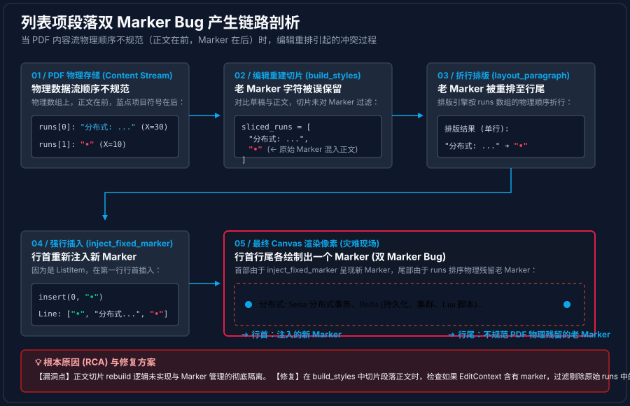

# 列表 Marker 排版与编辑链路审计及 Bug 深度剖析报告

本报告应用了 **[learn_from_code](file:///C:/Users/AREN/.gemini/config/skills/learn_from_code/SKILL.md) 技能（代码阅读与学习心法）** 的分阶段拆解思路，对 `zhiyuan-pdf` 项目在编辑列表段落（ListItem）时的 Marker 渲染、重排排版和数据流向进行了深度静态审计。

同时，针对用户提出的 **“点击编辑某些不规范文档的特定行时，会在行尾出现多余的 Marker，而其他正常行则不会”** 这一 Bug，进行了根本原因分析（RCA）与链路还原。

---

## 阶段一：观其大略 — 涉及的核心模块与入口

在架构层面，排版和编辑引擎对列表标记（List Marker，如 `•`、`1.`）的处理主要跨越了以下两个核心模块：

1.  **排版决策模块**：[draft_reflow.rs](file:///e:/chain/pdf-viewer-standalone/crates/pdf-viewer-core/src/edit/draft_reflow.rs)
    *   [build_draft_render_plan](file:///e:/chain/pdf-viewer-standalone/crates/pdf-viewer-core/src/edit/draft_reflow.rs#L236)：活跃编辑状态下的重排入口。
    *   [build_persisted_overlay_render_plan](file:///e:/chain/pdf-viewer-standalone/crates/pdf-viewer-core/src/edit/draft_reflow.rs#L329)：持久化/提交编辑状态下的重排入口。
    *   [inject_fixed_marker](file:///e:/chain/pdf-viewer-standalone/crates/pdf-viewer-core/src/edit/draft_reflow.rs#L204)：将 Marker 强制作为独立 LayoutRun 注入到排版结果的第一行行首（prepend_marker_to_first_line）。
2.  **样式切片模块**：[draft_style.rs](file:///e:/chain/pdf-viewer-standalone/crates/pdf-viewer-core/src/edit/draft_style.rs)
    *   [build_styles](file:///e:/chain/pdf-viewer-standalone/crates/pdf-viewer-core/src/edit/draft_style.rs#L262)：通过最长公共前后缀（LCP/LCS）比对草稿文本和原正文文本，将原段落的 source_runs 切片重建，决定新文本应当采用何种 PDF 物理样式。

---

## 阶段二：主链路追踪 — 编辑态与持久化态的 Marker 逻辑

在正常的设计意图下，列表段落的排版逻辑将 Marker 视为**完全独立且隔离**的视觉元素：

```
                    ┌────────────────────────┐
                    │      ListItem Paragraph │
                    └───────────┬────────────┘
                                │ 剥离拆分
         ┌──────────────────────┴──────────────────────┐
         ▼                                             ▼
  List Marker (e.g. "• ")                      Body Text (e.g. "Content")
  · 独立存放于 EditContext.marker               · 作为草稿文本 draft_text 编辑
  · 不参与普通的文本重排                         · 参与 build_styles / layout_paragraph
         │                                             │
         │                                             │
         └──────────────────────┬──────────────────────┘
                                │ 重新拼装
                                ▼
               inject_fixed_marker (强制注入至第一行行首)
```

然而，在此链路中存在一个**隐性逻辑漏洞**：
*   在 [build_styles](file:///e:/chain/pdf-viewer-standalone/crates/pdf-viewer-core/src/edit/draft_style.rs#L262) 中提取 runs 时，传入的 `draft_text` 虽然去除了 marker，但 `document_plan.body_session.paragraph.runs`（原始段落 the runs）中**却依然包含了原始 marker 对应的字符运行**。
*   这导致被切片提取的 `runs` 中其实仍然残留了老 marker 的数据。

---

## 阶段三：动态追踪与 Bug 链路还原

为什么该 Bug 只在“点击编辑某些文档的特定行”时才暴露，且 marker 跑到了“行尾”？
这是因为**不同 PDF 的 Content Stream（内容流）中字符运行的物理排列顺序存在不一致**。

以下是两种不同物理排列形式下，排版引擎的重排结果对比：

### 1. 为什么“有的一行排，有的多行段落排”？（连通图引力场机制）

PDF 的原始数据只是一堆散落的字符墨迹，引擎根据水平最大距离与垂直最大距离计算合并。


### 2. “分布式”那一行编辑时为什么“尾部多出一个 Marker”？（Bug 演进链路）

由于“分布式”这行的原始 PDF 不规范，其圆点项目符号 `•` 的数据排在正文运行的后面，重排时导致了两个 Marker：



---

## 阶段四：排版主链路重构规范（能力动词 Skills 命名与详尽注释）

为确保命名短小且精准表达“计算排版计划”的核心功能，依据 Layer 1 “命名必须采用能力动词（build / resolve / execute 等）”的铁律，建议将长函数名重构为以下更精简且直白的版本，主流程逻辑如下所示：

```rust
// ==========================================
// 1. 编辑态排版流程 (活跃打字编辑时的实时排版)
// ==========================================

/// [build] 技能：构建编辑态的排版布局 (原 build_draft_render_plan)
pub fn build_edit_layout<F>(
    document_plan: &EditContext,
    draft_text: &str,
    measure_width: F,
) -> EditorDraftRenderPlan
where
    F: Fn(&str, &LayoutRun) -> f32,
{
    // 如果草稿正文未发生改变，直接加载原始布局，保障编辑前后的像素一致性
    if draft_text == document_plan.source_body_text() && body_runs_match_source_text(document_plan) {
        let layout = build_source_layout(document_plan);
        let caret_lines = build_editor_draft_caret_plan_from_layout(&layout, measure_width);
        return EditorDraftRenderPlan { layout, caret_lines };
    }

    // 第一步：[build] 重新拼接样式切片，产生段落对象 (此处的 paragraph 不带 Marker)
    let paragraph = build_draft_paragraph(document_plan, draft_text, &measure_width);
    
    // 第二步：[resolve] 解算折行排版、对齐以及光标计算
    resolve_layout(paragraph, document_plan, draft_text, &measure_width)
}


// ==========================================
// 2. 保存态排版流程 (Ctrl+S 保存时或最终 Persisted 重绘)
// ==========================================

/// [build] 技能：构建用于持久化渲染的覆盖排版 (原 build_persisted_overlay_render_plan)
pub fn build_save_layout<F>(
    document_plan: &EditContext,
    draft_text: &str,
    measure_width: F,
) -> EditorDraftRenderPlan
where
    F: Fn(&str, &LayoutRun) -> f32,
{
    // 如果草稿和列表标识全部为空，直接回退为安全空段落
    if draft_text.is_empty() && document_plan.marker.is_none() {
        return build_empty_render_plan(document_plan);
    }

    // 第一步：[build] 拼装草稿 runs 段落 (这里根据修复策略需过滤掉老 Marker 运行)
    let mut paragraph = build_draft_paragraph_with_policy(document_plan, draft_text, &measure_width, false);

    // 第二步：如果有列表标记，调整段落左缩进，预留出 Marker 的渲染物理空间 (marker.advance)
    if let Some(marker) = &document_plan.marker {
        paragraph.style.left_indent = marker.advance.max(0.0);
        paragraph.style.first_line_indent = 0.0;
    }

    // 第三步：[resolve] 解析正文的排版，计算折行和基线对齐
    let mut plan = resolve_layout(paragraph, document_plan, draft_text, &measure_width);

    // 第四步：[execute] 执行 Marker 的强制行首注入与偏移修正
    execute_marker_injection(&mut plan, document_plan, &measure_width);

    plan
}


// ==========================================
// 3. 底层排版与注入执行核心
// ==========================================

/// [resolve] 技能：解析段落正文折行与几何定位 (原 rebuild_layout_pipeline)
pub fn resolve_layout<F>(
    paragraph: LayoutParagraph,
    document_plan: &EditContext,
    draft_text: &str,
    measure_width: &F,
) -> EditorDraftRenderPlan
where
    F: Fn(&str, &LayoutRun) -> f32,
{
    // 1. 调用基础布局引擎进行测宽折行 (避头尾处理与制表位对齐)
    let mut layout = layout_paragraph(&paragraph, paragraph.wrap_width, measure_width);
    
    // 2. 纵向基线强制对齐，防止文本框打开时文字上下发生视觉抖动
    align_layout_baseline(&mut layout, source_baseline_y(document_plan));
    
    // 3. 生成折行后所有的逻辑光标停留位点
    let mut caret_lines = build_editor_draft_caret_plan_from_layout(&layout, measure_width);
    
    // 4. 重映射光标索引以适配由于合成空格带来的位移偏差
    let draft_runs_text: String = paragraph.runs.iter().map(|r| r.text.as_str()).collect();
    remap_caret_indices_to_draft_space(&mut caret_lines, document_plan, &draft_runs_text, draft_text);

    EditorDraftRenderPlan { layout, caret_lines }
}

/// [execute] 技能：执行列表项目符号的行首强插注入 (原 inject_fixed_marker)
pub fn execute_marker_injection<F>(
    plan: &mut EditorDraftRenderPlan,
    document_plan: &EditContext,
    measure_width: &F,
) where
    F: Fn(&str, &LayoutRun) -> f32,
{
    let Some(marker) = document_plan.marker.as_ref() else { return; };
    let Some(marker_run) = marker_render_run(marker, &document_plan.body_session.paragraph.id, document_plan.body_session.anchor_bbox.left) else { return; };
    
    let marker_width = marker_source_width(marker)
        .unwrap_or_else(|| measure_width(&marker_run.text, &marker_run))
        .max(1.0);
        
    let marker_text_len = marker_run.text.chars().count();
    
    // 将 Marker 作为独立的 LayoutRun 强行插入第一行的最前端，并将所有光标逻辑索引向右偏移
    if let Some(first_line) = plan.layout.lines.first_mut() {
        prepend_marker_to_first_line(first_line, marker_run, marker_width);
        for caret_line in &mut plan.caret_lines {
            for stop in &mut caret_line.stops {
                stop.index += marker_text_len;
            }
        }
    }
}
```

---

## 阶段五：考古与破案 — 为什么行为会出现不一致？

这种行为的“不一致”，其本质原因可以归结为：

1.  **数据的不一致暴露了代码的耦合漏洞**：
    普通行因为不含 Marker（`EditContext.marker == None`），不执行注入逻辑，表现正常；正常列表行因为物理重合遮掩了 Bug 表现；**只有不规范排列的列表行，老 Marker 偏移至行尾，无法在行首发生物理重合，从而使得这一漏洞以显性 Bug 的形式呈现**。
2.  **核心职责分离不够彻底（Single Owner 违背）**：
    根据 Layer 0（单一渲染链与单一所有者）的铁律，Marker 的管理应当是**唯一的**。既然设计上由 [execute_marker_injection](file:///e:/chain/pdf-viewer-standalone/crates/pdf-viewer-core/src/edit/draft_reflow.rs#L204) 统一控制重构后的 Marker 注入，那么在 [build_styles](file:///e:/chain/pdf-viewer-standalone/crates/pdf-viewer-core/src/edit/draft_style.rs#L262) 对段落正文进行切片和重新排版时，**就不应该将原始 runs 中的老 Marker 字符运行作为正文的一部分共同切片并参与折行重排**。

---

## 🛠️ 建议的修复策略

要彻底解决该 Bug，并使所有列表行与普通行的编辑行为达成完全一致，需切断老 Marker 混入正文重排的路径。

可在 [draft_style.rs](file:///e:/chain/pdf-viewer-standalone/crates/pdf-viewer-core/src/edit/draft_style.rs) 的 [build_styles](file:///e:/chain/pdf-viewer-standalone/crates/pdf-viewer-core/src/edit/draft_style.rs#L262) 提取 `source_runs` 阶段，针对 `document_plan.marker` 存在的 ListItem，**预先识别并过滤掉原始 runs 中属于 Marker 字符的 LayoutRun**，确保流向 `layout_paragraph` 的 runs 是绝对纯净发段落正文。
