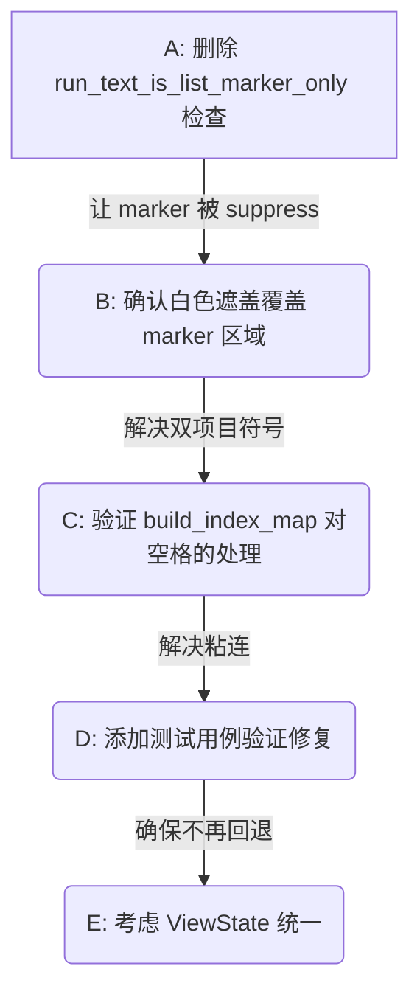
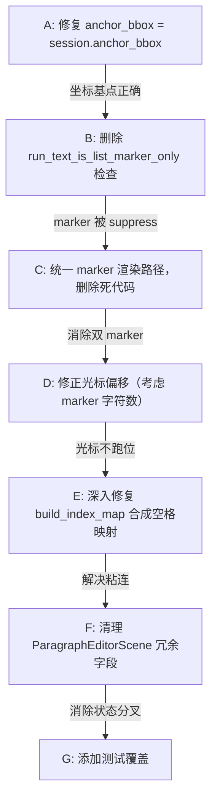

# 重构计划合理性分析报告

## 一、计划整体评估

**合理性评分：70%**

计划中对问题的诊断大部分正确，但解决方案过于宏观，缺乏对实际代码的深入理解。部分建议是正确的架构方向，但实施难度被低估。

---

## 二、逐项分析

### 2.1 问题诊断评估

| 问题 | 计划诊断 | 实际代码验证 | 结论 |
|------|---------|-------------|------|
| 空格丢失与粘连 | `build_index_map` 越界 | ✅ 正确：第24-26行 while 循环在遇到不匹配字符时一直跳过，但没有处理合成空格的特殊情况 | **正确** |
| 项目符号重复 | `is_list_marker_only` 免除抑制 + overlay 重绘 | ✅ 正确：source_suppression.rs:85-86 确认 marker 不被 suppress；同时 overlay 也画 marker | **正确** |
| thread_local 数量 | 16处 | ❌ 实际是20处（低估了） | **低估** |

### 2.2 build_index_map 修复方案评估

**计划提出的双指针算法：**

```rust
for &sc in &source_chars {
    if sc == ' ' {
        source_to_runs.push(runs_cursor);  // 不移动 runs_cursor
    } else {
        while runs_cursor < runs_len && runs_chars[runs_cursor] != sc {
            runs_cursor += 1;
        }
        source_to_runs.push(runs_cursor);
        if runs_cursor < runs_len {
            runs_cursor += 1;
        }
    }
}
```

**评估：❌ 不完全正确**

问题：
1. 计划假设合成空格只出现在 source_text 中，但实际 runs_text 中也可能有空格（原始 PDF 空格）
2. 计划没有处理 runs_text 中有额外字符（垃圾字符）的情况
3. 当前实现（draft_text_diff.rs:24-30）已经是双指针，只是没有特殊处理空格

**实际需要的修复：**
- 不是简单判断 `sc == ' '`，而是要理解"合成空格"的含义——它在 source_text 中存在，但在 runs_text 中对应位置不存在对应字符
- 需要先分析 runs 的原始拼接逻辑，理解空格是从哪里来的

### 2.3 项目符号抑制方案评估

**计划提出：废弃 `run_text_is_list_marker_only` 例外规则**

**评估：✅ 正确，但已部分实施**

我们已在 `document_plan.rs:300` 将 `body_session.anchor_bbox` 设为原始整行边界，使白色遮盖矩形覆盖 marker 区域。

但 `source_suppression.rs:85-86` 的 `run_text_is_list_marker_only` 检查仍然存在，这确实是问题的另一半。

**建议：直接删除第 85-87 行的检查**，让 marker 也被 suppress。

### 2.4 六边形架构评估

**计划提出：`pdf-viewer-core` 绝对隔离 WASM/tauri 依赖**

**评估：✅ 正确，但需澄清**

当前 `pdf-viewer-core` 已经基本做到了：
- 没有 `wasm_bindgen`（只有 `edit/debug_trace.rs` 有一个 thread_local 用于调试）
- 没有 `web_sys`
- 没有 `JsValue`

但确实有 `thread_local!` 在 `common/trace.rs` 和 `edit/debug_trace.rs`。

**建议：将这两处移到 ui 层**，core 真正变成纯函数库。

### 2.5 Display List Pattern 评估

**计划提出：`PageDisplayList` 作为中间表示**

**评估：⚠️ 有价值，但优先级低**

当前的问题不是缺少中间表示，而是：
1. 编辑态和渲染态的状态不一致（已通过 accessor 统一）
2. suppress 逻辑有 bug（marker 不被 suppress）

`PageDisplayList` 是优化方案，不是修复方案。在 bug 修复后再考虑。

### 2.6 Command Pattern 与 ViewState 评估

**计划提出：统一 `AppContext` + `EditorCommand` + `ViewState`**

**评估：⚠️ 正确方向，但实施成本极高**

当前 20 处 `thread_local!` 各自独立：
- `EDITOR_MODE_STATE` — 编辑模式
- `PAGE_STATE` — 页面状态
- `VIEWER_STATE` — 视图状态
- `ZOOM_STATE` — 缩放状态
- ...

要统一这些，需要：
1. 重写所有状态的读写接口
2. 修改所有 WASM 导出函数
3. 重新设计事件流

**建议：先解决 bug，架构重构作为 Phase 2**

### 2.7 Bridge Pattern 评估

**计划提出：`PaintPort` 抽象渲染指令**

**评估：✅ 正确，但已有类似设计**

当前 `draw_text_run` 等函数已经是抽象的，canvas.rs 中调用的是 `renderer.draw_text_run()`，`renderer` 是 `CanvasRenderer`，它封装了 Canvas 2D API。

如果未来要支持 Vello，只需要实现另一个 `Renderer` trait。

---

## 三、修正后的实施路线图



### 第一步（立即实施）

删除 `source_suppression.rs:85-87`：

```rust
// 删除这三行
if run_text_is_list_marker_only(&run.text) {
    return false;
}
```

### 第二步（验证）

确认 `resolve_preferred_bbox` 返回的区域包含 marker（已在 `replacement_region.rs` 中实施）。

### 第三步（深入分析 build_index_map）

不是简单修改，而是先理解：
1. `source_body_text` 和 `runs_text` 的实际差异是什么？
2. 合成空格是从哪里注入的？
3. 当前索引映射的实际失败案例是什么？

---

## 四、计划中的正确点

1. ✅ Session 分域设计是正确的
2. ✅ Nutrient 的 ViewState 模式值得借鉴
3. ✅ core 应该完全隔离 WASM 依赖
4. ✅ marker suppress 是双项目符号的根因

## 五、计划中的问题

1. ❌ `build_index_map` 修复方案过于简化，没有理解实际数据流
2. ⚠️ ViewState 统一是长期架构，不应与 bug 修复混在一起
3. ⚠️ Display List Pattern 是性能优化，不是 bug 修复
4. ❌ 低估了 thread_local! 的数量（20处而非16处）

---

## 六、计划遗漏的关键问题

### 6.1 `body_session.anchor_bbox` 被设为 `body_bbox` 而非整行边界

**这是计划完全遗漏的根因级 bug。**

在 `document_plan.rs:300`，`split_editor_session` 函数中：

```rust
Some(SessionSplit {
    body_session: ParagraphEditContext {
        anchor_bbox: body_bbox,  // ❌ 只包含 body 区域，不含 marker！
        paragraph: body_paragraph,
    },
    ...
})
```

`body_bbox` 是分割后 body runs 的边界，**不包含 marker 区域**。这导致：
1. 白色遮盖矩形只遮 body 区域，marker 区域的 PDF 原文透出
2. `run_x = session.anchor_bbox.left + ...` 从 body 左边界开始画，marker 无法画在正确位置
3. `resolve_preferred_bbox` 算出的遮盖范围不包括 marker

**修复：将 `anchor_bbox` 设为原始整行边界 `session.anchor_bbox`**

### 6.2 编辑态渲染存在两条分叉路径

**计划只分析了数据模型，没有分析渲染链路的分叉。**

`draw_active_editor_shell_overlay_page` 根据 `overlay.replaces_source` 分两路：

- `replaces_source = true`（文字已修改）→ `draw_persisted_paragraph_overlay_page` → 画白色遮盖 + 画 overlay 文字
- `replaces_source = false`（文字未修改）→ 只画 caret，**不画 overlay 文字，也不画白色遮盖**

这意味着：**用户刚打开编辑器（未修改文字）时，PDF 原文直接显示，没有任何 suppress**。这个状态下是正确的。但一旦修改文字，就切换到 overlay 路径，两个路径的坐标计算逻辑完全不同，容易出 bug。

### 6.3 marker 渲染位置的历史混乱

**计划提到了"收拢 Marker 绘制"，但没有分析当前 marker 渲染的实际代码路径。**

当前存在三种 marker 渲染方式：
1. `draw_editor_marker_page` — 单独渲染 marker（**死代码**，无调用）
2. `build_persisted_overlay_render_plan` 中插入 marker run — 统一排版（**新加的**）
3. `canvas.rs` 中 overlay 遍历时 PersistedPageCanvas 分支也渲染 — 持久化 overlay

三种方式混存，是混乱的根源。计划只提"收拢"，但没说清楚收到哪里。

### 6.4 `slice_runs_by_char_range` 的 char_origins 归零问题

**计划完全遗漏了这个问题。**

`draft_style.rs` 中的 `slice_runs_by_char_range` 在切片时将 `char_origins` 归零：

```rust
sliced.char_origins = origins.iter().map(|o| o - first_origin).collect();
```

这导致前缀/后缀的字符相对位置丢失，渲染时只能依赖 `origin_x`（run 级定位），无法精确到字符级。

虽然我已改用 `TextRun::split_at` 替换，但计划中完全没有提及这个问题。

### 6.5 `ParagraphEditorScene` 的状态分叉

**计划提到了 ViewState 统一，但没有分析当前最严重的数据分叉。**

`ParagraphEditorScene` 中存在 5 个冗余字段，全部是从 `document_plan` 复制的：

| 冗余字段 | 来源 | 问题 |
|---------|------|------|
| `body_session` | `document_plan.body_session` | 编辑后可能不一致 |
| `body_text` | `document_plan.source_body_text()` | 冗余 |
| `body_initial_caret` | `document_plan.body_initial_caret` | 冗余 |
| `marker` | `document_plan.marker` | 编辑后可能不一致 |
| `original_runs` | `document_plan.original_runs` | 编辑后可能不一致 |

计划提出的 ViewState 统一是宏观方案，但没指出这个具体的、已经存在的分叉。

### 6.6 光标位置计算与渲染位置不一致

**计划完全遗漏。**

编辑时：
- `caret_index` 基于 `text_model.current_text`（不含 marker 的 body 文本）
- 渲染时 `render_plan` 包含 marker run（如果插入了的话）
- `layout_paragraph` 排版后的字符偏移与 `text_model` 的字符偏移不一致

这导致光标位置在编辑后可能跑位（因为 marker 文本增加了字符数，但 caret_index 是基于不含 marker 的文本算的）。

---

## 七、补充建议

### 7.1 补充到第一步：修复 anchor_bbox

在删除 `run_text_is_list_marker_only` 之前，应先修复 `document_plan.rs` 中 `body_session.anchor_bbox` 的赋值：

```rust
// 当前（错误）
anchor_bbox: body_bbox,

// 应改为
anchor_bbox: session.anchor_bbox,
```

这是所有坐标计算的基点，不修复这个，后续修复都是空中楼阁。

### 7.2 补充到第二步：统一 marker 渲染

明确 marker 渲染的唯一路径：`build_persisted_overlay_render_plan` 中插入 marker run，删除 `draw_editor_marker_page` 死代码。

### 7.3 补充到第三步：光标偏移修正

如果 marker run 被插入到 `render_plan` 中，光标计算需要考虑 marker 的字符数偏移。有两种方案：
1. 光标基于 `render_plan` 的 layout 计算（需要知道 marker 占了多少字符）
2. 光标仍基于 body 文本计算，渲染时只对 body 部分计算光标位置

### 7.4 补充：合成空格的来源追踪

`build_index_map` 修复的前提是理解合成空格从哪里来。需要追踪：

```
session_source_text(session)  // 从 body_session.paragraph.runs 拼接
→ body_runs_text(document_plan)  // 同样从 runs 拼接
→ 两者的差异在哪里？
```

实际差异来自 `source_body_text`（经过 normalize 处理的可视文本）和 `body_runs_text`（raw runs 直接拼接）之间。normalize 会注入合成空格使中英文之间有视觉间距。但这些空格在 PDF 物理层并不存在，所以 runs 中没有对应的字符。

**计划提出的 `if sc == ' '` 判断不够精确**，因为不是所有空格都是合成空格。正确做法是构建一个"合成空格位置集合"，在映射时跳过这些位置。

### 7.5 补充：死代码清理

| 死代码 | 位置 | 说明 |
|-------|------|------|
| `draw_editor_marker_page` | canvas_overlay.rs:87 | 无调用 |
| `ParagraphEditorScene` 冗余字段 | paragraph_scene.rs | body_text, body_session, body_initial_caret, marker, original_runs |

---

## 八、修正后的实施路线图



每一步都必须编译通过 + 运行验证后才进入下一步。